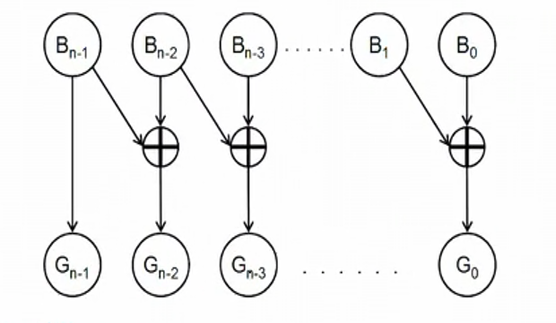
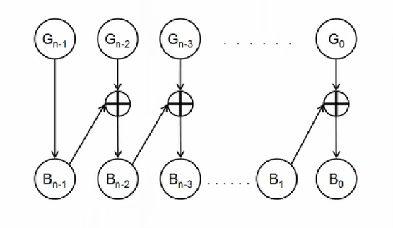

# 算法

## 一.双指针

### 1.指针更新问题

遍历寻找更新 r 指针的时候,若 r 指针需要更新,则 l 指针不能同时更新,需保持之前的状态,与新更新的 r 指针再次进行验证

## 二.数学

### 1.求两个数的最大公因数和最小公倍数

a,b 两个数的最小公倍数(lcm)乘以它们的最大公因数(gcd)等于 a,b 本身的乘积

```C
int gcd(int a, int b)
{
    return b > 0 ? gcd(b, a % b) : a;
}
int lcm(int a, int b)
{
    return a / gcd(a, b) * b;
}
```

### 2.裴蜀定理(贝祖等式)

[裴蜀定理](https://zh.wikipedia.org/wiki/%E8%B2%9D%E7%A5%96%E7%AD%89%E5%BC%8F)
对于不全为零的任意整数 a 和 b,记 g=gcd(a,b),其中 gcd(a,b)为 a 和 b 的最大公约数,则对于任意整数 x 和 y 都满足 a*x+b*y 是 g 的倍数,特别的,存在整数 x 和 y 满足 a*x+b*y=g
对于不全为零的任意 n 个整数个整数$a_1,a_2,…a_n$,记这 n 个数的最大公约数为 g,则对于任意 n 个整数$x_1,x_2,...x_n$都满足$\sum_{i=1}^n a_i*x_i$是 g 的倍数
正整数$a_1到a_n$的最大公约数是 1 的充分必要条件是存在 n 个整数$x_1到x_n$满足$\sum_{i=1}^n a_i*x_i=1$

求解一组数的最大公约数

```C
int gcd(int a, int b)
{
    return b > 0 ? gcd(b, a % b) : a;
}

int maxgacd(int *nums, int len)
{
    int res = nums[0];
    for (int i = 0; i < len; i++)
        res = gcd(res, nums[i]);
    return res;
}
```

题目示例--[LeetCode1250.检查好数组](https://leetcode.cn/problems/check-if-it-is-a-good-array/)
给你一个正整数数组 nums，你需要从中 **任选** 一些子集，然后将子集中每一个数乘以一个 任意整数，并求出他们的和。

假如该和结果为  1，那么原数组就是一个「好数组」，则返回 True；否则请返回 False

```C
int gcd(int a, int b)
{
    return b > 0 ? gcd(b, a % b) : a;
}
bool isGoodArray(int *nums, int numsSize)
{
    int res = nums[0];
    for (int i = 0; i < numsSize; i++)
    {
        res = gcd(res, nums[i]);
        if (res == 1)
            return true;
    }
    if (res == 1)
        return true;
    return false;
}
```

### 3.取模

取模的本质: a % b = a - a / b $\cdot$ b
-10 % 3 = -10 - (-10) / 3 $\cdot$ 3 = -10 + 9 = -1
10 % 3 = 10 -10 / (-3) $\cdot$ (-3) = 10 - 9 = 1
10 % -3 = (-10) - (-10) / (-3) $\cdot$ (-3) = -10 + 9 = -1

(a+b) mod m = ((a mod m) + (b mod m)) mod m

(a · b) mod m = ((a mod m) · (b mod m)) mod m

### 4.自增

```c
int i = 1;
i = i++;
printf("%d", i); //输出1
```

i = i++可拆分为 3 步操作

1. temp = i
2. i = i + 1
3. i = temp

所以 i 的值会从 1 变成 2 再变回 1

```C
int i = 1;
i = ++i;
printf("%d", i); // 输出2
```

1. i = i + 1
2. temp = i
3. i = temp

### 5.精度

#### 1.尽量不使用科学计数法

```C
long long num = 1000000000;
num %= (10e9 + 7); // 大概率会出错
num = 100000000;
num %= (1000000007); // 可以正常运行
```

#### 2.小数不直接比较是否相等

当对两个经过小数运算的变量进行比较是否相同时,不应当直接比较,应比较两个变量的差值是否在某一精度范围内

```C
double a = 2.7;
double b = 8.1 / 3;
if (a == b)
    printf("1");
else
    printf("0");
```

该段代码会输出 0

#### 3.自动转换精度

```java
byte a = 3;
a = a + 3;// 错误,a+3会自动转化为int型,但a仍是byte型
a += 3;// 正确,该操作等同于a = (byte)(a + 3)
a++;// 正确a=(byte)(a + 1)
```

#### 4.long long int

题目使用科学计数法时,注意运算过程是否会爆 int,参数取值范围若大于$10^8$,直接使用 long ling int.

若某个函数内使用 longlong 类型的参数,则该函数内其他整形变量也应当使用 longlong 类型,避免运算时溢出

初始化 longlong 变量时,最好提前定义一个值为 1 的 longlong 类型变量 temp,然后再将初始化内容乘 temp 后进行赋值,避免初始化内容在运算时溢出,如 `long long a = 0x3f3f * 0x3f3f3f` 0x3f3f 与 0x3f3f3f 均为 int 型数据,在运算过程中,其结果已经超过 int 型数据,a 将不能得到预期值

### 6.格雷码

[格雷码](https://zh.wikipedia.org/wiki/%E6%A0%BC%E9%9B%B7%E7%A0%81)
格雷码（循环二进制单位距离码）是任意两个相邻数的代码只有一位二进制数不同的编码，它与奇偶校验码同属可靠性编码.

以二进制为 0 值的格雷码为第零项，第一项改变最右边的位元，第二项改变右起第一个为 1 的位元的左边位元，第三、四项方法同第一、二项，如此反复，即可排列出 n 个位元的格雷码

[格雷码转化](https://www.bilibili.com/video/BV1RL4y1K7r6/?spm_id_from=333.1007.top_right_bar_window_custom_collection.content.click)

二进制转格雷码如图:



格雷码转二进制如图:



格雷码也可以使用公式直接求出.第 i(i>=0)个格雷码即为: $g_i  = i$ $\bigoplus \frac{i}{2}$

题目示例--[LeetCode89:格雷编码](https://leetcode.cn/problems/gray-code/)
n 位格雷码序列 是一个由 2n 个整数组成的序列，其中：

- 每个整数都在范围 [0, 2n - 1] 内（含 0 和 2n - 1）
- 第一个整数是 0
- 一个整数在序列中出现 不超过一次
- 每对 相邻 整数的二进制表示 恰好一位不同 ，且第一个 和 最后一个 整数的二进制表示 恰好一位不同
  给你一个整数 n ，返回任一有效的 n 位格雷码序列

```c
int* grayCode(int n, int* returnSize) {
    int ret_size = 1 << n;
    int *ret = (int *)malloc(ret_size * sizeof(int));
    for (int i = 0; i < ret_size; i++) {
        ret[i] = (i >> 1) ^ i;
    }
    *returnSize = ret_size;
    return ret;
}
```

题目示例--[LeetCode1238:循环码排列](https://leetcode.cn/problems/circular-permutation-in-binary-representation/)
给你两个整数  n 和 start。你的任务是返回任意 (0,1,2,,...,2^n-1) 的排列 p，并且满足：

- p[0] = start
- p[i] 和 p[i+1]  的二进制表示形式只有一位不同
- p[0] 和 p$[2^n -1]$  的二进制表示形式也只有一位不同

```c
int* circularPermutation(int n, int start, int* returnSize){
    int ret_size = 1 << n;
    int *ret = (int *)malloc(ret_size * sizeof(int));
    *returnSize = ret_size;
    for (int i = 0; i < ret_size; i++)
        ret[i] = (i >> 1) ^ i;
    for(int i=0;i<ret_size;i++)
        ret[i]=ret[i]^start;
    return ret;
}
```

### 7.进制转化

```java
class Solution {
public:
    string baseNeg2(int n) {
        return _baseAny(n, -2);
    }
    string _baseAny(int n, int base)
    {
        if (n == 0 || n == 1) return to_string(n);
        string ans;
        // 除基取余，余数是负需转成正
        while (n)
        {
            int r = n % base;
            /*
                如果 r < 0， 商 + 1，余数 - 基数即可
                余数（绝对值）一定小于基数，余数 - 基数可以将余数换为正数
                a * base + r = n
                (a + 1) * base + (r - base)
                = a * base + base + r - base
                = a * base + r = n
            */
            if (r < 0)
            {
                r -= base;
                n += base;
            }

            if (r >= 10)
            {
                ans += 'A' + r - 10;
            }
            else
            {
                ans += r + '0';
            }
            n /= base;
        }
        reverse(ans.begin(), ans.end());
        return ans;
    }
};
```

## 三.极限边界

### 1.判断大小

部分情况下判断大小进行$max_{index}/min_{index}$更新时应考虑两个数值相等时是否要进行更新

初始状态下的 max 应设置为-0x3f3f3f3f,min 应设置为 0x3f3f3f3f,而不是使用 0 或数组第一个元素进行初始化

### 2.数组初始化

数组初始化时要用绝对不可能用到的数据进行初始化例如 0x3f3f3f3f,,不能用 0 或 1 进行初始化,否则后续进行操作时,初始化内容可能会与操作内容冲突

### 3.二分

在求最短/最少时,先考虑二分是否可行,若解的值域范围内有单调性,就可以使用二分

#### 1.二分模板

```c
int l = 1, r = 0x3f3f3f3f, m;
int need;
while (l < r)
{
    m = (l + r) >> 1;
    if (ans(m) > need)
        r = m;
    else if (ans(m) < need)
        l = m + 1;//****
    else
    {
        return m;
        break;
    }
}
```

题目示例--[LeetCode2594.修车的最短时间](https://leetcode.cn/problems/minimum-time-to-repair-cars/)

给你一个整数数组 `ranks` ,表示一些机械工的能力值.$ranks_i$是第 i 位机械工的能力值.能力值为 r 的机械工可以在$r*n^2$分钟内修好 n 辆车

同时给你一个整数 `cars` ,表示总共需要修理的汽车数目

请你返回修理所有汽车 **最少** 需要多少时间

**注意：** 所有机械工可以同时修理汽车

```c
int check(long long time, int cars, int *ranks, int ranksSize)
{
    long long sum = 0;
    for (int i = 0; i < ranksSize; ++i)
        sum += sqrt(time * 1.0 / ranks[i]);
    if (sum == cars)
        return 0;
    else if (sum > cars)
        return 1;
    else
        return -1;
}
long long repairCars(int *ranks, int ranksSize, int cars)
{
    long long l = 1;
    long long r = l*ranks[0] * cars * cars, ans;
    while (l < r)
    {
        long long m = (l + r) >> 1;
        int temp = check(m, cars, ranks, ranksSize);
        if (temp >= 0)
            r = m;
        else
            l = m+1;
    }
    return l;
}
```

### 4.遍历

##### 1.直行遍历

在一个 n\*n 的矩阵中,给定一个点的坐标,要求遍历该点同行同列同对角线的所有点

```c
int n, x, y;
for (int dx = -1; dx <= 1; ++dx)
{
    for (int dy = -1; dy <= 1; ++dy)
    {
        if (dx == 0 && dy == 0)
            continue;
        int line = x, list = y;
        while (line >= 0 && line < n && list >= 0 && list < n)
            line += dx, list += dy;
    }
}
```

### 5.DP

违法状态一定要进行特殊初始化,根据情况初始化为极大值或极小值

## 四.树

### 1.二叉搜索树

#### 1.恢复二叉搜索树

已知 1~13 的二叉搜索树的前序遍历为

| 7   | 3   | 1   | 2   | 5   | 4   | 6   | 10  | 8   | 9   | 12  | 11  | 13  |
| --- | --- | --- | --- | --- | --- | --- | --- | --- | --- | --- | --- | --- |

第一个元素为根结点,设第一个大于根结点的数组下标为$bigger_{index}$,第一个小于根节点的数组下标为$smaller_{index}$,那么可将$smaller_{index}至bigger_{index}$划分为一个独立的数组,该数组即为根节点的左子树,剩下的即为根结点的右子树,按此方法遍历即可恢复二叉搜索树

题目示例--[LeetCode449. 序列化和反序列化二叉搜索树](https://leetcode.cn/problems/serialize-and-deserialize-bst/)

序列化是将数据结构或对象转换为一系列位的过程,以便它可以存储在文件或内存缓冲区中,或通过网络连接链路传输,以便稍后在同一个或另一个计算机环境中重建

设计一个算法来序列化和反序列化二叉搜索树.对序列化/反序列化算法的工作方式没有限制。 您只需确保二叉搜索树可以序列化为字符串,并且可以将该字符串反序列化为最初的二叉搜索树

**编码的字符串应尽可能紧凑**

```c
void getstr(struct TreeNode *root, char **mystr)
{
    if (root == NULL)
        return;
    char temp[50];
    sprintf(temp, "%d_", root->val);
    strcat(*mystr, temp);
    getstr(root->left, mystr);
    getstr(root->right, mystr);
}

/** Encodes a tree to a single string. */
char *serialize(struct TreeNode *root)
{
    char *mystr = (char *)malloc(sizeof(char) * 100000);
    memset(mystr, 0, sizeof(char) * 100000);
    getstr(root, &mystr);
    return mystr;
}

struct TreeNode *creatnode(int val)
{
    struct TreeNode *temp = (struct TreeNode *)malloc(sizeof(struct TreeNode));
    temp->val = val;
    temp->left = NULL;
    temp->right = NULL;
    return temp;
}

int *strtoint(char *mystr, int *arrlen)
{
    int len = strlen(mystr);
    char *temp = mystr;
    *arrlen = 0;
    int *vals = (int *)malloc(sizeof(int) * 100000);
    for (int i = 0; i < len; ++i)
    {
        if (mystr[i] != '_')
            continue;
        mystr[i] = '\0';
        vals[(*arrlen)++] = atoi(temp);
        temp = mystr + i + 1;
    }
    return vals;
}
void totree(struct TreeNode *root, int *vals, int l, int r)
{
    if (l > r)
        return;
    int rnum = r;
    for (int i = l; i <= r; ++i)
    {
        if (vals[i] > root->val)
        {
            struct TreeNode *temp = creatnode(vals[i]);
            root->right = temp;
            totree(temp, vals, i, r);
            rnum = i - 1;
            break;
        }
    }
    for (int i = l; i <= r; ++i)
    {
        if (vals[i] < root->val)
        {
            struct TreeNode *temp = creatnode(vals[i]);
            root->left = temp;
            totree(temp, vals, i, rnum);
            break;
        }
    }
}
/** Decodes your encoded data to tree. */
struct TreeNode *deserialize(char *data)
{
    int len = 0;
    int *vals = strtoint(data, &len);
    if (len == 0)
        return NULL;
    struct TreeNode *root = creatnode(vals[0]);
    totree(root, vals, 1, len - 1);
    return root;
}

// Your functions will be called as such:
// char* data = serialize(root);
// deserialize(data);

```

## 五.图

### 1.拓扑排序

给一个有向无环图的所有节点排序

构造拓扑序列步骤--

1. 从图中选择一个入度为零的点
2. 输出该顶点,从图中删除此顶点及其所有的出边

重复上面两步,直到所有顶点都输出,拓扑排序完成,或者图中不存在入度为零的点,此时说明图是有环图,拓扑排序无法完成,陷入死锁

题目示例--[LeetCode207.课程表](https://leetcode.cn/problems/course-schedule/)

你这个学期必须选修 `numCourses` 门课程,记为 `0` 到 `numCourses - 1`

在选修某些课程之前需要一些先修课程. 先修课程按数组 `prerequisites` 给出,其中 `prerequisites[i] = [`$a_i, b_i$`]` ，表示如果要学习课程$a_i$则**必须**先学习课程$b_i$

- 例如，先修课程对 `[0, 1]` 表示--想要学习课程 `0` ,你需要先完成课程 `1`

请你判断是否可能完成所有课程的学习?如果可以,返回 `true` ;否则.返回 `false`

```java
class Solution {
    public boolean canFinish(int numCourses, int[][] prerequisites) {
        int res = 0;
        int deep[] = new int[numCourses];
        HashSet<Integer> side[] = new HashSet[numCourses];
        for (int i = 0; i < numCourses; ++i) {
            side[i] = new HashSet<>();
        }
        for (int[] p : prerequisites) {
            ++deep[p[0]];
            side[p[1]].add(p[0]);
        }
        Queue<Integer> queue = new LinkedList<>();
        for (int i = 0; i < numCourses; ++i) {
            if (deep[i] == 0)
                queue.add(i);
        }
        while (!queue.isEmpty()) {
            int top = queue.poll();
            ++res;
            for (int s : side[top]) {
                --deep[s];
                if (deep[s] == 0)
                    queue.add(s);
            }
        }
        return res == numCourses;
    }
}
```
