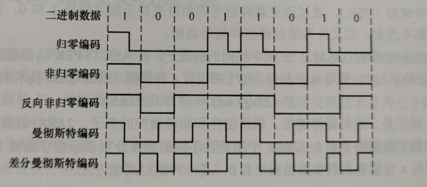

# 计算机网络

## 第一章 计算机网络体系结构

### 1.计算机网络概述

#### 1.概念,组成,功能,分类

三网--有线电视网络,电信网络,计算机网络

四网--有线电视网络,电信网络,计算机网络,电网

计算机网络--是一个将分散的,具有独立功能的**计算机系统(包括手机系统和电脑系统)**,通过**通信设备**与**线路**连接起来,由功能完善的**软件**实现**资源共享**和**信息传递**的系统

计算机网络是**互联**的,**自治**的计算机集合
互联--通过通信链路互联互通
自治--无主从关系

计算机网络的功能--

- 数据通信
- 资源共享--同一个计算机网络上的其他计算机可使用某台计算机资源的行为,可共享**硬件(打印机),软件,数据**
- 分布式处理--多台计算机各自承担同一工作任务的不同部分
  - 提高可靠性--替换机
  - 负载均衡--各计算机之间更亲密

计算机网络的发展--

1. 美国国防部高级研究计划局(ARPA)设计的一个分散的指挥系统--ARPAnet(阿帕网),通过无线分组交换网&卫星通信网连接
2. 1983 年阿帕网接受 TCP/IP 协议,选定 Internet 为主要的计算机通信系统
3. 1985 年起,美国国家科学基金会 NSF 围绕 6 个大型计算机中心建设计算机网络,即国家科学基金网**NSFNET**.具有**三级结构**--校园网/企业网 → 地区网 → 主干网
4. 多层次 ISP 结构.ISP--因特网服务提供者/因特网服务提供商,是一个向广大用户综合提供互联网接入业务,信息业务和增值业务的公司.如中国移动等.分为主干 ISP,地区 ISP,本地 ISP.
   主机 A→ 本地 ISP→ 地区 ISP→ 主干 ISP→ 地区 ISP→ 本地 ISP→ 主机 B

网络把许多计算机连接在一起
互联网把许多网络连接在一起
因特网是世界上最大的互联网

计算机网络的组成--

- 硬件
- 软件
- 协议(一系列规则和约定的集合)

计算机网络的工作方式--

- 边缘部分--用户直接使用
  - C/S 方式
  - P2P 方式
- 核心部分--网络和通信设备,为边缘部分服务

计算机网络的功能组成--

- 通信子网--实现**数据通信**
- 资源子网--实现**资源共享**/数据处理

|   ---   |   应用层   |              |
| :------: | :--------: | :-----------: |
| 资源子网 |   表示层   |              |
|   ---   |   会话层   |              |
|          |   传输层   |              |
|   ---   |   网络层   |    路由器    |
| 通信子网 | 数据链路层 |  交换机,网桥  |
|   ---   |   物理层   | 集线器,中继器 |

计算机网络的分类--

- 按分布范围分--
  - 个人局域网 PAN
  - 局域网 LAN(广播技术)
  - 城域网 MAN
  - 广域网 WAN(交换技术)
- 按使用者分--
  - 公用网
  - 专用网
- 按交互技术分--
  - 电路交换
  - 报文交换
  - 分组交换
- 按拓扑结构分--
  - 总线型
  - 星型
  - 环型
  - 网状型
- 按传输技术分--
  - 广播式网络--共享公共通信信道
  - 点对点网络--使用**分组存储转发**和**路由选择**机制

#### 2.标准化工作及相关组织

标准的分类--

- 法定标准--由权威机构制定的正式的,合法的标准.如 OSI
- 事实标准--某些公司的产品在竞争中占据了主流,这些产品中的协议和技术就成了标准.如 TCP/IP

RFC(Request For Comments)--因特网标准的形式

RFC 要上升为因特网正式标准的四个阶段--

1. 因特网草案(Internet Draft).这个阶段还不是 RFC 文档
2. 建议标准(Proposed Standard).从这个阶段开始成为 RFC 文档
3. 草案标准(Draft Standard).(2021 年后被取消)
4. 因特网标准(Internet Standa)

标准化工作的相关组织--

- 国际标准化组织 ISO--OSI 参考模型,HDLC 协议
- 国际电信联盟 ITU--制定通信规则
- 国际电气电子工程师协会 IEEE--学术机构,IEEE802 系列标准,5G
- Internet 工程任务组 IETF--负责因特网相关标准的制定,如 RFC XXXX

#### 3.性能指标

##### 1.速率,带宽,吞吐量

速率--数据率或数据传输率或比特率

带宽原指某个信号具有的频带宽度,即最高频率与最低频率之差,单位是赫兹(Hz)

在计算机网络中,带宽用来表示网络的通信线路传送数据的能力,通常是指单位时间内从网络中的某一点到另一点所能通过的**最高数据率**.也是网络设备所支持的最高速度.单位是比特每秒.

吞吐量--表示在**单位时间**内通过**某个网络**(或信道,接口)的数据量.单位 b/s,kb/s,Mb/s 等

吞吐量受网络的带宽或网络的额定速率的限制

##### 2.时延,时延带宽积,往返时间 RTT,利用率

时延--指数据(报文/分组/比特率)从网络(或链路)的一端传送到另一端所需要的时间.也叫延迟或迟延.单位是秒

- 发送时延--结点将分组的所有比特推向(传输)链路所需的时间,即从发送分组的第一个比特算起,到该分组的最后一个比特发送完毕所需要的时间,因此也被称为**传输时延**.
  计算公式为--发送时延=分组长度/信道宽度
- 传播时延--电磁波在信道中传播一定的距离需要花费的时间,即一个比特从链路的一段传播到另一端所需要的时间
  计算公式--传播时延=信道长度/电磁波在信道上的传播速率
- 排队时延--分组在进入路由器后要先在输入队列中排队等待处理.路由器确定转发端口后,还要在输出队列中等待转发,产生了排队时延
- 处理时延--数据在交换结点为存储转发而进行的一些必要的处理所花费的时间.如分析分组的首部,从分组中提取数据部分,进行差错检验等

总时延=发送时延+传播时延+排队时延+处理时延

时延带宽积--指发送端发送第一个比特即将到达终点时,发送端已经发出了多少个比特,因此又称以比特为单位的链路长度,即"某段链路现在又多少比特".即时延带宽积=传播时延 X 带宽

往返时延(Round-Trip Time,RTT)--指从发送端发出一个短分组,到发送端收到来自接收端的确认(接收端收到数据后立即发送确认),总共经历的时延.在互联网中,往返时延还包括各中间结点的处理时延,排队时延及转发数据时的发送时延

利用率--

- 信道利用率--有数据通过时间/(有+无)数据通过时间
- 网络利用率--信道利用率加权平均值.随利用率的增加,时延**急剧**增大

### 2.计算机网络体系结构与参考模型

#### 1.分层结构

网络体系结构是从**功能**上描述计算机网络结构的

计算机网络体系结构是计算机网络的**各层及其协议的集合**

体系结构是**抽象**的,而实现是指能运行的一些软件和硬件

分层的基本原则--

- 每层都实现一种相对独立的功能,降低大系统的复杂度
- 各层之间界面自然清晰,易于理解,相互交流尽可能少
- 各层功能的精确定义独立于具体的实现方法,可以采用最合适的技术来实现
- 保持下层对上层的独立性,上层单向使用下层提供的服务
- 整个分层结构能促进标准化工作

分层后各层之间相对独立,灵活性好,因此分层的体系结构易于更新(替换单个模块),易于调试,易于交流,易于抽象,易于标准化.

层次越多,不同层中重复出现的功能越多,产生额外的开销,整体的运行效率越低.
层次越少,每层的协议越复杂
在分层时应考虑层次的清晰程度与运行效率之间的折中,层次数量的折中

在计算机网络的分层结构中,第 n 层中的活动元素通常称为第 n 层实体.具体来说,实体指任何可发送或接受信息信息的硬件或软件进程,通常是一个特定的软件模块.

不同机器上的同一层称为**对等层**,同一层的实体称为**对等实体**.

第 n 层实体实现的服务为第 n+1 层所使用,在这种情况下,第 n 层称为**服务提供者**,第 n+1 层则服务于用户

在各个层次中,每个报文都分为两部分--数据部分(SDU),控制信息部分(PCI),他们共同组成 PDU

- 服务数据单元(SDU)--为完成用户所要求的功能而传送的数据.第 n 层的服务数据单元记为 n-SDU
- 协议控制信息(PCI)--控制协议操作的信息.第 n 层的协议控制信息记为 n-PCI
- 协议数据单元(PDU)--对等层次直接传送的数据单位称为该层的 PDU.第 n 层的协议数据单元记为 n-PDU
  - 物理层的 PDU 称为比特
  - 数据链路层的 PDU 称为帧
  - 网络层的 PDU 称为分组
  - 传输层的 PDU 称为报文段

各层间传输数据时,把第 n+1 层收到的 PDU 作为第 n 层的 SDU,加上第 n 层的 PCI,就变成了第 n 层的 PDU,交给第 n-1 层后作为 SDU 发送.接受方接收时做相反的处理.三者的关系如下--

$$
n-SDU+n-PCI=n-PDU=(n-1)-SDU
$$

层次结构的含义--

- 第 n 层的实体不仅要使用第 n-1 层的服务来实现自身定义的功能,还要向第 n+1 层提供本层的服务,该服务是第 n 层及其下面各层提供的服务总和
- 最底层只提供服务.是整个层次结构的基础,中间各层既是下一层的服务使用者,又是上一层的服务提供者,最高层面向用户提供服务
- 上一层只能通过相邻层间的接口使用下一层的服务,而不能调用其他层的服务,下一层所提供服务的实现细节对上一层透明(完全屏蔽)
- 两台主机通信时,对等层在逻辑上有一条直接信道,表现为不经过下层就能把信息送到对方

#### 2.协议,接口,服务

协议,就是规则的集合

为进行网络中的数据交换而建立的规则,标准或约定称为网络协议(Network Protocol),它是控制两个(或多个)对等实体进行通信的规则的集合,是水平的.不对等实体之间没有协议.网络协议简称为协议

协议组成--

- 语法--规定了传输数据的格式
- 语义--规定了所要完成的功能(需要发出何种控制信息,完成何种动作,做出何种应答)
- 同步--规定了执行各种操作的条件,时序关系等.即事件实现顺序的详细说明

一个完整的协议通常应该具有线路管理(建立,释放连接),差错控制,数据转换等功能

接口是同一结点内相邻两层间**交换信息的连接点**,是一个系统的内部规定

每层只能为紧邻的层次之间定义接口,不能跨层次定义接口.

在典型的接口上,同一结点相邻的两层实体通过服务访问点(Service Access Point,SAP)进行交互.服务是通过 SAP 提供给上层使用的,第 n 层的 SAP 就是第 n+1 层可以访问第 n 层服务的地方.每个 SAP 都有一个可以标识它的地址

服务是指下层为紧邻的上层提供的功能调用,它是垂直的.对等实体在协议的控制下,使得本层能为上一层提供服务,但要实现本层协议还需要使用下一层提供的服务

上层使用下层所提供的服务时必须与下层交换一些命令,这些命令在 OSI 参考模型中称为**服务原语**.OSI 参考模型将原语划分为 4 类--

- 请求(Request)--由服务用户发往服务提供者,请求完成某项工作
- 指示(Indication)--由服务提供者发送往服务用户,指示用户做某件事情
- 响应(Response)--由服务用户发往服务提供者,作为对指示的响应
- 证实(Confirmation)--由服务提供者发往服务用户,作为对请求的证实

有应答服务包含全部 4 种原语,无应答服务只有请求和指示两种原语

|  服务用户  |  实体(n+1)  | ← | 协议(n+1) | → |  实体(n+1)  | 第 n+1 层 |
| :--------: | :----------: | :-: | :-------: | :-: | :----------: | :-------: |
|            |      ↑      |    |          |    |      ↑      |          |
|            | 交换服务原语 |    |          |    | 交换服务原语 |          |
|            |      ↓      |    |          |    |      ↓      |          |
|            |     SAP     |    |          |    |     SAP     |          |
| 服务提供者 |   实体(n)   | ← |  协议(n)  | → |   实体(n)   |  第 n 层  |

计算机网络提供的服务--

- 面向连接服务和无连接服务
  - 面向连接服务--通信前双方必须先建立连接,分配相应的资源(如缓冲区),以保证通信能正常进行,传输结束后释放连接和所占用的资源.例如 TCP.这种服务可以分为--
    - 连接建立
    - 数据传输
    - 连接释放
  - 无连接服务--通信前双方不需要先建立连接,需要发送数据时可以直接发送.把每个带有目的地址的包(报文分组)传送到线路上,由系统选定路线进行传输.这是不可靠的服务.被描述为"尽最大努力交付"(Best-Effort-Delivery),它并不保证通信的可靠性.IP,UDP 就是无连接服务
- 可靠服务和不可靠服务
  - 可靠服务--网络具有纠错,检错,应答机制.能保证数据正确,可靠地传送到目的地
  - 不可靠服务--网络只是尽量正确,可靠地传送,而不能保证数据正确,可靠地传送到目的地,是一种尽力而为的服务
- 有应答服务和无应答服务
  - 有应答服务--接收方在收到数据后向发送方给出相应的应答,该应答由传输系统内部自动实现,而不由用户实现.所发送的应答可以是肯定应答,也可以是否定应答.通常在接收到的数据由错误时发送否定应答
  - 无应答服务--接受方收到数据后不自动给出应答.若要应答,则由高层实现

#### 3.ISO/OSI 模型

国际标准化组织(ISO)提出的网络体系结构模型,被称为**开放系统互联参考模型(OSI/RM)**,通常简称为 OSI 参考模型

目的--支持异构网络的互联互通

OSI 参考模型有 7 层,自下而上依次为物理层,数据链路层,网络层,传输层,会话层,表示层,应用层.
低三层统称为**通信子网**,它是为了联网而附加的通信设备,完成数据的传输功能
高三层统称为**资源子网**,它相当于计算机系统,完成数据的处理等功能
传输层承上启下

| 端系统(主机) |    |            |  中继系统  |            |    | 端系统(主机) |
| :----------: | :-: | :--------: | :--------: | :--------: | :-: | :----------: |
|    应用层    | ← | 应用层协议 |            | 应用层协议 | → |    应用层    |
|    表示层    | ← | 表示层协议 |            | 表示层协议 | → |    表示层    |
|    会话层    | ← | 会话层协议 |            | 会话层协议 | → |    会话层    |
|    传输层    | ← | 传输层协议 |            | 传输层协议 | → |    传输层    |
|    网络层    | ← |     →     |   网络层   |     ←     | → |    网络层    |
|  数据链路层  | ← |     →     | 数据链路层 |     ←     | → |  数据链路层  |
|    物理层    | ← |     →     |   物理层   |     ←     | → |    物理层    |

##### 1.物理层(Physical Layer)

物理层的传输单位是比特,功能是在物理媒体上为数据端设备透明的传输原始比特率

物理层主要定义数据终端设备(DTE)和数据通信设备(DCE)的物理与逻辑连接方法,所以物理层协议也被称为**物理层接口标准**.由于在通信技术的早期阶段,通信规则被称为**规程(Procedure)**,因此物理层协议也被称为**物理层规程**

物理层接口标准--

- EIA-232C
- EIA/TLA RS-449
- CCITT 的 X.21

物理层主要研究--

- 通信链路与通信结点的连接的电路接口的参数
- 通信链路上传输的信号的意义和电气特征

传输信息所利用的一些物理媒体,如光缆,无线信道等并不在物理层协议之内

##### 2.数据链路层(Data Link Layer)

数据链路层的传输单位是帧,任务是将网络层传来的 IP 数据报组装成帧.

数据链路层的功能--

- 成帧
- 差错控制
- 流量控制
- 传输管理

广播式网络在数据链路层还要处理如何控制对共享信道的访问,数据链路层的一个特殊的子层--介质访问子层,就是处理这个问题的

数据链路层协议--

- SDLC
- HDLC
- PPP
- STP
- 帧中继

以太网交换机根据数据链路层 MAC 地址进行帧交换帧中继网和 ATM 网都是面向连接的通信网,交换机根据预先建立的虚电路标识进行交换

帧中继的虚电路号是 DLCI,进行交换的协议数据单元为帧

ATM 网的虚电路号为 VPI 和 VCI,进行交换的协议数据单元为信元

三层交换机是因特网中使用的高档交换机,这种设备把 MAC 交换的高带宽和低延迟优势与网络层分组路由技术结合起来,其工作原理可以概括为--一次路由,多次交换.当三层交换机第一次收到一个数据包时必须通过路由功能寻找转发端口,同时记住目标 MAC 地址和源 MAC 地址,以及其他相关信息,当再次收到目标地址和源地址相同的帧时直接进行交换,不再调用路由功能.三层交换机不但具有路由功能,而且比通常的路由器转发得更快

##### 3.网络层(Network Layer)

网络层的传输单位是数据报,它关心的是通信子网的运行控制,主要任务是把网络层的协议数据单元(分组)从源端传输到目的端,为分组交换网上的不同主机提供通信服务.

关键问题--

- 对分组进行路由选择
- 实现流量控制
- 实现拥塞控制
- 实现差错控制--若发现了差错,优先纠正,纠正失败则直接丢弃,保证向上层提交的数据都是正确的
- 实现网际互联

因特网是一个很大的互联网,它由大量的异构网络通过路由器(Router)互相连接起来.因特网的主要网络层协议是无连接的网际协议(Internet Protocol,IP)和许多路由选择协议.因此因特网的网络层也称为**网际层**或**IP 层**

网络层协议--

- IP
- IPX
- ICMP
- IGMP
- ARP
- PARP
- OSPF

##### 4.传输层(Transport Layer)

传输层也称为**运输层**,传输单位是报文段(TCP)或用户数据报(UDP)

传输层负责主机中两个进程的通信,功能是为端到端连接提供稳定可靠的传输服务,为端到端连接提供流量控制,差错控制,服务质量,数据传输管理

**端到端**的通信是指运行在不同主机的两个进程之间的通信,一个进程由一个端口来标识,所以称为端到端通信

使用传输层的服务,高层用户可以直接进行端到端的数据传输.从而忽略通信子网的存在

通过传输层的屏蔽.高层用户看不到子网的交替和变化

由于一台主机可同时运行多个进程,因此传输层具有复用和分用的功能

- 复用--多个应用层进程可同时使用下面传输层的服务
- 分用--传输层把收到的信息分别交付给上面应用层中相应的进程

传输层协议--

- TCP
- **UDP**

##### 5.会话层(Session Layer)

会话层允许不同主机上的各个进程之间进行会话

会话层利用传输层提供的端到端的服务向表示层提供它的增值服务.这种服务主要为表示层实体或用户进程建立连接并在连接上有序地传输数据,这就是会话,也称建立同步(SYN)

会话层负责管理主机间的会话进程,包括建立,管理及终止进程间的会话

会话层可以使用校验点使通信会话在通信失效时从校验点继续恢复通信,实现数据同步

##### 6.表示层(Presentation Layer)

表示层主要处理在两个通信系统中交换信息的表示方式.不同机器采用的编码和表示方法不同,使用的数据结构也不同.为了使不同表示方法的数据和信息之间能互相交换,表示层采用抽象的标准方法定义数据结构,并采用标准的编码形式.

**数据压缩,加密和解密也是表示层可提供的数据表示变换功能**

##### 7.应用层(Application Layer)

应用层是 OSI 参考模型的最高层,是用户与网络的界面.

应用层为特定类型的网络应用提供访问 OSI 参考模型环境的手段.因为用户的实际应用多种多样,这就要求应用层采用不同的应用协议来解决不同类型的应用要求,因此应用层是最复杂的一层,使用的协议也最多

应用层协议--

- 用于文件传送的 FTP
- 用于电子邮件的 SMTP
- 用于万维网的 HTTP

#### 4.TCP/IP 模型

ARPA 在研究 ARPAnet 时提出了 TCP/IP 模型,模型从低到高依次为--

- 网络接口层(对应 OSI 参考模型中的物理层和数据链路层)
- 网际层
- 传输层
- 应用层(对应 OSI 参考模型中的会话层表示层和应用层)

TCP/IP 由于得到广泛应用而成为**事实上的国际标准**

|    层级    |      |    |            |            |            |    |    |
| :--------: | :--: | :-: | :--------: | :--------: | :--------: | :-: | :-: |
|   应用层   | HTTP |    |    SMTP    |            |    DNS    |    | RTP |
|            |  ↘  |    |     ↙     |            |     ↘     |    | ↙ |
|   传输层   |      | TCP |            |            |            | UDP |    |
|            |      |    |     ↘     |            |     ↙     |    |    |
|   网络层   |      |    |            |     IP     |            |    |    |
|            |      |    |     ↙     |     ↓     |     ↘     |    |    |
| 网络接口层 |      |    | 网络接口 1 | 网络接口 2 | 网络接口 3 |    |    |

IP 协议是因特网中的核心协议

TCP/IP 可以为各式各样的应用提供服务(所谓的 everything over IP),同时 TCP/IP 也允许 IP 协议在由各种网络构成的互联网上运行(所谓的 IPovereverything)

##### 1.网络接口层

网络接口层的功能类似于 OSI 参考模型的物理层和数据链路层.它表示与物理网络的接口,但实际上 TCP/IP 本身并未真正描述这一部分,只是指出主机必须使用某种协议与网络连接,以便在其上传递 IP 分组

具体的物理网络既可以是各种类型的局域网,如以太网,令牌环网,令牌总线网等,也可以是诸如电话网,SDH,X.25,中继和 ATM 等公共数据网络

网络接口层的作用是从主机或结点接收 IP 分组,并把它们发送到指定的物理网络上

##### 2.网络层

网际层(主机-主机)是 TCP/IP 体系结构的关键部分.

它和 OSI 参考模型的网络层在功能上非常相似.网际层将分组发往任何网络,并为之独立地选择合适的路由,但它不保证各个分组有序地到达,各个分组的有序交付由高层负责

网际层定义了标准的分组格式和协议,即 IP.当前采用的是 IPv4,它的下一版本是 IPv6

##### 3.传输层

传输层(应用-应用或进程-进程)的功能同样和 OSI 参考模型中的传输层类似,即使得发送端和目的端主机上的对等实体进行会话

传输层主要使用以下两种协议--

- 传输控制协议 (Transmission Control Protocol,TCP)--它是面向连接的,数据传输的单位是报文段,能够提供可靠的交付
- 用户数据报协议(User Datagram Protocol,UDP)--它是无连接的,数据传输的单位是用户数据报,不保证提供可靠的交付,只能提供"尽最大努力交付"

##### 4.用户层

应用层(用户-用户)包含所有的高层协议,如--

- 虚拟终端协议(Telnet)
- 文件传输协议(FTP)
- 域名解析服务(DNS)
- 电子邮件协议 (SMTP)
- 超文本传输协议 (HTTP)

#### 5.TCP/IP 模型与 OSI 模型的比较

##### 1.相似之处

- 二者都采取分层的体系结构,将庞大且复杂的问题划分为若干较容易处理的,范围较小的问题,而且分层的功能也大体相似
- 二者都是基于独立的协议栈的概念
- 二者都可以解决异构网络的互连,实现世界上不同厂家生产的计算机之间的通信

##### 2.不同之处

- OSI 参考模型的最大贡献就是精确地定义了三个主要概念--服务,协议和接口,这与现代的面向对象程序设计思想非常吻合.而 TCP/IP 模型在这三个概念上却没有明确区分,不符合软件工程的思想
- OSI 参考模型产生在协议发明之前,没有偏向于任何特定的协议,通用性良好.但设计者在协议方面没有太多经验,不知道把哪些功能放到哪一层更好.TCP/IP 模型正好相反,首先出现的是协议,模型实际上是对已有协议的描述,因此不会出现协议不能匹配模型的情况,但该模型不适合于任何其他非 TCP/IP 的协议栈
- TCP/IP 模型在设计之初就考虑到了多种异构网的互连问题,并将网际协议(IP)作为一个单独的重要层次.OSI 参考模型最初只考虑到用一种标准的公用数据网将各种不同的系统互连.OSI 参考模型认识到 IP 的重要性后,只好在网络层中划分出一个子层来完成类似于 TCP/IP 模型中的 IP 的功能
- **OSI 参考模型在网络层支持无连接和面向连接的通信,但在传输层仅有面向连接的通信.而 TCP/IP 模型认为可靠性是端到端的问题,因此它在网际层仅有一种无连接的通信模式但传输层支持无连接和面向连接两种模式**

OSI 参考模型的软件效率极低,OSI 参考模型缺乏市场与商业动力,结构复杂,实现周期长,运行效率低,这是它未能达到预目标的重要原因

##### 3.理想的 5 层协议体系结构模型

|    应用层    |                            |     应用层     |
| :----------: | :------------------------: | :------------: |
| 应用层(客户) |    客户发起连接建议请求    | 应用层(服务器) |
| 应用层(客户) | →→→→→→→→→→→→→ | 应用层(服务器) |
| 应用层(客户) | ←←←←←←←←←←←←← | 应用层(服务器) |
| 应用层(客户) |   服务器接受连接建立请求   | 应用层(服务器) |
|    传输层    | 使用下层提供的服务(TCP/IP) |     传输层     |
|    网络层    | 使用下层提供的服务(TCP/IP) |     网络层     |
|  数据链路层  | 使用下层提供的服务(TCP/IP) |   数据链路层   |
|    物理层    |           因特网           |     物理层     |

##### 4.通信协议栈

每个协议栈的最顶端都是一个面向用户的接口,下面各层是为通信服务的协议

用户传输一个数据报时,通常给出用户能够理解的自然语言,然后通过应用层,将自然语言会转化为用于通信的通信数据.通信数据到达传输层,作为传输层的数据部分(传输层 SDU),加上传输层的控制信息(传输层 PCI),组成传输层的 PDU,然后交到网络层.传输层的 PDU 下放到网络层后,就成为网络层的 SDU,然后加上网络层的 PCI,又组成了网络层的 PDU,下放到数据链路层.就这样层层下放,层层包裹,最后形成的数据报通过通信线路传输,到达接收方结点协议栈,接收方再逆向地逐层把包裹拆开,然后把收到的数据提交给用户

## 第二章 物理层

### 1.通信基础

#### 1.基础概念

##### 1.数据,信号和码元

通信的目的是传送信息,如文字,图像和视频等

数据是指传送信息的实体,信号则是数据的电气或电磁表现,是数据在传输过程中的存在形式.数据和信号都可用"模拟的"或"数字的"来修饰--

- 连续变化的数据(或信号)称为模拟数据(或模拟信号)
- 取值允许为有限的几个离教数值的数据(或信号)称为数宇数据(或字信号)

数据传输方式可分为串行传输和并行传输.串行传输是指 1 比特 1 比特地按照时间顺序传输(远距离通信通常采用串行传输),并行传输是指若干比特通过多条通信信道同时传输

码元是指用一个固定时长的信号波形(数字脉冲)表示一位 k 进制数字,代表不同离散数值的基本波形,是数字通信中数字信号的计量单位,这个时长内的信号称为 k 进制码元,而该时长称为码元宽度.1 码元可以携带若干比特的信息量.例如,在使用二进制编码时,只有两种不同的码元--一种代表 0 状态,另一种代表 1 状态

##### 2.信源,信道与信宿

数据通信是指数字计算机或其他数字终端之间的通信.一个数据通信系统主要划分为信源,信道和信宿三部分

信源是产生和发送数据的源头,信宿是接收数据的终点,它们通常都是计算机或其他数字终端装置.

发送端信源发出的信息需要通过变换器转换成适合于在信道上传输的信号,而通过信道传输到接收端的信号先由反变换器转换成原始信息,再发送给信宿

信道与电路并不等同,信道是信号的传输媒介.一个信道可视为一条线路的逻辑部件,一般用来表示向某个方向传送信息的介质,因此一条通信线路往往包含一条发送信道和一条接收信道.噪声源是信道上的噪声(即对信号的干扰)及分散在通信系统其他各处的噪声的集中表示

| 单     | 向 | 信道   | 通 | 信     | 系 | 统       | 模 | 型     |
| ------ | -- | ------ | -- | ------ | -- | -------- | -- | ------ |
| 信源   | → | 变换器 | → | 信道   | → | 反变换器 | → | 信宿   |
| 发送端 |    | 发送端 |    | 噪声源 |    | 接受端   |    | 接受端 |

实际的通信系统大多为双向的,即往往包含一条发送信道和一条接收信道,信道可以进行双向通信.

信道分类--

- 传输信号形式
  - 传送模拟信号的模拟信道
  - 传送数字信号的数字信道
- 传输介质
  - 无线信道
  - 有线信道

信道上传送的信号--

- 基带信号--将数字信号 1 和 0 直接用两种不同的电压表示,**直接表达了要传输的信息**,然后送到数字信道上传输(称为基带传输),适用于距离较近
- 宽带信号--将基带信号进行调制后形成频分复用模拟信号,然后送到模拟信道上传输(称为宽带传输),适用于距离较远

从通信双方信息的交互方式看可分为三种基本方式--

- 单向通信--只有一个方向的通信而没有反方向的交互,仅需要一条信道.例如,无线电广播,电视广播就属于这种类型
- 半双工通信--通信的双方都可以发送或接收信息,但任何一方都不能同时发送和接收信息,此时需要两条信道
- 全双工通信--通信双方可以同时发送和接收信息,也需要两条信道

信道的极限容量是指信道的最高码元传输速率或信道的极限信息传输速率

数据传输方式分为--

- 串行传输--速度慢,费用低,适合远距离
- 并行传输--速度快,费用高,适合近距离,常用于计算机内部的数据传输

##### 3.速率,波特与带宽

速率也称数据率,指的是数据传输速率,表示单位时间内传输的数据量.可以用码元传输速率和信息传输速率表示--

- 码元传输速率--又称波特率,它表示单位时间内数字通信系统所传输的码元个数(也可称为脉冲个数或信号变化的次数),单位是波特(Baud).1 波特表示数字通信系统每秒传输一个码元.码元可以是多进制的,也可以是二进制的,码元速率与进制数无关
- 信息传输速率--又称信息速率,比特率等,它表示单位时间内数字通信系统传输的二进制码元个数(即比特数),单位是比特/秒 (b/s)

波特和比特是两个不同的概念,码元传输速率也称调制速率,波形速率或符号速率但码元传输速率与信息传输速率在数量上却又有一定的关系.若一个码元携带 n 比特的信息量则 M 波特率的码元传输速率所对应的信息传输速率为 Mn 比特/秒

带宽原指信号具有的频带宽度,单位是赫兹(HZ).在实际网络中,由于数据率是信道最重要的指标之一,而带宽与数据率存在数值上的互换关系,因此常用来表示网络的通信线路所能传输数据的能力.因此,带宽表示单位时间内从网络中的某一点到另一点所能通过的"最高数据率".此时带宽的单位不再是 Hz,而是 b/s

#### 2.奎斯特定理与香农定理

##### 1.奎斯特定理

具体的信道所能通过的频率范围总是有限的.信号中的许多高频分量往往不能通过信道,否则在传输中会衰减,导致接收端收到的信号波形失去码元之间的清晰界限,这种现象称为**码间串扰**

奈奎斯特(Nyquist)定理又称氏准则,它规定:--在理想低通(没有噪声,带宽有限)的信道中,为了避免码间串扰,极限码元传输速率为 2W 波特,其中 W 是理想低通信道的带宽.若用 V 表示每个码元离散电平的数目(码元的离散电平数目是指有多少种不同的码元,比如有 16 种不同的码元，则需要 4 个二进制位,因此数据传输速率是码元传输速率的 4 倍),则极限数据率为--
理想低通信道下的极限数据传输速率=$2Wlog_2V $(单位为 b/s)

对于奈氏准则，可以得出以下结论--

- 在任何信道中,码元传输速率是有上限的.若传输速率超过此上限,就会出现严重的码间串扰问题,使得接收端不可能完全正确识别码元
- 信道的频带越宽(即通过的信号高频分量越多),就可用更高的速率进行码元的有效传输
- 奈氏准则给出了码元传输速率的限制,但并未对信息传输速率给出限制,即未对一个码元可以对应多少个二进制位给出限制

由于码元传输速率受奈氏准则的制约,所以要提高数据传输速率,就必须设法使每个码元携带更多比特的信息量,此时就需要采用多元制的调制方法

##### 2.香农定理

香农 (Shannon)定理给出了带宽受限且有高斯白噪声干扰的信道的极限数据传输速率,当用此速率进行传输时,可以做到不产生误差

香农定理定义为--信道的极限数据传输速率=$Wlog_2(1+ S/N)$(单位为 b/s)

- W 为信道的带宽
- S 为信道所传输信号的平均功率
- N 为信道内部的高斯噪声功率
- S/N 为信噪比,即信号的平均功率与噪声的平均功率之比.信噪比为$10log_{10}(S/N)$(单位为 dB)

对于香农定理，可以得出以下结论--

- 信道的带宽或信道中的信噪比越大,信息的极限传输速率越高
- 对一定的传输带宽和一定的信噪比,信息传输速率的上限是确定的
- 只要信息传输速率低于信道的极限传输速率,就能找到某种方法来实现无差错的传输
- 香农定理得出的是极限信息传输速率,实际信道能达到的传输速率要比它低不少

奈氏准则只考虑了带宽与极限码元传输速率的关系,而香农定理不仅考虑到了带宽,也考虑到了信噪比.这从另一个侧面表明,一个码元对应的二进制位数是有限的

#### 3.编码与调制

把数据变换为模拟信号的过程称为**调制**,把数据变换为数字信号的过程称为**编码**

信号是数据的具体表示形式,它和数据有一定的关系,但又和数据不同

数字数据可以通过数字发送器转换为数字信号传输,也可以通过调制器转换成模拟信号传输.模拟数据可以通过 PCM 编码器转换成数字信号传输,也可以通过放大器调制器转换成模拟信号传输.

##### 1.数字数据编码为数字信号

数字数据编码用于基带传输中,即在基本不改变数字数据信号频率的情况下,直接传输数字信号

- 归零编码--在归零编码 (RZ) 中用高电平代表 1,低电平代表 0(或者相反),每个时钟周期的中间均跳变到低电平(归零),接收方根据该跳变调整本方的时钟基准,这就为传输双方提供了自同步机制.由于归零需要占用一部分带宽,因此传输效率受到了一定的影响
- 非归零编码--非归零编码 (NRZ)与 RZ 编码的区别是不用归零,一个周期可以全部用来传输数据.但 NRZ 编码无法传递时钟信号,双方难以同步,因此若想传输高速同步数据则需要都带有时钟线
- 反向非归零编码--反向非归零编码 (NRZI)与 NRZ 编码的区别是用信号的翻转代表 0 信号保持不变代表 1.翻转的信号本身可以作为一种通知机制,这种编码方式集成了前两种编码的优点,既能传输时钟信号,又能尽量不损失系统带宽.USB 2.0 通信的编码方式就是 NRZI 编码
- 曼彻斯特编码--曼彻斯特编码 (Manchester Encoding)将一个码元分成两个相等的间隔,前一个间隔为高电平而后一个间隔为低电平表示码元 1,码元 0 的表示方法则正好相反.当然,也可采用相反的规定.该编码的特点是,在每个码元的中间出现电平跳变,位中间的跳变既作为时钟信号(可用于同步),又作为数据信号,但它所占的频带宽度是原始基带宽度的两倍.**以太网使用的编码方式就是曼彻斯特编码**
- 差分曼彻斯特编码--差分曼彻斯特编码常用于局域网传输,其规则是--若码元为 1,则前半个码元的电平与上一码元的后半个码元的电平相同.若码元为 0,则情形相反.该编码的特点是,在每个码元的中间都有一次电平的跳转,可以实现自同步,且抗干扰性较好
- 4B/5B 编码--将欲发送数据流的每 4 位作为一组,然后按照 4B/5B 编码规则将其转换成相应的 5 位码.5 位码共 32 种组合,但只采用其中的 16 种对应 16 种不同的 4 位码,其他 16 种作为控制码(帧的开始和结束,线路的状态信息等) 或保留.其编码效率为 80%

##### 2.数字数据调制为模拟信号

数字数据调制技术在发送端将数字信号转换为模拟信号,而在接收端将模拟信号还原为数字信号,分别对应于调制解调器的调制和解调过程

基本的数字调制方法--

- 幅移键控(ASK)--通过改变载波信号的**振幅**来表示数字信号 1 和 0,而载波的频率和相位都不改变.比较容易实现,但抗干扰能力差
- 频移键控(FSK)--通过改变载波信号的**频率**来表示数字信号 1 和 0,而载波的振幅和相位都不改变.容易实现,抗干扰能力强,目前应用较为广泛
- 相移键控(PSK)--通过改变载波信号的**相位**来表示数字信号 1 和 0,而载波的振幅和频率都不改变.它又分为绝对调相和相对调相
- 正交振幅调制(QAM)--在频率相同的前提下,将 ASK 与 PSK 结合起来,形成叠加信号设波特率为 B,采用 m 个相位,每个相位有 n 种振幅.该 QAM 技术的数据传输速率 R 为$Blog_2(mn)$(单位为 b/s)

##### 3.模拟数据编码为数宇信号

采样定理--在通信领域,带宽是指信号最高频率与最低频率之差,单位为 Hz.因此,将模拟信号转换成数字信号时,设原始信号中的最大频率为 f,那么采样频率$f_{采样}$必须大或等于最大频率$f$的**两倍**,才能保证采样后的数字信号完整保留原始模拟信号的信息.采样定理又称奈奎斯特定理

模拟数据编码为数宇信号常用于对音频信号进行编码的脉码调制(PCM).它主要包括--

- 采样--是指对模拟信号进行周期性扫描,把时间上连续的信号变成时间上离散的信号.根据采样定理,当采样的频率大于或等于模拟数据的频带带宽(最高变化频率)的两倍时所得的离散信号可以无失真地代表被采样的模拟数据
- 量化--是把采样取得的电平幅值按照一定的分级标度转化为对应的数字值并取整数,这样就把连续的电平幅值转换为了离散的数字量.**采样和量化的实质就是分割和转换**
- 编码是把量化的结果转换为与之对应的二进制编码

##### 4.模拟数据调制为模拟信号

为了实现传输的有效性,可能需要较高的频率.这种调制方式还可以使用频分复用(FDM)技术,充分利用带宽资源.电话机和本地局交换机采用模拟信号传输模拟数据的编码方式,模拟的声音数据是加载到模拟的载波信号中传输的

#### 4.电路交换,报文交换与分组交换

##### 1.电路交换

在进行数据传输前,两个结点之间必须先建立一条专用(双方独占)的物理通信路径(由通信双方之间的交换设备和链路逐段连接而成),该路径可能经过许多中间结点.这一路径在整个数据传输期间一直被独占,直到通信结束后才被释放.因此,电路交换技术分为三个阶段:--连接建立,数据传输和连接释放

从通信资源的分配角度来看,"交换"就是按照某种方式动态地分配传输线路的资源.电路交换的关键点是,在数据传输的过程中,用户始终占用端到端的固定传输带宽

电路交换技术的优点--

- 通信时延小--由于通信线路为通信双方用户专用,数据直达,因此传输数据的时延非常小.当传输的数据量较大时,这一优点非常明显
- 有序传输--双方通信时按发送顺序传送数据,不存在失序问题
- 没有冲突--不同的通信双方拥有不同的信道,不会出现争用物理信道的问题
- 适用范围广--电路交换既适用于传输模拟信号,又适用于传输数字信号
- 实时性强--通信双方之间的物理通路一旦建立,双方就可以随时通信
- 控制简单--电路交换的交换设备 (交换机等)及控制均较简单

电路交换技术的缺点--

- 建立连接时间长--电路交换的平均连接建立时间对计算机通信来说太长
- 线路独占--使用效率低.电路交换连接建立后,物理通路被通信双方独占,即使通信线路空闲,也不能供其他用户使用,因而信道利用率低
- 灵活性差--只要在通信双方建立的通路中的任何一点出了故障,就必须重新拨号建立新的连接,这对十分紧急和重要的通信是很不利的
- 难以规格化--电路交换时,数据直达.不同类型,不同规格,不同速率的终端很难相互进行通信,也难以在通信过程中进行差错控制

电路建立后,除源结点和目的结点外,电路上的任何结点都采取"直通方式"接收数据和发送数据，即不会存在存储转发所耗费的时间

要传送的数据量很大且其传送时间远大于呼叫时间时,采用电路交换较为合适

##### 2.报文交换

数据交换的单位是报文,报文携带有目标地址,源地址等信息.

报文交换在交换结点采用的是存储转发的传输方式

报文交换技术的优点如下--

- 无须建立连接--报文交换不需要为通信双方预先建立一条专用的通信线路,不存在建立连接时延,用户可以随时发送报文
- 动态分配线路--当发送方把报文交给交换设备时,交换设备先存储整个报文,然后选择一条合适的空闲线路,将报文发送出去
- 提高线路可靠性--如果某条传输路径发生故障,那么可重新选择另一条路径传输数据.因此提高了传输的可靠性
- 提高线路利用率--通信双方不是固定占有一条通信线路,而是在不同的时间一段一段地部分占有这条物理通道,因而大大提高了通信线路的利用率
- 提供多目标服务--一个报文可以同时发送给多个目的地址,这在电路交换中是很难实现的

报文交换技术的缺点如下--

- 由于数据进入交换结点后要经历存储,转发这一过程,因此会引起转发时延(包括接报文,检验正确性,排队,发送时间等)
- 报文交换对报文的大小没有限制,这就要求网络结点需要有较大的缓存空间

报文交换主要使用在早期的电报通信网中,现在较少使用,通常被较先进的分组交换方式所取代

##### 3.分组交换

同报文交换一样,分组交换也采用存储转发方式,但解决了报文交换中大报文传输的问题.分组交换限制了每次传送的数据块大小的上限,把大的数据块划分为合理的小数据块,再加上一些必要的控制信息(如源地址,目的地址和编号信息等),构成分组 (Packet).网络结点根据控制信息把分组送到下一个结点,下一个结点接收到分组后,暂时保存并排队等待传输,然后根据分组控制信息选择它的下一个结点,直到到达目的结点

分组交换的优点如下--

- 无建立时延--不需要为通信双方预先建立一条专用的通信线路,不存在连接建立时延,用户可随时发送分组
- 线路利用率高--通信双方不是固定占有一条通信线路,而是在不同的时间一段一段地部分占有这条物理通路,因而大大提高了通信线路的利用率
- 简化了存储管理(相对于报文交换)--因为分组的长度固定,相应的缓冲区的大小也固定.在交换结点中存储器的管理通常被简化为对缓冲区的管理,相对比较容易
- 加速传输--分组是逐个传输的,可以使后一个分组的存储操作与前一个分组的转发操作并行,这种流水线方式减少了报文的传输时间.此外,传输一个分组所需的缓冲区比传输一次报文所需的缓冲区小得多,这样因缓冲区不足而等待发送的概率及时间也必然少得多
- 减少了出错概率和重发数据量--因为分组较短,其出错概率必然减小,所以每次重发的数据量也就大大减少,这样不仅提高了可靠性,也减少了传输时延

分组交换的缺点如下--

- 存在存储转发时延--尽管分组交换比报文交换的传输时延少,但相对于电路交换仍存在存储转发时延,而且其结点交换机必须具有更强的处理能力
- 需要传输额外的信息量--每个小数据块都要加上源地址,目的地址和分组编号等信息从而构成分组.因此使得传送的信息量增大了 5%-10%,一定程度上降低了通信效率增加了处理的时间,使控制复杂,时延增加
- 当分组交换采用数据报服务时,可能会出现失序,丢失或重复分组.分组到达目的结点时,要对分组按编号进行排序等工作,因此很麻烦.若采用虚电路服务,虽无失序问题但有呼叫建立,数据传输和虚电路释放三个过程

端到端的通路由多段链路组成时,采用分组交换传送数据较为合适

分组交换比报文交换的时延小,尤其适合于**计算机之间的突发式数据通信**

#### 5.数据报与虚电路

分组交换根据其通信子网向端点系统提供的服务,还可进一步分为**面向连接的虚电路方式**和**无连接的数据报方式**.这两种服务方式都由**网络层**提供

##### 1.数据报

作为通信子网用户的端系统发送一个报文时,在端系统中实现的高层协议先把报文拆成若干带有序号的数据单元,并在网络层加上地址等控制信息后形成数据报分组(即网络层的 PDU).中间结点存储分组很短一段时间,找到最佳的路由后,尽快转发每个分组.不同的分组可以走不同的路径,也可以按不同的顺序到达目的结点

假定主机 A 要向主机 B 发送分组--

1. 主机 A 先将分组逐个发往与它直接相连的交换结点 A,交换结点 A 缓存收到的分组
2. 然后查找自己的转发表,由于不同时刻的网络状态不同,因此转发表的内容可能不完全相同,所以有的分组转发给交换结点 C,有的分组转发给交换结点 D
3. 网络中的其他结点收到分组后,类似地转发分组,直到分组最终到达主机 B

当分组正在某一链路上传送时,分组并不占用网络的其他部分资源.因为采用存储转发技术资源是共享的,所以主机 A 在发送分组时,主机 B 也可同时向其他主机发送分组

数据报服务具有如下特点--

- 发送分组前不需要建立连接.发送方可随时发送分组,网络中的结点可随时接收分组
- 网络尽最大努力交付,传输不保证可靠性,所以可能丢失.网络为每个分组独立地选择路由,转发的路径可能不同,因而分组不一定按序到达目的结点
- 发送的分组中要包括发送端和接收端的完整地址,以便可以独立传输
- 分组在交换结点存储转发时,需要排队等候处理,这会带来一定的时延.通过交换结点的通信量较大或网络发生拥塞时,这种时延会大大增加,交换结点还可根据情况丢弃部分分组
- 网络具有冗余路径,当某个交换结点或一条链路出现故障时,可相应地更新转发表,寻找另一条路径转发分组,对故障的适应能力强
- 存储转发的延时一般较小,提高了网络的吞吐量
- 收发双方不独占某条链路,资源利用率较高

##### 2.虚电路

虚电路方式试图将数据报方式与电路交换方式结合起来,充分发挥两种方法的优点,以达到最佳的数据交换效果.在分组发送之前,要求在发送方和接收方建立一条逻辑上相连的虚电路,并且连接一旦建立,就固定了虚电路所对应的物理路径.与电路交换类似,整个通信过程分为三个阶段--虚电路建立,数据传输与虚电路释放

在虚电路方式中,端系统每次建立虚电路时,选择一个未用过的虚电路号分配给该虚电路,以区别于本系统中的其他虚电路.在传送数据时,每个数据分组不仅要有分组号,校验和等控制信息,还要有它要通过的虚电路号,以区别于其他虚电路上的分组.在虚电路网络中的每个结点上都维持一张虚电路表,表中的每项记录了一个打开的虚电路的信息,包括在接收链路和发送路上的虚电路号,前一结点和下一结点的标识.

数据的传输是双向进行的

虚电路工作方式--

1. 为进行数据传输,主机 A 与主机 B 之间先建立一条逻辑通路,主机 A 发出一个特殊的"呼叫请求"分组,该分组通过中间结点送往主机 B,若主机 B 同意连接,则发送"呼叫应答"分组予以确认
2. 虚电路建立后,主机 A 就可向主机 B 发送数据分组.当然,主机 B 也可在该虚电路上向主机 A 发送数据
3. 传送结束后主机 A 通过发送"释放请求"分组来拆除虚电路,逐段断开整个连接

虚电路服务具有如下特点--

- 虚电路通信链路的建立和拆除需要时间开销,对交互式应用和小量的短分组情况显得浪费,但对长时间,频繁的数据交换效率较高
- 虚电路的路由选择体现在连接建立阶段,连接建立后,就确定了传输路径
- 虚电路提供了可靠的通信功能,能保证每个分组正确且有序到达.此外,还可以对两个数据端点的流量进行控制,当接收方来不及接收数据时,可以通知发送方暂缓发送
- 当网络中的某个结点或某条链路出现故障而彻底失效时,所有经过该结点或该链路的虚电路将遭到破坏
- 分组首部不包含目的地址,包含的是虚电路标识符,相对于数据报方式,其开销小

虚电路之所以是"虚"的,是因为这条电路不是专用的,每个结点到其他结点之间的链路可能同时有若干虚电路通过,也可能同时与多个结点之间建立虚电路.每条虚电路支持特定的两个端系统之间的数据传输,两个端系统之间也可以有多条虚电路为不同的进程服务,这些虚电路的实际路由可能相同也可能不同

|                    | 数据报服务                                                       | 虚电路服务                                                   |
| ------------------ | ---------------------------------------------------------------- | ------------------------------------------------------------ |
| 连接的建立         | 不需要                                                           | 需要                                                         |
| 目的地址           | 每个分组都有完整的目的地址                                       | 仅在建立连接阶段使用 之后每个分组使用长度较短的虚电路号 |
| 路由选择           | 每个分组独立地进行路由选择和转发                                 | 属于同一条虚电路的分组按照同一路由转发                       |
| 分组顺序           | 不保证分组的有序到达                                             | 保证分组的有序到达                                           |
| 可靠性             | 不保证可靠通信 可靠性由用户主机来保证                       | 可靠性由网络保证                                             |
| 对网络故障的适应性 | 出故障的结点丢失分组 其他分组路径选择发生变化时可以正常传输 | 所有经过故障结点的虚电路均不能正常工作                       |
| 差错处理和流量控制 | 由用户主机进行流量控制 不保证数据报的可靠性                 | 可由分组交换网负责,也可由用户主机负责                        |

### 2.传输介质

传输介质也称为传输媒体,传输媒介,指的是数据传输系统中发送设备和接收设备间的物理通路

在传输媒体中传输的是信号,传输媒体不是物理层.传输媒体在物理层的下面

传输介质分为--

- 导向性传输介质--电磁波被导向沿着固体媒介(铜线,光纤等)传播
- 非导向型传输介质--电磁波可以在自由空间中传播,介质可以是空气,真空,海水等

#### 1.双绞线,同轴电缆,光纤与无线传输介质

##### 1.双绞线

双绞线是最常用的古老传输介质,它由两根采用一定规则并排绞合的,相互绝缘的铜导线组成.绞合可以减少对相邻导线的电磁干扰

为了进一步提高抗电磁干扰的能力,可在双绞线的外面再加上一层,即用金属丝编织成的屏蔽层.这就是屏蔽双绞线(STP).无屏蔽层的双绞线称为非屏蔽双绞线(UTP)

双绞线的价格便宜,是最常用的传输介质之一,在局域网和传统电话网中普遍使用

双绞线的带宽取决于铜线的粗细和传输的距离

模拟传输和数字传输都可使用双绞线,其通信距离一般为几千米到数十千米.距离太远时,对于**模拟传输**,要用**放大器**放大衰减的信号;对于**数字传输**要用**中继器**将失真的信号整形

##### 2.同轴电缆

同轴电缆由内导体、绝缘层、网状编织屏蔽层和塑料外层构成

按特性抗阻数值的不同,通常将同轴电缆分为两类--

- 50Ω 同轴电缆--用于传送基带数字信号,又称**基带同轴电缆**,它在局域网中应用广泛
- 75Ω 同轴电缆--用于传送宽带信号,又称**宽带同轴电缆**,主要用于有线电视系统

由于外导体屏蔽层的作用,同轴电缆具有良好的抗干扰特性,被广泛用于传输较高速率的数据,其传输距离更远,但价格较双绞线贵

##### 3.光纤

光纤通信就是利用光导纤维(简称光纤)传递光脉冲来进行通信.有光脉冲表示 1,无光脉冲表示 0.可见光的频率约为$10^8MHz$,因此光纤通信系统的带宽范围极大

光纤主要由纤芯和包层构成,纤芯很细,其直径只有 8 至 100μm.光波通过纤芯进行传导

利用光的全反射特性,可以将从不同角度入射的多条光线在一根光纤中传输,这种光纤称为**多模光纤**.多模光纤的光源为发光二极管,光脉冲在多模光纤中传输时会逐渐展宽造成失真,因此多模光纤只适合于**近距离传输**

光纤的直径减小到只有一个光的波长时,光纤就像一根波导那样,可使光线一直向前传播,而不会产生多次反射,这样的光纤就是单模光纤.单模光纤的纤芯很细,直径只有几微米,制造成本较高.同时,单模光纤的光源为定向性很好的半导体激光器,因此单模光纤的衰减较小,可传输数公里甚至数十千米而不必采用中继器,**适合远距离传输**

光纤不仅具有通信容量非常大的优点,还具有如下特点--

- 传输损耗小,中继距离长,对远距离传输特别经济
- 抗雷电和电磁干扰性能好.这在有大电流脉冲干扰的环境下尤为重要
- 无串音干扰,保密性好,也不易被窃听或截取数据。
- 体积小,重量轻.这在现有电缆管道已拥塞不堪的情况下特别有利

|          | 定义                           | 光源                   | 特点                  |
| -------- | ------------------------------ | ---------------------- | --------------------- |
| 单模光纤 | 在横向模式直接传输光信号的光纤 | 定向性很好的激光二极管 | 衰耗小,适合远距离传输 |
| 多模光纤 | 有多种传输光信号模式的光纤     | 发光二极管             | 易失真,适合近距离传输 |

##### 4.无线传输介质

无线通信已广泛应用于移动电话领域,构成蜂窝式无线电话网

无线电波具有较强的穿透能力,可以传输很长的距离,所以它被广泛应用于通信领域,如无线手机通信,计算机网络中的无线局域网(WLAN)等.因为无线电波使信号向所有方向散播因此有效距离范围内的接收设备无须对准某个方向,就可与无线电波发射者进行通信连接,大大简化了通信连接.这也是无线电传输的最重要的优点之一

目前高带宽的无线通信主要使用三种技术--微波,红外线和激光.它们都需要发送方和接方之间存在一条视线 (Line-ofsight) 通路,有很强的方向性,都沿直线传播,有时统称这三者视线介质.不同的是,红外通信和激光通信把要传输的信号分别转换为各自的信号格式,即红外信号和激光信号,再直接在空间中进行传播
微波通信的频率较高,频段范围也很宽,载波频率通常为 2~40GHZ,因而通信信道的容量大.例如,一个带宽为 2MHz 的频段可容纳 500 条语音线路,若用来传输数字信号,数据率可数兆比特/秒.与通常的无线电波不同,微波通信的信号是沿直线传播的,因此在地面的传播距离有限,超过一定距离后就要用中继站来力
卫星通信利用地球同步卫星作为中继来转发微波信号,可以克服地面微波通信距离的限制.三颗相隔 120° 的同步卫星几乎能覆盖整个地球表面,因而基本能实现全球通信,卫星通信的优点是通信容量大,距离远,覆盖广,缺点是保密性差,端到端传播时延长

#### 2.物理层接口的特性

物理层考虑的是如何在连接到各种计算机的传输媒体上传输数据比特流,而不指具体的传输媒体.网络中的硬件设备和传输介质的种类繁多,通信方式也各不相同.物理层应尽可能屏蔽这些差异,让数据链路层感觉不到这些差异,使数据链路层只需考虑如何完成本层的协议和服务

物理层的主要任务可以描述为确定与传输媒体的接口有关的一些特性--

- 机械特性--定义物理连接的特性,规定物理连接时所采用的规格,接口形状,引线数目,引脚数量和排列情况
- 电气特性--规定传输二进制位时,线路上信号的电压范围,阻抗匹配,传输速率和距离限制等
- 功能特性--指明某条线上出现的某一电平表示何种意义,接口部件的信号线的用途
- 规程特性(过程特性)--定义各条物理线路的工作规程和时序关系

常用的物理层接口标准--

- EIARS-232-C
- ADSL
- SONET/SDH

### 3.物理层设备

#### 1.中继器

中继器的主要功能是将信号整形并放大再转发出去,以消除信号经过一长段电缆后而产生的失真和衰减,使信号的波形和强度达到所需要的要求,进而扩大网络传输的距离.其原理是信号再生(而非简单地将衰减的信号放大).中继器有两个端口,数据从一个端口输入,再从另一个端口发出.端口仅作用于信号的电气部分,而不管是否有错误数据或不适于网段的数据

如果某个网络设备具有存储转发的功能,那么可以认为它能连接两个不同的协议.如果该网络设备没有存储转发功能,那么认为它不能连接两个不同的协议.中继器没有存储转发功能,因此它不能连接两个速率不同的网段,中继器两端的网段一定要使用同一个协议

网络标准中对信号的延迟范围做了具体的规定,中继器只能在此规定范围内进行有效的工作,否则会引起网络故障

在采用粗同轴电缆的 10BASE5 以太网规范中,互相串联的中继器的个数不能超过 4 个,而且用 4 个中继器串联的 5 段通信介质中只有 3 段可以挂接计算机其余两段只能用作扩展通信范围的链路段,不能挂接计算机.这就是 5-4-3 规则

放大器和中继器都起放大作用,只不过放大器放大的是模拟信号,原理是将表减的信号放大
中继器放大的是数字信号,原理是将衰减的信号整形再生

#### 2.集线器

集线器(Hub)实质上是一个多端口的中继器.当 Hub 工作时,一个端口接收到数据信号后,由于信号在从端口到 Hub 的传输过程中已有衰减,所以 Hub 便将该信号进行整形放大,使之再生(恢复)到发送时的状态,紧接着转发到其他所有(除输入端口外) 处于工作状态的端口.如果同时有两个或多个端口输入,那么输出时会发生冲突,致使这些数据都无效.从 Hub 的工作方式可以看出,它在网络中只起信号放大和转发作用,目的是扩大网络的传输范围,而不具备信号的定向传送能力,即信息传输的方向是固定的,是一个标准的共享式设备

Hub 主要使用双绞线组建共享网络,是从服务器连接到桌面的最经济方案,在交换式网络中 Hub 直接与交换机相连,将交换机端口的数据送到桌面上.使用 Hub 组网灵活,它把所有结点的通信集中在以其为中心的结点上,对结点相连的工作站进行集中管理,让出问题的工作站影响整个网络的正常运行,并且用户的加入和退出也很自由.由 Hub 组成的网络是共享式网络,但逻辑上仍是一个总线网.Hub 的每个端口连接的网络部分是同一个网络的不同网段,同时 Hub 也只能在半双工状态下工作,网络的吞吐率因而受到限制

## 第三章 数据链路层

### 1.数据链路层的功能

数据链路层在物理层提供服务的基础上向网络层提供服务,其主要作用是加强物理层传输原始比特流的功能,将物理层提供的可能出错的物理连接改造为逻辑上无差错的数据链路,使之对网络层表现为一条无差错的链路

#### 1.为网络层提供服务

对网络层而言,数据链路层的基本任务是将源机器中来自网络层的数据传输到目标机器的网络层.数据链路层通常可为网络层提供如下服务--

- 无确认的无连接服务--源机器发送数据帧时不需先建立链路连接,目的机器收到数据帧时不需发回确认.对丢失的帧,数据链路层不负责重发而交给上层处理.适用于实时通信或误码率较低的通信信道,如以太网
- 有确认的无连接服务--源机器发送数据帧时不需先建立链路连接,但目的机器收到数据帧时必须发回确认.源机器在所规定的时间内未收到确定信号时,就重传丢失的帧,以提高传输的可靠性.该服务适用于误码率较高的通信信道,如无线通信
- 有确认的面向连接服务--帧传输过程分为三个阶段--建立数据链路,传输帧,释放数据链路.目的机器对收到的每一帧都要给出确认,源机器收到确认后才能发送下一帧,因而该服务的可靠性最高.该服务适用于通信要求(可靠性,实时性)较高的场合.(有连接就一定要有确认,即不存在无确认的面向连接的服务)

#### 2.链路管理

数据链路层连接的建立,维持和释放过程称为链路管理

主要用于面向连接的服务.链路两端的结点要进行通信,必须首先确认对方已处于就绪状态,并交换一些必要的信息以对帧序号初始化,然后才能建立连接,在传输过程中则要能维持连接,而在传输完毕后要释放该连接.在多个站点共享同一物理信道的情况下(如在局域网中)如何在要求通信的站点间分配和管理信道也属于数据链路层管理的范畴

#### 3.帧定界,帧同步与透明传输

两台主机之间传输信息时,必须将网络层的分组封装成帧,以帧的格式进行传送.将一段数据的前后分别添加首部和尾部,就构成了帧.因此,帧长等于数据部分的长度加上首部和尾部的长度.首部和尾部中含有很多控制信息,它们的一个重要作用是确定帧的界限,即帧定界

帧同步指的是接收方应能从接收到的二进制比特流中区分出的起始与终止.在不同的协议中使用不同的标识位来表示帧的开始和结束,如果在数据中恰好出现与定界符相同的比特组合,会误认为传输结束而丢弃后面的数据.

每种数据链路层协议都规定了倾的数据部分的长度上限--最大传送单元(MTU).

透明传输--不管所传数据是什么样的比特组合,都应当能在链路上传送.即无视标识位

#### 4.流量控制

流量控制--限制发送方的数据流量,使其发送速率不超过接收方的接收能力

需要有一些则使得发送方知道在什么情况下可以接着发送下一帧,而在什么情况下必须暂停发送以等待某种反馈信息后继续发送

许多高层协议中也提供此功能,但控制对象不同--

- 数据链路层--控制相邻两结点之间数据链路上的流量
- 传输层--，控制从源端到目的端之间的流量

#### 5.差错控制

差错控制--用以使发送方确定接收方是否正确收到由其发送的数据的方法

- 位错--指帧中某些位出现了差错.通常采用循环冗余校验(CRC)方式发现位错,通过自动传请求(Automatic Repeat reQuest,ARQ)方式来重传出错的帧.这种差错控制方法称为 ARO 法,只需回很少的控制信息就可有效地确认所发数据帧是否被正确接收
- 帧错--帧的丢失,重复或失序等错误.在数据链路层引入定时器和编号机制.能保证每一帧最终都能有且仅有一次正确地交付给目的结点

### 2.组帧

数据链路层将比特组合成帧传输的目的--在出错时只重发出错的帧,而不必重发全部数据,从而提高效率

为了使接收方能正确地接收并检查所传输的帧,发送方必须依一定的规则把网络层递交的分组封装成帧(称为组帧)

组帧主要解决帧定界,帧同步,透明传输等问题

由于字符计数法中计数字段的脆弱性和字符填充法实现上的复杂性与不兼容性,目前较常用的组帧方法是零比特填充法和违规编码法

#### 1.字符计数法

在头部使用一个计数字段来标明内字符数.

目的结点的数据链路层收到字节计数值时,就知道后面跟随的字节数,从而可以确定帧结束的位置(计数字段提供的字节数包含自身所占用的一个字节)

| 字符计数  |     |     |     |     | 字符计数  |     |     |     |     |     |
| --------- | --- | --- | --- | --- | --------- | --- | --- | --- | --- | --- |
| 5         | 1   | 2   | 3   | 4   | 6         | 5   | 6   | 7   | 8   | 9   |
| 第一帧(1) | (2) | (3) | (4) | (5) | 第二帧(1) | (2) | (3) | (4) | (5) | (6) |

于如果计数字段出错,即失去了帧边界划分的依据,收发双方将失去同步,从而造成灾难性后果

#### 2.字符填充的首尾定界符法

使用特定字符来定界一帧的开始与结束

可在特殊字符前面填充一个转义字符(ASCII 码中的控制字符)来加以区分,以实现数据的透明传输

#### 3.零比特填充的首尾标志法

零比特填充法允许数据包含任意个数的比特,也允许每个字符的编码包含任意个数的比特

它使用一个特定的比特模式,即 01111110 来标志一的开始和结束.为了不使信息位中出现的比特流 01111110 被误判为的首尾标志,发送方的数据链路层在信息位中遇到 5 个连续的 1 时,将自动在其后插入一个 0;而接收方做该过程的逆操作,即每收到 5 个连续的 1 时,自动删除后面紧跟的 0,以恢复原信息

零比特填充法很容易由硬件来实现,性能优于字符填充法

#### 4.违规编码法

在物理层进行比特编码时,通常采用违规编码法

例如,曼彻斯特编码方法将数据比特 1 编码成高-低电平对,将数据比特 0 编码成低-高电平对,而高-高电平对和低-低电平对在数据比特中是违规的(即没有采用).可以借用这些违规编码序列来定界帧的起始和终止.局域网 IEEE 802 标准就采用了这种方法

违规编码法不需要采用任何填充技术,便能实现数据传输的透明性,但它**只适用于采用冗余编码的特殊编码环境**

### 3.差错控制

通常利用编码技术进行比特差错控制,主要有两类--

- 自动重传请求 ARQ--接收端检测到差错时,设法通知发送端重发,直到接收到正确的码字为止
- 前向纠错 FEC--接收端不但能发现差错,而且能确定比特串的错误位置,从而加以纠正

因此,比特差错控制又可分为检错编码和纠错编码

#### 1.检错编码

检错编码都采用冗余编码技术,其核心思想是在有效数据(信息位)被发送前,先按某种关系附加一定的冗余位,构成一个符合某一规则的码字后再发送

接收端根据收到的码字是否仍符合原规则判断是否出错

##### 1.奇偶校验码

##### 2.循环冗余码

循环冗余码(Cyclic Redundancy Code,CRC)又称多项式码,任何一个由二进制数位串组成的代码都可与一个只含有 0 和 1 两个系数的多项式建立对应关系

| 1       | 1       | 1       | 0     | 0     | 1     | 1     |
| ------- | ------- | ------- | ----- | ----- | ----- | ----- |
| $X^6$ | $X^5$ | $X^4$ | $0$ | $0$ | $X$ | $1$ |

即 1110011 可以表示为$X^6+X^5+X^4+X+1$

给定一个 m bit 的帧或报文,发送器生成一个 r bit 的序列,称为顿检验序列(FCS).这样所形成的帧将由 m+r 比特组成.发送方和接收方事先商定一个多项式 G(x)(最高位和最低位必须为 1),使这个带检验码的帧刚好能被预先确定的多项式 G(x)整除.接收方用相同的多项式去除收到的帧,如果无余数,那么认为无差错

假设一个帧有 m 位,其对应的多项式为 M(x),则计算冗余码的步骤如下--

1. 加 0--假设 G(x)的阶为 r,在帧的低位端加上 r 个 0
2. 模 2 除--利用模 2 除法,用 G(x)对应的数据串去除上一步计算出的数据串,得到的余数即为冗余码(共 r 位,前面的 0 不可省略)

模二除--加法不进位,减法不借位,只进行异或操作

设 G(x)=1101(即 r=3),待传送数据 M=101001 (即 m=6),模 2 除法运算后的结果是--商 Q=110101(无用),余数 R=001.发送出去的数据为 101001 001,共有 m+r 位

循环冗余码(CRC)是具有纠错功能的,但数据链路层仅使用了它的检错功能,检测到帧出错则直接丢弃,方便协议的实现

#### 2.纠错编码(海明码)

设 n 为有效信息的位数,k 为校验位的位数,则信息位 n 和校验位 k 应满足$2^k-1 \geq n+k$

若要检测两位错,则需再增加 1 位校验位

规定校验位$P_i$在海明位号为$2^{i-1}$的位置上(从右向左数),其余各位为信息位

每个数据位用多个校验位进行校验,被校验数据位的海明位号等于校验该数据位的各校验位海明位号之和

校验位$P_i$的值为第 i 组(由该校验位校验的数据位)所有位求异或

每个校验组分别利用校验位和参与形成该校验位的信息位进行奇偶校验检查,构成 k 个校验方程

示例--

数据码为 1010

确定 n=4,k=3,对应的海明码为$H_7H_6H_5H_4H_3H_2H_1$

$P_1$的海明号为$2^{1-1}$,即$H_1$为$P_1$
$P_2$的海明号为$2^{2-1}$,即$H_2$为$P_2$
$P_3$的海明号为$2^{3-1}$,即$H_4$为$P_3$
其余位为数据位

更新后为$D_4D_3D_2P_3D_1P_2P_1$

|              |  | $P_1(H_1)$ |  | $P_2(H_2)$ |  | $P_3(H_4)$ |
| :----------: | :-: | :----------: | :-: | :----------: | :-: | :----------: |
| $D_1(H_3)$ | = |      1      | + |      2      |  |              |
| $D_2(H_5)$ | = |      1      | + |              |  |      4      |
| $D_3(H_6)$ | = |              |  |      2      | + |      4      |
| $D_4(H_7)$ | = |      1      | + |      2      | + |      4      |
|              |  |    第一组    |  |    第二组    |  |    第三组    |

$位于H_3的D_1被位于H_2H_1的P_2P_1校验$
$位于H_5的D_2被位于H_4H_1的P_3P_1校验$
$位于H_6的D_3被位于H_4H_2的P_3P_2校验$
$位于H_7的D_4被位于H_4H_2H_1的P_3P_2P_1校验$
$即P_1负责校验D_1D_2D_4$
$P_2负责校验D_1D_3D_4$
$P_3负责校验D_2D_3D_4$

$P_1 = D_1 \bigoplus D_2 \bigoplus D_4 = 0 \bigoplus 1 \bigoplus 1 = 0$
$P_2 = D_1 \bigoplus D_3 \bigoplus D_4 = 0 \bigoplus 0 \bigoplus 1 = 1$
$P_3 = D_2 \bigoplus D_3 \bigoplus D_4 = 1 \bigoplus 0 \bigoplus 1 = 0$

1010 对应的海明码即为 1010010

| 1       | 0       | 1       | 0       | 0       | 1       | 0       |
| ------- | ------- | ------- | ------- | ------- | ------- | ------- |
| $D_4$ | $D_3$ | $D_2$ | $P_3$ | $D_1$ | $P_2$ | $P_1$ |

$S_1 = P_1 \bigoplus D_1 \bigoplus D_2 \bigoplus D_4$
$S_2 = P_2 \bigoplus D_1 \bigoplus D_3 \bigoplus D_4$
$S_3 = P_3 \bigoplus D_2 \bigoplus D_3 \bigoplus D_4$

若$S_3S_2S_1$为 000,则说明无错,否则说明出错,且这个数就是错误位的位号.如$S_3S_2S_1$为 111 则说明$H_7$出错,直接将该位取反就达到了纠错的目的

### 4.流量控制与可靠传输机制

#### 1.流量控制,可靠传输与滑动窗口机制

流量控制涉及对链路上的帧的发送速率的控制,以使接收方有足够的缓冲空间来接收每帧

流量控制的基本方法是由接收方控制发送方发送数据的速率,常见的方式有两种停止-等待协议和滑动窗口协议

##### 1.停止-等待协议

发送方每发送一帧,都要等待接收方的应答信号,之后才能发送下一帧

接收方每接收一帧,都要反馈一个应答信号,表示可接收下一帧

每次只允许发送一帧,传输效率很低

##### 2.滑动窗口

停止-等待协议 plus 版,单次发送上限高,但同样要等待确认

发送端每收到一个确认帧,发送窗口就向前滑动一个帧的位置,当发送窗口内没有可以发的帧(即窗口内的帧全部是已发送但未收到确认的帧)时,发送方就会停止发送,直到收到接方发送的确认帧使窗口移动,窗口内有可以发送的帧后,才开始继续发送

接收端收到数据帧后,将窗口向前移一个位置,并发回确认帧,若收到的数据帧落在接收口之外,则一律丢弃

数据链路层的滑动窗口协议中,窗口的大小在传输过程中是固定的

##### 3.可靠传输机制

数据链路层的可靠传输通常使用--

- 确认--一种无数据的控制帧,使得接收方可以让发送方知道哪些内容被正确接收.有些情况下为了提高传输效率,将确认捎带在一个回复帧中,称为捎带确认
- 超时重传--发送方在发送某个数据帧后就开启一个计时器,在一定时间内如果没有得到发送的数据帧的确认帧,就重新发送该数据帧直到发送成功为止

自动重传请求(Automatic Repeat reQuest,ARQ)--通过接收方请求发送方重传出错的数据来恢复出错的帧,是通信中用于处理信道所带来差错的方法之一,分为三种--

- 停止-等待(Stop-and-Wait)ARQ
- 后退 N 帧(Go-Back-N)ARQ
- 选择性重传(Selective Repeat)ARQ

后退 N 帧和选择性重传是滑动窗口技术与请求重发技术的结合,又称其为连续 ARO 协议

在数据链路层中流量控制机制和靠传输机制是交织在一起的(现有的实际有线网络的数据链路层很少采用可靠传输)

#### 2.单帧滑动窗口与停止-等待协议

从滑动窗口机制的角度看,停止-等待协议相当于发送窗口和接收窗口大小均为 1 的滑动窗口协议

停止-等待协议常见错误--

- 数据帧丢失
- 数据帧丢弃(数据错误)
- 确认帧错误

在停止-等待协议中,若连续出现相同发送序号的数据帧,表明发送端进行了超时重传.连续出现相同序号的确认帧时,表明接收端收到了重复帧

为了超时重发和判定重复帧的需要,发送方和接收方都须设置一个帧缓冲区.发送端在发送完数据帧时,必须在其发送缓存中保留此数据帧的副本,这样才能在出现差错时进行重传

#### 3.多帧滑动窗口与后退 N 帧协议(GBN)

后退 N 帧协议--发送方可以连续发送帧,出错/丢失后需重传出错/丢失帧后的所有帧.接收方只允许按顺序接收帧

累积确认--GBN 协议允许收到多帧后返回一个确认帧或需要发送信息时捎带确认信息

后退帧协议的接收窗口为 1,可以保证按序接收数据帧

若采用 n 比特对编号,窗口尺寸 W 应满足$1< W \leq 2^n-1$,否则会造成接收方无法区分新帧和旧帧

当信道传输质量较差时,后退 N 帧协议可能差于停止-等待协议

#### 4.多帧滑动窗口与选择重传协议 (SR)

选择重传协议--先收下发送序号不连续但仍处在接收窗口中的数据帧,等到所缺序号的数据帧收到后再一并送交主机.只重传出现差错的数据帧或计时器超时的数据帧

该协议使用了更有效的差错处理策略,一旦接收方怀疑帧出错,会发一个否定 NAK 给发送方,要求发送方对 NAK 中指定的帧进行重传

若采用 n 比特对编号,则需要满足$W_{发max}=W_{收max}=2^{(n-1)}$,否则当一个或多个确认帧丢失时,接收方无法分辨是新的数据帧还是重传的数据帧

所需缓冲区的数目等于窗口的大小

### 5.介质访问控制

为使用介质的每个结点隔离来自同一信道上其他结点所传送的信号,以协调活动结点的传输

介质访问控制 (Medium Access Control,MAC) 子层--决定广播信道中信道分配

介质访问控制的内容--采取一定的措施,使得两对结点之间的通信不会发生互相干扰的情况

常见的介质访问控制方法--

- 静态划分信道
  - 信道划分介质访问控制
- 动态分配信道
  - 随机访问介质访问控制
  - 轮询访问介质访问控制

#### 1.信道划分介质访问控制
