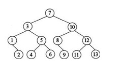

Q--在 1~13 的二叉排序树中,7 的左结点是否应为 4



A--否,二叉排序树的中序遍历是有序的，且为升序,若将 3,4 交换则中序遍历不再是升序数组

---

Q--数组传实参并改变数组内容时 `*temp[i]=i`报错

```c
void temp_num(int **temp)
{
    for (int i = 0; i < 10; ++i)
    {
        *temp[i] = i;
        printf("%d ", *temp[i]);
    }
}
int main()
{
    int *temp = (int *)malloc(sizeof(int) * 10);
    temp_num(&temp);
}
```

A--数组名本身即为地址,不需要再取地址,以下写法即可改变数组内容

```c
void temp_num(int *temp)
{
    for (int i = 0; i < 10; ++i)
    {
        temp[i] = i;
        printf("%d ", temp[i]);
    }
}
int main()
{
    int *temp = (int *)malloc(sizeof(int) * 10);
    temp_num(temp);
    printf("\n");
    for (int i = 0; i < 10; ++i)
    {
        printf("%d ", temp[i]);
    }
}
```

---

Q--异或操作是按位进行异或吗

A--异或操作直接按数据进行异或 不是按位进行异或

---

Q--VSCode 如何打开多个标签页,且仅可手动关闭,不会在打开新文件时自动替换

A--设置里取消勾选 Workbench › Editor:Enable preview

---

Q--已提交内存过大且无法释放

A--禁用打印机驱动并禁用 spoolsv.exe 和 splwow64.exe
