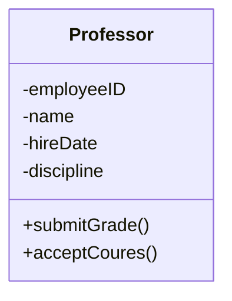
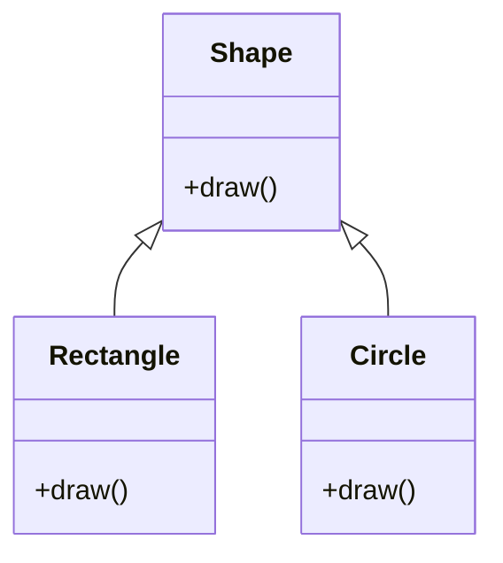
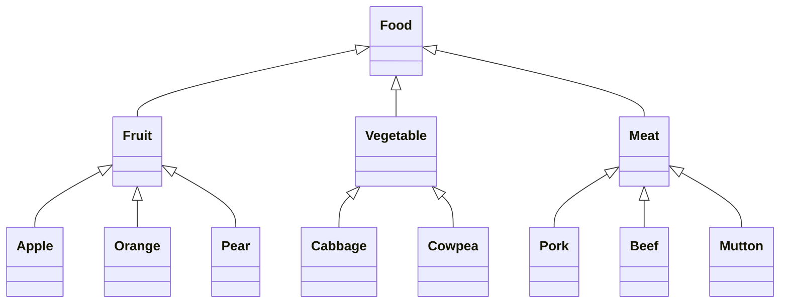
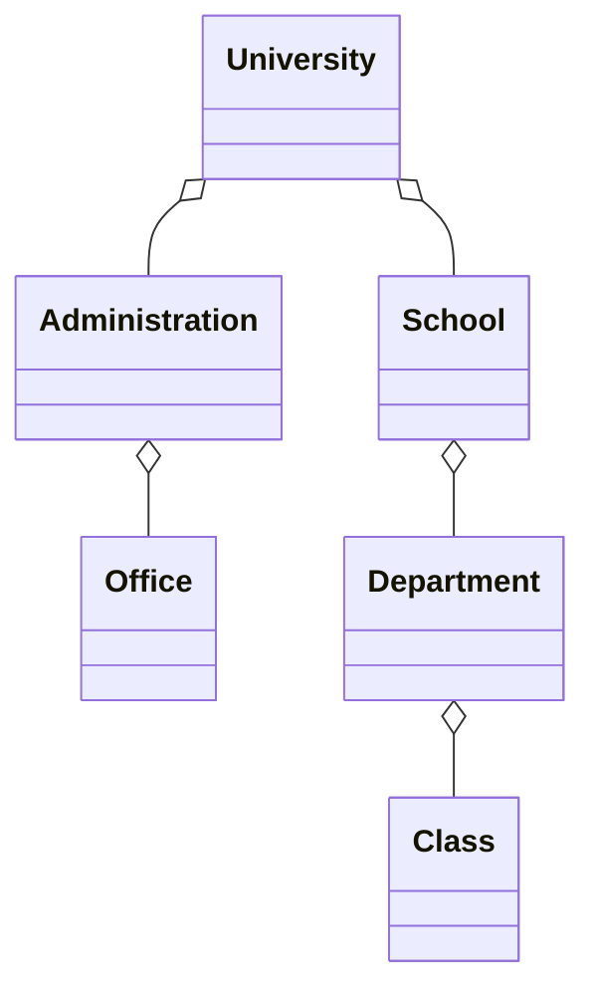

# 面向对象分析与设计

## 对象与类

### 对象

定义--对象是一个实体,具有明确定义的边界(Boundary)和标识(Identity),并且封装了状态(State)和行为(Behavior)

重要特征--

- 对象具有明确定义的边界和标识.边界意味着对象是一个封装体,通过封装来与其他对象分隔.而标识则表明每一个对象都是唯一的
- 对象封装了状态和行为.对象的状态通过对象的属性(Attribute)和关系(Relationship)来表达.

命名对象与匿名对象--

- 命名对象--J.Clark:Professor--一个名为 J.Clark 的 Professor 类的对象
- 匿名对象--:Professor--一个 Professor 类的对象,但没有名称

### 类

Professor 为类名,employeeID 为属性,submitGrade()为方法

类是静态的,它的存在,语义和关系在执行前就已经定义好了.而对象是动态的,在程序执行时可以被创建和删除

## 相关原则

### 抽象

将内容抽象化,保留重要内容,忽略其他不相关的内容

### 封装

对象隐藏具体的实现,即对访问者来说对象是透明的

### 分解

将单个大规模复杂系统划分为多个不同的小构件,构件通过抽象和封装等技术形成相对独立的单元,独立地设计和开发

### 泛化(继承)

一个类可以共享一个或多个类的结构和行为(继承)

可以进行单一继承和多重继承

### 多态

通过泛化支持多态

直接调用 Shape.draw()即可,不需要关注细节

### 分层

首先将系统分解成几个独立的部分(如先划分为若干层或若干模块),然后在此基础上对每个部分再进一步分解小的部分,这些小的部分有的还可以进一步分解,直至形成最小的独立单元(如类或函数)

分层(Hierarchy)--面向不同的目标建立不同的抽象级别层次,从而在不同的抽象层次对系统进行分解,进一步简化对系统的理解

在面向对象系统中,主要有两种层次结构--

- 类层次结构--在不同的抽象级别进行对象的抽象,高层的类抽象层次更高,其描述能力也越强,而越往下抽象层次越低,底层的类则最具体,代表具体的事物.这些类之间通过泛化关系形成一种层次结构,也称为继承层次结构.一般同一层次的抽象级别相同(Food 图)
- 对象层次结构--对象间的组成结构,即大的对象由小的对象组成(即分解成小的对象).通过类之间的聚合关系来实现的,也称为聚合层次结构(University 图)

### 复用

借助已有软件的各种有关知识建立新的软件,以缩减新软件开发和维护的成本
