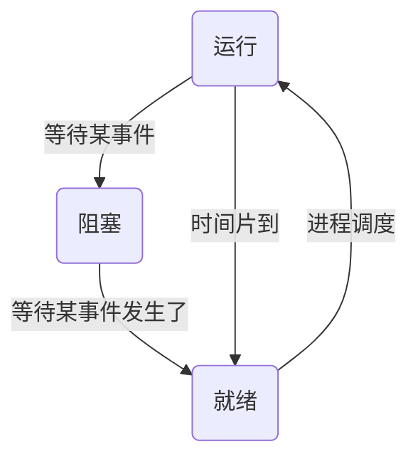

# 初级程序员

## 计组

### 寻址

寻址方式中,操作数在指令中称为立即寻址;

操作数在通用寄存器中称为寄存器寻址;

操作数在主存单元,而其地址在指令中称为直接寻址;

操作数在主存单元,而其地址在寄存器中称为寄存器间接寻址

主存主要由 DRAM(动态随机访问存储器)构成,其内部寻址方式是随机存取,也就是 CPU 给出需要访问的存储单元地址后,存储器中的地址译码部件可以直接选中要访问的存储单元

### CPU

CPU 中主要部件有运算单元,控制单元和寄存器,连接这些部件的是**片内总线**.系统总线用来连接微机各功能部件而构成一个完整的微机系统

单核 CPU 可以通过分时实现并行计算

### 存储

CMOS (Complementary Metal Oxide Semiconductor,互补金属氧化物半导体）是指制造大规模集成电路芯片用的一种技术或用这种技术制造出来的芯片,是计算机主板上的一块可读写的 RAM 芯片,用来保存 BIOS 设置完计算机硬件参数后的数据,这个芯片仅用来存放数据.

计算机启动时,CPU 从**CMOS**中读取硬件配置参数

主存储器主要由存储体,控制线路,地址寄存器,数据寄存器和地址译码电路等部分组成

硬盘的寻址信息由硬盘驱动号,圆柱面号,磁头号(记录面号),数据块号(或扇区号)以及交换量组成

硬磁盘的主要技术指标如下--道密度,位密度,存储容量,平均存取时间,寻道时间,等待时间,数据传输率

固态硬盘存储介质是**闪存芯片**,比机械硬盘功耗低

## 操作系统

利用 Windows 系统中的事件查看器将查看的事件分为应用程序事件,安全性事件和系统事件

### 系统类型

批处理操作系统是脱机处理系统,即在作业运行期间无须人工干预,由操作系统根据作业说明书控制作业运行

分时操作系统是将 CPU 的时间划分成时间片,轮流为各个用户服务,其设计目标是多用户的通用操作系统,交互能力强

分布式操作系统是网络操作系统的更高级形式,它保持网络系统所拥有的全部功能,同时又有透明性,可靠性和高性能等特性

实时操作系统的设计目标是专用系统,其主要特征是实时性强及可靠性高

### 系统操作算法

在操作系统设备管理中,通常不能采用时间片轮转分配算法

在操作系统中常用的磁盘调度算法有--

- 先来先服务是最简单的磁盘调度算法,它根据进程请求访问磁盘的先后次序进行调度,所以该算法可能会随时改变移动臂的运动方向
- 最短寻道时间优先算法根据进程请求,访问磁盘的寻道距离短的优先调度,因此该算法可能会随时改变移动臂的运动方向
- 电梯调度法的工作原理是先响应同方向(向内道或向外道方向)的请求访问,然后再响应反方向的请求访问,如同电梯的工作原理一样,因此该算法可能会随时改变移动臂的运动方向
- 单向扫描算法是电梯调度法的改进,该算法在返程时不响应请求访问,目的是为了解决电梯调度法带来的饥饿问题

### 进程



在请求分页系统中,当访问的页面不在主存时会产生一个缺页中断,缺页中断与一般中断的主要区别是缺页中断是在指令执行期间产生并进行处理的,而一般中断是在一条指令执行完,下一条指令开始执行前进行处理的.缺页中断在一条指令执行期间可能会产生多次,每当发生缺页中断并进行处理后,将返回到被中断指令开始重新执行

### 文件

操作系统文件管理中,目录文件由**文件控制块**组成

在 Windows 系统中的文件名最长可达 255 个字符

若要彻底删除某个文件,先选中该文件,并同时按下 Shift+Del 组合键

系统文件通常位于"Windows"文件夹或"ProgramFiles"文件夹中

Windows 系统中有两个通配符?,\*,其中?与单个字符匹配,\*与多个字符匹配

剪切板是内存的一块区域,是为应用程序之间相互传送信息所提供的一个缓冲区

"我的文档"和"我的公文包"是操作系统为了便于管理文件在磁盘上建立的文件夹

"回收站"是硬盘上的一块区域,用于存放从硬盘删除的文件

如果想一次选定连续的文件或文件夹,应单击需要选定的第一个文件或文件夹,按住 Shift 键并用鼠标左键单击需要选定的最后一个文件或文件夹.若选择不连续的多个文件或文件夹,可通过按住 Ctrl 键完成.

### 磁盘

在 Windows 系统中的磁盘碎片整理程序可以分析本地卷,使每个文件或文件夹占用卷上连续的磁盘空间,合并卷上的可用空间使其成为连续的空闲区域,这样系统就可以**更有效地访问文件或文件夹**,以及**更有效地保存新的文件和文件夹**.通过合并文件和文件夹,磁盘碎片整理程序还将合并卷上的可用空间,以减少新文件出现碎片的可能性.合并文件和文件夹碎片的过程称为**碎片整理**

硬磁盘的主要技术指标如下--道密度,位密度,存储容量,平均存取时间,寻道时间,等待时间,数据传输率.不包含存取周期

硬盘平均访问时间=平均寻道时间+平均等待时间

寻道时间是指磁头移动到目标磁道（或柱面)所需要的时间,由驱动器的性能决定,是个常数,由厂家给出

等待时间是指等待读写的扇区旋转到磁头下方所用的时间,一般选用磁道旋转一周所用时间的一半作为平均等待时间

提高磁盘转速缩短的是平均等待时间

DVD-RAM 和 DVD-RW 是 DVD 技术所支持的两种不同的可多次擦除重写的 DVD 光盘格式

CD-R 指一次性可写(刻录)CD 光盘

CD-RW 指可多次擦除,重写的 CD 光盘

### 接口

接口指两个相对独立子系统直接的相连部分,也被称为界面

#### I/O 接口

I/O 接口不仅完成设备物理上的连接,一般来说,还具有以下功能

- 地址译码功能-- 一个计算机系统中连接有多个 I/O 设备,相应的接口也有多个.为了能进行区别和选择,需要给它们分配不同的地址码
- 交换功能-- 在主机与 I/O 设备之间交换数据,控制命令及状态信息等
- 访问功能-- 支持主机采用程序查询,中断和 DMA 等访问方式
- 转换功能-- 进行数据的类型,格式等方面的转换
- 提供主机和 I/O 设备所需的缓冲,暂存,驱动能力,满足一定的负载要求和时序要求

当 Io 接口准备好接收数据或传送数据时,就发出中断信号通知 CPU.

对中断信号进行确认后,CPU 保存正在执行的程序的现场,转而执行提前设置好的 IO 中断服务程序,完成一次数据传送的处理.

这样,CPU 就不需要主动查询外设的状态,在等待数据期间可以执行其他程序,从而提高了 CPU 的利用率.

采用中断方式管理 I/O 设备,CPU 和外设可以并行地工作

直接存储器存取(Direct Memory Access, DMA)方式的基本思想是-- 通过硬件控制实现主存与 I/o 设备间的直接数据传送,数据的传送过程由 DMA 控制器(DMAC)进行控制,不需要 CPU 的干预.在 DMA 方式下,由 CPU 启动传送过程,即向设备发出“传送一块数据”的命令,在传送过程结束时,DMAC 通过中断方式通知 CPU 进行一些后续处理工作.

DMA 方式简化了 CPU 对数据传送的控制,提高了主机与外设并行工作的程度,实现了快速外设和主存之间成批的数据传送,使系统的效率明显提高.

## 程序设计

### 语言/环境

Delphi 是 Windows 平台下的应用开发工具和可视化编程环境

COBOL 是面向事务处理的语言

XML 即可扩展标记语言

PROLOG 是逻辑式语言

LISP 是函数式语言

Python 称为通用的脚本语言

Verilog HDL 是一种硬件描述语言,以文本形式来描述数字系统硬件的结构和行为的语言,用它可以表示逻辑电路图,逻辑表达式，还可以表示数字逻辑系统所完成的逻辑功能

#### 汇编

汇编语言源程序由若干条语句组成,可分为指令语句,伪指令语句和宏指令语句三类

指令语句又称为机器指令语句,将其汇编后能产生相应的机器代码,这些代码能被 CPU 直接识别并执行相应的操作

伪指令语句指示汇编程序在汇编源程序时完成某些工作,比如给变量分配存储单元地址,给某个符号赋一个值等,伪指令语句经汇编后不产生机器代码

在汇编语言中,还允许用户将多次重复使用的程序段定义为宏,宏指令语句就是宏的引用

如果源程序是用汇编语言编写的,则需要一个称为汇编程序的翻译程序将其翻译成目标程序后才能执行

#### 脚本语言

Ruby 是一种为简单快捷的面向对象编程而创建的**脚本语言**

脚本语言一般以文本方式存在

客户端脚本包括 VbScript 和 JavaScript

服务器脚本环境有许多,其中最流行的几种包括 ASP(Active Server Pages),JSP(Java ServerPages),ColdFusion,PHP 等,它们的主要区别仅在于语法上

#### 编译/解释

解释器翻译源程序时不产生独立的目标程序

编译器则需将源程序翻译成独立的目标程序

### 函数

函数定义是指对函数的完整定义,包括函数首部和函数体

一个方法被调用时,该方法关联其方法体的过程称为方法绑定

静态绑定是指在程序编译时进行绑定,动态绑定是指在运行时进行绑定,即根据实际情况有选择地进行绑定

### 类

面向对象中,基类和超类属于同一个概念,等价于面向对象继承关系中的父亲类,基类定义了一组对象的共有行为和属性

子类是集成关系中的孩子类,定义了特有的行为和属性;特化关系等价于继承关系,因此子类是基类或超类的特化

### 面向对象

面向对象分析的主要任务是描述用户需求,构建一个准确的,一致的模型以描述软件需要解决的问题,其结果是软件系统的分析模型

面向对象设计的主要任务则是描述系统如何解决问题,其结果是软件系统的设计模型

对象的属性表示了对象特有的与其他对象相互区分的特性

Peter Coad 和 Edward Yourdon 提出用下面的等式识别面向对象方法--
面向对象=对象(object)+分类(classification)+继承( inheritance)+通过消息的通信(communication with messages)

对象有三种成份--对象标识,属性和方法(或操作)

### 语法

逗号表达式的求值过程为-- 从左至右依次处理由逗号运算符","连接的运算对象先对左侧的表达式求值,结果丢弃,最后保留右侧表达式的值

```c
temp = (a = 2, b = 4, c = 8);
```

temp 的值为 8

### 变量

C 语言中越靠前定义的局部变量越靠近栈顶

共用体变量的大小取决于其**所需存储空间最大的成员**.
运行时系统为变量 rec 分配的空间大小为 4 字节(仅作为考试答案,实际情况根据编译器采用的对齐方式决定)

```c
struct union{
    char ch;
    int num;
}rec;
```

## 数据结构与算法

### 基本数据

#### 汉字

汉字的输入码主要分为三类-- 数字编码,拼音编码和字形码

### 树

#### 二叉树

设某二叉树中有 n 个结点,用$n_0,n_1,n_2$分别表示度为 0,1,2 的节点数.显然有$n=n_0+n_1+n_2$.**在任一非空二叉树中分支的数目正好比结点总数少 1,** 而二叉树中的分支正是结点与其子树的连接关系,因此有分支数 = $ 2 \cdot n_2+1 \cdot n_1 + 0 \cdot n_0$

### 排序

若待排序记录按关键字基本有序,则宜采用**直接插入排序**

排序和快速排序方法中,能在第一趟排序结束后就得到最大(或最小)元素的排序方法是冒泡排序和简单选择排序

简单选择排序中,关键字相同的记录在排序前后的相对位置可能交换

快速排序最不适用于数据基本有序的排序

冒泡排序是稳定的排序方式,简单选择排序不是稳定的排序方式

小根堆的第一个元素一定是最小元素,而最后一个元素不能保证是最大元素

## 软件工程

程序设计文档应在程序设计之初,而不是在代码调试结束之后开始编写,并在程序设计,编写代码和调试过程中不断修改,补充,完善

通过开发程序解决问题的过程中,问题建模与算法设计可以不考虑实现程序所用的语言,编写程序代码时则一定先要确定要采用的程序语言,编译调试工具更是针对特定语言开发的

软件设计注重软件的三大属性--软件架构,数据结构和详细的处理过程

### UML 建模

UML 中序列图,通信阁,活动图和交互概览图都用于建模系统动态方面

序列图描述以**时间顺序组织**的对象之间的交互动态视图

通信图强调收发消息的对象的结构组织

交互概览图描述交互（特别是关注控制流),但是抽象掉了消息和生命线

序列图,通信图和交互概览图都是交互图,活动图是一种特殊的状态图,它展现了在系统内从一个活动到另一个活动的流程

类图,组件图,包图和部署图都是展示系统静态结构的视图

类图中包含类,接口,协作和它们之间的依赖,泛化和关联等关系,常用于对系统的词汇进行建模

组件图专注于系统静态实现视图,展示一组构件之间的组织和依赖,与类图相关,通常把构件映射为一个或多个类,接口或协作.

包图用于把模型本身组织成层次结构,描述类或其他 UML 构件如何组织成包及其之间的依赖关系.

部署图给出了体系结构的静态实施视图,展示运行时处理结点以及其中构件的配置,它是 UML 图中唯一用来建模系统物理方面的图.

### 模型

#### XP

XP(极限编程)是一种轻量级（敏捷),高效,低风险,柔性,可预测的,科学的软件开发方式

它由价值观,原则,实践和行为四个部分组成,彼此相互依赖,关联,并通过行为贯穿于整个生存周期

其四大价值观包括沟通,简单,反馈和勇气

#### RUP

RUP 是统一过程的商业版本,是用例和风险驱动,以架构为中心,迭代的增量开发过程.

#### 螺旋模型

螺旋模型将开发过程分为几个螺旋周期,每个螺旋周期在前一个螺旋周期的基础上迭代进行开发.

#### 瀑布模型

瀑布模型将软件生存周期各个活动规定为依线性顺序连接的若干阶段的模型,适合于软件需求很明确的软件项目的模型

#### V 模型

V 模型是瀑布模型的一种演变模型,将测试和分析与设计关联进行,加强分析与设计的验证.

#### 原型模型

原型模型是一种演化模型,通过快速构建可运行的原型系统,然后根据运行过程中获取的用户反馈进行改进,**特别适用于对软件需求缺乏准确认识的情况**

### 软件周期

#### 设计

程序模块设计的原则--

- 规模适中
- 单入口,单出口
- 接口简单

在结构化设计中,根据数据流图进行体系结构设计和接口设计,根据数据字典和实体关系图进行数据设计,根据加工规格说明,状态转换图和控制规格说明进行过程设计

设计时按照用户切实需求设计,待应用一段时间后再考虑升级扩展

#### 项目开发管理

Gantt 图是一种简单的水平条形图,它以日历为基准描述项目任务,能清晰地描述每个任务从何时开始,到何时结束,任务的进展情况以及各个任务之间的并行性,但是它不能清晰地反映出各任务之间的依赖关系,难以确定整个项目的关键所在,也不能反映计划中有潜力的部分.

PERT 图是一个有向图,图中的箭头表示任务,它可以标上完成该任务所需的时间.PERT 图不仅给出了每个任务的开始时间,结束时间和完成该任务所需的时间,还给出了任务之间的关系,即哪些任务完成后才能开始另外一些任务,以及如期完成整个工程的关键路径,但是它难以清晰地反映任务之间的并行关系.

#### 测试

使用独立测试团队的最主要原因是-- 可以更彻底的进行软件测试

"先写测试方案再编程"的测试驱动开发使切实可行的,也有利于提高软件的质量

#### 运维

根据维护目的的不同,软件维护一般分为 4 类.

- 正确性维护是指改正在系统开发阶段已发生而系统测试阶段尚未发现的错误;
- 适应性维护是指使应用软件为适应信息技术变化和管理需求变化而进行的修改;
- 完善性维护是为扩充功能和改善性能而进行的修改,主要是对已有的软件系统增加一些在系统分析和设计阶段中没有规定的功能与性能特征;
- 预防性维护是为了改进应用软件的可靠性和可维护性及适应未来的软硬件环境的变化,而主动增加预防性的新功能,以使应用系统适应各类变化而不被淘汰

### 企业应用

企业信息化应从**企业战略和业务的角度**来规划企业的信息系统.通过一体化的基础设施资源管理平台解决企业技术架构和基础设施的融合问题.

企业管理,电子政务,电子商务等应用中,科学计算量不大,重点是按流程进行规范处理,在处理过程中特别强调人机交互,因此,**弱计算,强流程,多交互**是这些应用的特点

## 数据库

### 转储

数据的转储分为

- 静态转储-- 在转储期间不允许对数据库进行任何存取,修改操作;
- 动态转储-- 在转储期间允许对数据库进行存取,修改操作,故转储和用户事务可并发执行.
- 海量转储-- 每次转储全部数据;
- 增量转储-- 每次只转储上次转储后更新过的数据.

### 事务

事务具有原子性,一致性,隔离性和持久性,被称为事务的 ACIC 性质

- 原子性-- 事务是原子的,要么都做,要么都不做
- 一致性-- 事务执行的结果必须保证数据库从一个一致性状态变到另一个一致性状态,因此,当数据库只包含成功事务提交的结果时,称数据库处于一致性状态
- 隔离性-- 事务相互隔离.当多个事务并发执行时,任一事务的更新操作直到其成功提交的整个过程,对其他事务都是不可见的
- 持久性-- 一旦事务成功提交,即使数据库崩溃,其对数据库的更新操作也将永久有效

### 数据

#### 数据控制

数据控制功能包括对数据库中数据的安全性,完整性,并发和恢复的控制.

- 安全性(security)-- 指保护数据库受恶意访问,即防止不合法的使用所造成的数据泄露,更改或破坏.这样,用户只能按规定对数据进行处理,例如,划分了不同的权限,有的用户只能有读数据的权限,有的用户有修改数据的权限,用户只能在规定的权限范围内操纵数据库
- 完整性( integrality)-- 指数据库正确性和相容性,是防止合法用户使用数据库时向数据库加入不符合语义的数据.保证数据库中数据是正确的,避免非法的更新
- 并发控制(concurrency control)-- 指在多用户共享的系统中,许多用户可能同时对同一数据进行操作.DBMS 的并发控制子系统负责协调并发事务的执行,保证数据库的完整性不受破坏,避免用户得到不正确的数据
- 故障恢复(recovery from failure)-- 数据库中的 4 类故障是事务内部故障,系统故障,介质故障及计算机病毒.故障恢复主要是指恢复数据库本身,即在故障引起数据库当前状态不一致后,将数据库恢复到某个正确状态或一致状态.恢复的原理非常简单,就是要建立冗余(redundancy)数据.换句话说,确定数据库是否可恢复的方法就是其包含的每一条信息是否都可以利用冗余地存储在别处的信息重构.冗余是物理级的,通常认为逻辑级是没有冗余的

#### 数据模型

数据模型主要有网状模型,层次模型,关系模型和面向对象模型

尽管采用网状模型和层次模型的网状数据库和层次数据库已经很好地解决了数据的集中和共享何题,但是在数据独立性和抽象级别上仍有很大欠缺.用户在对这两种数据库进行存取时,仍然需要明确数据的存储结构,指出存取路径

而后来出现的采用关系模型的关系数据库则较好地解决了这些问题,因为,关系模型是采用二维表格结构表达实体类型及实体间联系的数据模型.关系模型有严格的数学基础,抽象级别比较高,而且简单清晰,便于理解和使用

构成数据模型的三要素是-- 数据结构,数据操作,完整性约束

### ADO

微软公司的 ADO (ActiveX Data Objects)是一个用于存取数据源的 COM 组件.它是编程语言和统一数据访问方式 OLE DB 的一个中间层,允许开发人员编写访问数据的代码,到数据库的连接,而不用关心数据库的实现

ADO 提供四种类型的集合--

- Connection 对象负责与数据库实际的连接动作,代表与数据源进行的唯一会话
- Command 对象负责对数据库提供请求,也就是传递指定的 SQL 命令
- Recordset 对象负责浏览和操作从数据库中取出的数据,对象表示的是来自基本表或命令执行结果的记录全集
- Err 对象是用来判断发生什么错误

## 网络与信息安全

### 网络传输

ADSL 是以普通铜质电话线为传输介质的 Internet 接入技术

IFC 则是光纤与同轴电缆混合,借助已铺设好的电视电缆接入

FTTx 是采用光纤接入的一种技术,包括光纤到小区,光纤到户等

Wi-Fi 采用无线介质进行接入

### 防火墙

防火墙一般分为包过滤型,应用级网关和复合型防火墙（(集合包过滤与应用级网关技术)

应用级网关防火墙是内部网和外部网的隔离点,可以对应用层的通信数据流进行监控和过滤

Web 防火墙是一种针对网站安全的入侵防御系统,一般部署在 Web 服务器上或者 Web 服务器的前端

包过滤防火墙对数据包的过滤依据包括-- 源 IP 地址,源端口号,目标 IP 地址和目标端口号.不包括 MAC 地址

防火墙对数据包信息的过滤是通过对数据包的 IP 头和 TCP 头或 UDP 头的检查来实现的,主要信息有 IP 源地址,IP 目标地址,协议,数据包到达以及出去的端口等

防火墙**不能自主判断**所有来自网络的 URL 地址是否存在安全隐患

防火墙不能过滤病毒

防火墙的网络地址转换功能(NAT,NetworkAddressTranslation)是一种将私有（保留）地址转化为合法 IP 地址的转换技术,NAT 不仅完美地解决了 IP 地址不足的问题,而且还能够有效地避免来自网络外部的攻击,隐藏内部网络 IP 地址及拓扑结构信息

常作为网络边界防范的是**防火墙**

### 数字签名

数字签名通常需要对消息进行哈希运算,提取摘要,然后对摘要采用**发送方的私钥**进行加密,接收方采用**发送方的公钥**来验证签名的真伪

### 网络协议

在 TCP/IP 网络中,RARP 协议的作用是根据 MAC 地址查找对应的 lP 地址,ARP 协议的作用是根据 IP 地址查找对应的 MAC 地址

在 TCP/IP 协议簇中主要有两个传输层协议,TCP 为可靠的传输层协议,UDP 为不可靠的传输层协议

HTTPS(Hyper Text Transfer Protocol over SecureSocket Layer),是以安全为目标的 HTTP 通道,即使用**SSL**加密算法的 HTTP

在 TCP/IP 协议栈中,ARP 协议属于网络层,作用是由 IP 地址查找对应的 MAC 地址,RARP 协议的作用正好相反,是由 MAC 地址查找对应的 IP 地址.

ICMP 协议是 TCP/IP 网络中的网络层协议,其报文封装在 IP 协议数据单元中传送.

CSMA/CD 是以太网中介质访问控制协议,不属于 TCP/IP 协议集合

DNS 属于应用层协议,UDP 为传输层协议,IP 和 ARP 是网络层协议

### 数据加密

防范网络监听最有效的方法是**数据加密**

MD5 的全称是 Message-digest Algorithm5(信息/报文摘要算法),是计算机安全领域广泛使用的一种散列函数,用以提供消息的完整性保护

加密算法根据加密密钥和解密密钥是否相同分为共享密钥算法和公钥加密算法.若使用的加密密钥和解密密钥是相同的,则称为共享密钥算法,而使用不同的密钥进行加密和解密的算法称为公钥加密算法

DES,AES 和 IDEA 都是共享密钥算法

RSA 是公钥加密算法

证书颁发机构(Certificate Authority, CA)是负责发放和管理数字证书的权威机构,并作为电子商务交易中受信任的第三方,承担公钥体系中公钥的合法性检验的责任.

CA 中心为每个使用公开密钥的用户发放一个数字证书,以证明证书中列出的用户合法拥有证书中列出的公开密钥.CA 机构的数字签名使得攻击者不能伪造和篡改证书.在 SET 交易中,CA 不仅对持卡人,商户发放证书,还要对获款的银行,网关发放证书

### 电子邮件

Outlook Express 是微软公司开发的应用最广泛的,专门用于管理电子邮件,新闻组的应用软件,其实质是**邮件客户端**.

常用的电子邮件协议有 SMTP,POP3,IMAP4,它们都隶属于 TCP/IP 协议簇,默认状态下,分别通过 TCP 端口 25,110 和 143 建立连接.

MIME (Multipurpose Internet Mail Extensions,多用途互联网邮件扩展类型）是设定某种扩展名的文件用一种应用程序来打开的方式类型,当该扩展名文件被访问的时候,浏览器会自动使用指定应用程序来打开.它是一个互联网标准,扩展了电子邮件标准,使其能够支持--非 ASCII 字符文本;非文本格式附件（二进制,声音,图像等);由多部分(multiple parts)组成的消息体;包含非 ASCII 字符的头信息(Header information).因此,电子邮件发送多媒体文件附件时采用 MIME 协议来支持邮件传输.

### 网络地址

公共互联网中的地址不能是规定的私网地址

在 IE 浏览器中,安全等级从可信站点,本地 Intranet,Internet 到受限站点默认情况下依次为低,中低,中,高,逐步提升

### 网络攻击

网络攻击(Cyber Attacks,也称赛博攻击)-- 指对计算机信息系统,基础设施,计算机网络或对个人计算机设备的.任何类型的进攻动作.

对于计算机和计算机网络来说,破坏.揭露,修改,使软件或服务失去功能,在没有得到授权的情况下偷取或访问计算机系统的数据,都被视为对计算机和计算机网络的攻击

主动攻击-- 篡改,伪造消息数据和终端(拒绝服务),会导致某些数据流的篡改和虚假数据流的产生

被动攻击-- 窃听,流量分析,破解弱加密.不对数据信息做任何修改,在未经用户同意的情况下,攻击者获得了相关信息和数据

### 网络设备

中继器是网络物理层的一种介质连接设备,其作月是对接收的信号进行再生放大,以延长传输的距离

网桥是一种数据链路层设备,它处理的对象是数据链路层的协议数据单元——中贞,其处理功能包括检查帧的格式,识别 MAC 地址,进行差错校验,识别目标地址,选择路由并实现帧转发等.更准确地说,网桥包含了物理层和数据链路层两个功能层次,所以在以太网中,网桥也能起到延长传输距离的作用

交换机是由硬件构成的多端口网桥,交享介质变成了专用链路,使得网络的有效数据速率大大提高,也是一种数据链路层设备

路由器是网络层设备,可以识别 IP 地址,进行数据包的转发

集线器是一种物理层设备,所有端口构成一个广播域,同时也是一个冲突域,还有检测冲突的作用

交换机的每一个端口构成一个冲突域,接在不同端口上的主机分属于不同的广播域

### 病毒

- 文件型计算机病毒-- 感染可执行文件（主要感染类型为 EXE 和 COM 文件)
- 引导型计算机病毒-- 影响软盘或硬盘的引导扇区
- 宏病毒-- 感染的对象是使用某些程序创建的文本文档,数据库,电子表格等文件
- 目录型计算机病毒-- 能够修改硬盘上存储的所有文件的地址,如果用户使用某些工具(如 SCANDISK 或 CHKDSK)检测受感染的磁盘,会发现大量的文件链接地址的错误,这些错误都是由此类计算机病毒造成的

Js.Fortnight.c.s 和 VBS.Happytime 是脚本病毒,Macro.Melissa 是宏病毒,这三种病毒都属于单机病毒

Trojan.QQ3344 是一种特洛伊木马,它通过网络来实现对计算机的远程攻击

木马程序一般分为服务器端(Server)和客户端(Client),服务器端是攻击者传到目标机器上的部分,用来在目标机上监听等待客户端连接过来.客户端是用来控制目标机器的部分,放在攻击者的机器上

常见的木马程序-- BackOffice,Netbus,Netspy,YAI,SubSeven,冰河,广外女士等

### VPN

VPN 主要采用 4 项技术来保证安全,这 4 项技术分别是隧道技术(Tunneling),加解密技术
(Encryption&Decryption),密钥管理技术(KeyManagement),使用者与设备身份认证技术(Authentication)

### 网络命令

net view 命令用于显示计算机共享资源列表,带选项使用本命令显示前域或工作组计算机列表

nbtstat 显示基于 TCP/IP 的 NetBIOS(NetBT)协议统计资料,本地计算机和远程计算机的 NetBIOS 名称表和 NetBIOS 名称缓存.nbtstat-r 显示 NetBIOS 名称解析统计资料

netstat 是控制台命令,是一个监控 TCP/IP 网络的非常有用的工具,它可以显示路由表,实际的网络连接以及每一个网络接口设备的状态信息,nbstat 用于显示 IP,TCP,UDP 和 ICMP 协议相关的统计数据,一般用于检验本机各端口的网络连接情况

nslookup 是一个监测网络中 DNS 服务器是否能正确实现域名解析的命令行工具

### 服务器

在 Windows 系统中,FTP 组件通常集成在 IIS 中,故通过安装 IIS 组件来创建 FTP 站点

Gopher 服务器--提供分类的文档查询及管理.它将网络中浩瀚如海的信息分门别类地整理成菜单形式,提供给用户快捷查询并选择使用

Telnet 服务器--提供远程登录服务.一般使用 Telnet 协议.使用 Telnet 可以实现远程计算机资源共享,也就是指使用远程计算机就和使用本地计算机一样.很多 BBS(电子公告牌)就是使用该协议来实现

FTP 服务器--提供文件的上传和下载服务.一般使用 FTP 协议.使用该协议可以实现文件共享,可以远程传递较大的文件.同时,该服务器也提供存放文件或软件的磁盘空间.

E-mail 服务器--提供电子邮件服..一般都支持 SMTP 和 POP3 协议.该服务器用来存放使用电子邮件用户的邮件并且维护邮件用户的邮件发送.

Web 服务器--提供 www 服务.一般使用 HTTP 协议来实现.浏览器软件必须通过访问 Web 服务器才能获取信息.

## 标准化与知识产权

对计算机软件的保护的法律不涉及**知识产权法**

构成我国保护计算机软件著作权的两个基本法律文件是《中华人民共和国著作权法》和《计算机软件保护条例》

根据 **《著作权法》** 和 **《计算机软件保护条例》** 的规定,计算机软件著作权的权利自**软件开发完成之日**起产生,保护期为 **50** 年.保护期满,除开发者身份权以外,其他权利终止.一旦计算机软件著作权超出保护期,软件就进入公有领域

通过改编,翻译,注释,整理已有作品而产生的作品是演绎作品,其著作权属于改编人,翻译人,注释人和整理人.

汇编作品指对若干作品,作品的片段或者其他材料内容经选择或者编排体现独创性的作品,其著作权属于汇编人.

受他人委托创作的作品是委托作品,其著作权由合同约定.如果合同中未作明确约定或者没有订立合同的,著作权属于受托人即作者.

商标法保护商标注册人,而不是商标使用人

软件著作权保护的对象不包括**算法思想**

根据《计算机软件保护条例》的规定,当**软件作品创作完成并固定在某种有形物体上**后,其软件著作权才能得到保护

软件著作权中翻译权是指**将原软件从一种程序设计语言转换成另一种程序设计语言**而不是将软件的操作界面或者程序中涉及的语言文字翻译成另一种语言文字

## 数学

数控编程中,需要**5**个独立参数就可以确定一段圆弧

4 个独立参数可以确定一个正方形

## 多媒体

在 Windows 系统中,若要移动窗口,可用鼠标拖动窗口的**标题栏**

8 位声卡中的"8 位"指声音最大量化位数是 8

### 文件扩展

- AVI(Audio Video Interleaved)是微软开发的一种符合 RIFF 文件规范的数字音频与视频文件格式
- GIF 是 CompuServe 公司开发的图像文件格式,它以数据块为单位来存储图像的相关信息
- WAV 文件是 Windows 系统中使用的标准音频文件格式,它来源于对声音波形的采样,即波形文件
- XLS 一般指 Microsoft Excel 工作表（一种常用的电子表格格式)文件扩展名
- Quick Time 文件(.mov,.qt)是 Apple 公司开发的一种音频,视频文件格式,用于保存音频和视频信息,具有先进的视频和音频功能,提供跨平台支持
- MID 是目前较为成熟的音乐格式
- BMP 是一种图像文件格式,属于典型的位图格式.采用位映射存储格式,除了图像深度可选以外,不采用其他任何压缩
- PNG(便携式网络图形)是一种**无损压缩的位图格式**,其设计目的是试图替代 GIF 和 TIFF 文件格式,同时增加一些 GIF 文件格式所不具备的特性
- MPG 又称 MPEG,是一种动态图像格式

### Excel

ROUND(x,digit)函数用来求 x 的四舍五入值.当 digit 大于 0,四舍五入到指定小数位,当 digit 等于 0,四舍五入到最接近的整数,digit 小于 0 时,在小数点左侧第 digit 位进行四舍五入

SUM()函数使用逗号分隔参数

LEFTB 基于所指定的**字节数**，返回文本字符串中的第一个或前几个字符

LEFT(text,num_chars)函数的功能是根据所指定的**字符数**返回文本字符串中第一个字符或前几个字

### Word

绘制圆-- 选择"绘图"工具栏,单击"椭圆"按键,再按住 Shift 键

在 Word 的编辑状态下,若光标停在某个段落中的任意位置时,用户设置字体格式为"微软雅黑",则所设置的字体格式应用于**光标处新输入的文本**

若要将文档中选定的文字移动到文档的另一个位置上,应该按下鼠标左键或者同时按下"Shift"键及鼠标左键,即可将选定的文字拖曳至该位置上

若要修改已输入的公式,只需双击此公式,打开公式编辑窗口,再进行修改即可

在 Word 2003 的编辑状态下,将光标移至文本行首左侧空白处呈箭头形状时,若单击鼠标左键,则可以选中一行;若双击鼠标左键,则可以选中一段落;若三击鼠标左键,则可以选中全文

### 点播电视系统

点播电视系统(VOD)又称交互式电视,它是一种受观众（用户）控制的电视系统

点播电视系统主要由视频服务器,编码器/路由器,用户请求和记账计算机,电视机机顶盒构成

视频服务器的主要功能是大容量视频存储,节目检索和服务,快速传输;

编码器/路由器的主要功能是按用户的需求,将节目和服务数据经过选定分配到用户;

用户请求和记账计算机的主要功能是接受用户访问,服务管理（包括服务类型,更新修改服务及各种服务的收费问题);

电视机机顶盒是用户用于节目选择与 VOD 系统交互通信的用户端设备.其主要功能是把用户选择传送给服务器,提供用户基本的控制功能等

点播电视系统用户端必须配备的是**机顶盒**

### 信号转化处理

音频信号经计算机系统处理后送到扬声器的信号是**模拟信号**

话筒是向计算机提供声音信号的设备,作用是将自然声音信号转化为**电信号(模拟声音信号)**,然后送到音频卡(声卡),将话筒输入的声音信息进行模数转换(A/D),压缩等处理

在某些特定的时刻获取模拟声音并转换为数字声宵的过程称为采样

声音信号的数字化过程就是在时间和幅度两个维度上的离散化过程.采样是把时间连续的模拟信号在时间轴上离散化的过程,在某些特定的时刻获取声音信号幅值叫作采样.量化处理是把在幅度上连续取值（模拟量)的每一个样本转换为离散值（数字量)表示,即对样本的幅度值进行 A/D 转换（模数转换)
