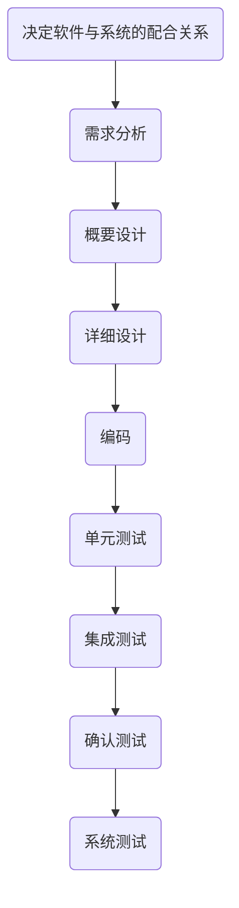
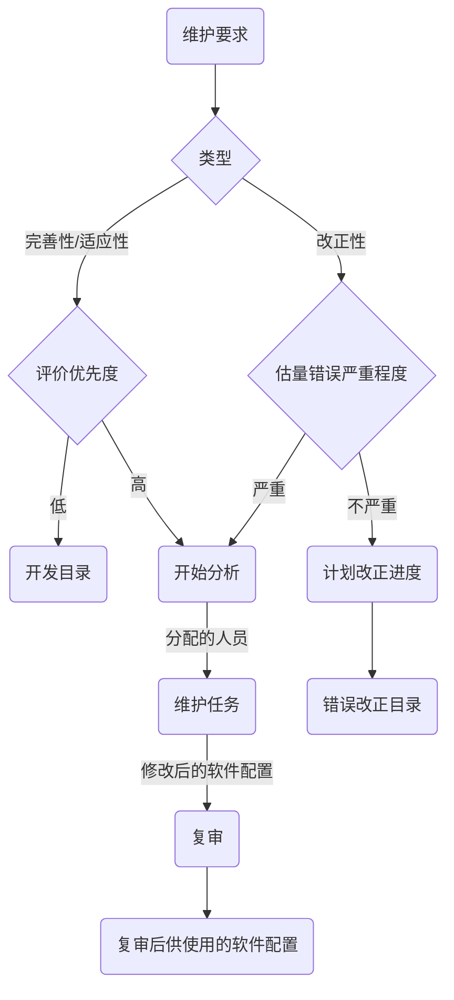

# 软件工程

## 第一章 概述

### 1.软件

软件是计算机程序、规程以及运行计算机系统可能需要的相关文档和数据，从软件的内容来看，软件更像是一种嵌入式的数字化知识，其形成是一个通过交互对话和抽象理解而不断演化的过程，根据软件服务对象的范围，一般分为通用和定制两种.

- 通用软件(Generic Software)：由软件开发组织开发、面向市场用户公开销售的独立运行系统（优点：一次开发，多次出售 缺点：有风险）
- 定制软件(Customized Software )：由某个特定用户委托、软件开发组织在合同的约束下开发的软件（优点：满足用户个性化需求 缺点：重复利用性差）

### 2.软件的特性

- 复杂性
- 不可见性
- 可变性
- 一致性

软件是复杂的，软件是人类思维和智能的一种延伸和在异体上的再现，远比任何以往人类的创造物都要复杂的多，软件的复杂性是软件的固有属性、本质特性.

软件是不可见的，软件是客观世界空间和计算机空间之间的一种逻辑实体，不具有物理的形体特征.

软件是不断变化的，它需要随着应用、硬件、用户和社会等各种因素的变化而不断的被修改和扩展.

软件必须遵从人为的惯例并适应已有的技术和系统，软件需要随接口的不同而改变，随时间的推移而变化，而这些变化是不同的人设计的结果，许多复杂性来自保持与其他接口的一致，对软件的任何再设计，都无法简化这些复杂特性.

### 3.软件工程三要素

软件工程以关注软件质量为目标，包括过程、方法和工具三要素

- 过程: 支持软件生命周期的所有活动
- 方法: 为软件开发过程提供"如何做"的技术
- 工具: 为软件开发方法提供自动的或半自动的软件支撑环境

### 4.ISO9126 软件质量的六个一级特性

- 功能性：在指定条件下使用时，软件产品提供满足明确和隐含需求功能的能力
- 可靠性：在指定条件下使用时，软件产品维持规定的性能级别的能力(在规定的条件下，在规定的时间内，软件不引起系统失效的概率)；
- 易用性（可使用性）：在指定条件下使用时，软件产品被理解、学习、使用及其吸引用户的能力；
- 效率（有效性）：在规定条件下，相对于所用资源的数量，软件产品可提供适当性能的能力；
- 可维护性：软件产品可被修改的能力，修改可能包括修正、改进或者适应环境、需求和功能规约的变化；
- 可移植性：软件产品从一种环境迁移到另一种环境的能力.

## 第二章 软件过程

### 1.软件过程

软件过程是软件工程人员为了获得软件产品而在软件工具的支持下实施的一系列软件工程活动.

### 2.软件过程的基本活动

1. 问题提出（可行性分析）：对开发任务进行调研和分析，研究系统的可行性和可能的解决方案，确定开发总目标和范围.
2. 软件需求规格说明：软件需求规格说明描述软件功能、列出约束条件、定义软件的输入和输出接口.
3. 软件设计：软件设计是根据需求规格说明，确定软件体系结构，进一步设计每个系统部件的实现算法、数据结构及其接口等，编写软件设计说明书.
4. 软件实现：软件实现是将所设计的各个子系统编写成计算机可接受的程序代码.
5. 软件确认：检查和验证所开发的系统是否符合用户的期望.
6. 软件演化：软件的内在本质是灵活的和可变的.随着业务需求的变化，软件必须进化和变更.尽管在开发过程和演化（维护）过程之间存在划分，但是现实中全新的系统越来越少.

### 3.软件过程模型

软件过程模型描述软件过程的整体框架，是软件过程的一种抽象表示.

软件过程模型包括：瀑布模型、快速原型模型、增量模型、螺旋模型、形式化方法模型、基于组件的开发模型

- 瀑布模型: 将软件过程划分为需求定义与分析、软件设计、软件实现、软件测试、软件运行与维护等一系列基本活动.以上活动自上而下、相互衔接的固定顺序，如瀑布流水，逐级下落.
- 快速原型模型: 快速原型模型的第一步是迅速构建一个可以运行的软件原型，实现用户与系统的交互，由用户对该原型进行评价，进一步细化待开发软件需求.结果逐步调整使其满足用户的要求之后，开发人员可以将用户的真正需求确定下来.第二步则在第一步的基础上开发用户满意的软件.（特点：有效适应用户需求的变化不知循环多少次，进度难以控制）
- 增量模型: 增量模型在各个阶段并不一定交付一个可运行的完整产品，而是交付满足用户需求的一个子集.第一个增量往往是实现基本需求的核心产品，交付用户使用后，经过评价形成下一个增量的开发计划，其中包括对核心产品的修改和一些新功能的发布.这个过程在每个增量发布后不断重复，直到产生最终的完善产品.
- 螺旋模型 :将瀑布模型和快速原型模型结合起来，强调了风险分析，特别适合大型复杂软件系统（优点：风险驱动（关注软件的重用、关注早期错误的消除、将质量目标放在首位、将开发阶段与维护阶段结合在一起）（缺点：需要风险评估的经验适应内部大规模软件开发）
- 形式化方法模型: 首先将软件需求描述提炼成采用数学符号表达的形式化描述；然后经过一系列的形式化转换将形式化描述转换成可执行程序；最后将整个系统集成起来测试. (优点：由于数学方法具有严密性和准确性，形式化方法开发过程所交付的软件系统具有较少的缺陷和较高的安全性) (缺点：开发人员需要具备一定技能并经过特殊训练;形式化描述和转换是一项费时费力的工作,成本高，质量不一定高;现实应用的系统大多数是交互性强的软件，但是这些系统难以用形式化方法进行描述)

### 4.软件设计基础

- 软件体系结构
- 软件过程
- 模块化
- 抽象
- 信息隐蔽
- 信息局部化

### 5.软件的总体结构

- 软件的组成部分
- 软件的层次关系
- 模块的内部处理逻辑
- 模块之间的界面

### 6.SRS(软件说明大纲)

- 1 前言
  - 1.1 目的
  - 1.2 范围
  - 1.3 定义,缩写词,略语
  - 1.4 参考资料
- 2 任务概述(项目概述)
  - 2.1 产品描述
  - 2.2 产品功能
  - 2.3 用户特点
  - 2.4 一般约束
  - 2.5 假设和依据
- 3 具体需求
  - 3.1 数据描述
  - 3.2 功能描述
  - 3.3 接口
  - 3.4 性能需求
  - 3.5 属性
  - 3.6 其他需求

### 7.软件体系结构

- 过程构件(模块)的层次结构
- 构件间交互的方式
- 构件的数据结构

### 8.系统流程图

早于 DFD 的一种建模工具

它以**图形方式**说明系统中的**控制流**和**数据流**

## 第三章 软件项目管理

### 1.项目管理(PM)

就是在项目活动中运用相关知识, 技能, 工具和技术满足项目的要求.

### 2.项目管理的五个阶段

启动、计划、监督、控制、收尾

- 启动: 确定项目范围、组建项目团队、建立项目环境
- 计划: 确定项目活动、预算项目成本、制定进度计划
- 实施（监督+控制）: 监控项目执行、管理项目风险、控制项目变更
- 收尾: 客户验收项目、安装培训软件、总结项目经验

### 3.Albrecht 的软件信息域的 5 个基本特征

- 外部输入：用户进行添加或修改的表格.
- 外部输出：产生的报表输出和屏幕输出.
- 外部查询：独立查询.
- 内部逻辑文件：软件修改或保存的逻辑纪录集合.
- 外部接口：与其他系统进行信息交换或共享的 文件.

### 4.软件风险

一个不确定的事件或者情况，若其一旦发生，会对项目的目标，例如，范围、进度、成本和质量，产生积极或消极的影响.

- 特点: 事先难以确定；一旦发生将带来损失，影响项目实施，甚至会导致项目失败
- 类别: 软件规模、商业影响、客户特性、软件过程、开发技术、开发环境、开发人员

### 5.软件风险管理过程

风险识别 → 风险评估 → 风险管理计划 → 风险监控

风险识别是试图采用系统化的方法，识别特定项目已知和可预测的风险 风险识别的常用方法是建立风险条目检查表，即利用一组提问来帮助项目管理者了解在项目和技术方面的一些风险.

## 第四章 需求工程

### 1.不同角度的需求

- 业务需求：定义了软件的远景和范围.
- 用户需求：反映了用户使用该系统需要完成的任务.
- 性能需求: 软件开发的技术性指标

  - 存储容量限制
  - 执行速度,响应时间
  - 吞吐量

- 功能需求：系统需要具备的功能.

  - 系统做什么
  - 系统何时做
  - 系统何时及如何修改或升级

- 非功能需求：系统应该具备的性能.
- 数据需求

  - 输入输出数据的格式
  - 接收,发送数据的频率
  - 数据的精确度和单位
  - 数据的有效性

- 系统需求：面向开发人员、详细描述系统应该做什么. 软件的功能需求必须根据用户需求来考虑，而且应该与业务需求定义的目标相一致
- 软件成本消耗和开发进度需求
- 质量保证

### 2.软件需求分析

1. 分析问题
2. 问题评估和方案综合
3. 建模
   - 物理建模
   - 逻辑建模
4. 规约
5. 复审

#### 1.获取需求的目的

- 清楚的理解所要解决的问题
- 完整的获取用户的需求

#### 2.需求获取面临的挑战

- 问题空间理解
- 人与人之间的通信
- 需求的不断变化
- 不完备性和不一致性

### 3.功能需求

描述系统应该提供的功能或服务，通常涉及用户或外部系统与该系统之间的交互，一般不考虑系统的实现细节

### 4.非功能需求

是从各个角度对系统的约束和限制，反映了应用对软件系统质量和特性的额外要求，包括过程需求、产品需求和外部需求等类型.

### 5.需求工程

需求工程是应用已证实有效的原理和方法，并通过合适的工具和符号，系统地描述出待开发系统及其行为特征和相关约束.

- 需求管理：在开发过程中有效地管理和控制需求变更.
- 需求获取：开发人员聆听客户的需求，观察用户的行为；
- 需求分析：分析和整理所收集的用户需求；
- 需求规格说明：以文档形式，精确地阐述一个软件系统 必须提供的功能和性能以及它所要考虑的限制条件；
- 需求验证：使用评审和商议等有效手段对其进行验证， 最终形成一个需求基线；

### 6.需求获取技术

用户面谈、需求专题讨论会、现场考察、原型化方法、基于用例的方法 基于用例的方法 通过用例模型，明确系统功能

特点：以任务和用户为中心、有助于客户了解系统功能、有助于开发人员理解用户需求、可以采用面向对象分析和设计方法将用例转化为设计模型

### 7.需求验证

- 正确性
- 无二异性
- 完整性
- 可验证性
- 一致性
- 可理解性
- 可修改性
- 可被跟踪性
- 可跟踪性
- 设计无关性
- 注释

## 第五章 软件标准

### 1.模块化标准

- 模块可分解性
- 模块可组装性
- 模块可理解性
- 模块连续性
- 模块保护性

1. 模块功能的完善化(完整的模块应包括三部分):

   - 执行规定功能的部分
   - 出错处理部分
   - 需返回给调用者数据时,返回是否正确结束标志

2. 修改模块结构方法:

   - 将包含条件判定的模块合并到它的调用模块中,使判定处于较高的位置
   - 将接受判定影响的模块下移到控制范围内
   - 增加模块的重用性
   - 减少高扇出,争取高扇入
   - 模块大小适中
     - 模块过大: 可理解程度下降
     - 模块过小: 开销大于有效操作,系统接口复杂
   - 降低模块接口的复杂性.接口传递信息应简单且和模块功能一致
   - 模块应单入口单出口

### 2.抽象

解决问题时只考虑与问题有关的方面,不考虑不问题无关的方面,即抽出事物的本质特性而不考虑细节.

### 3.信息隐蔽

含义:有效化的模块可以通过定义一组独立模块来实现,这些模块互相之间只交流软件功能必需的信息.
目的:提高模块的独立性,减少修改或系统维护时的影响面.

### 4.软件质量因素

- 可维护性
- 可靠性
- 可理解性
- 效率

### 5.模块的独立性

含义:

- 模块完成独立的功能
- 符合信息隐蔽和信息局部化原则
- 模块间关联的依赖尽量小

质量: 模块独立性取决于模块的内部和外部特征

目标:建立模块间耦合度尽可能松散,内聚性尽可能高的系统.

耦合是直接的主导因素,内聚辅助度量

规则:

- 改进软件结构提高模块独立性
- 模块规格应该适中
- 深度,宽度,扇出和扇入都应适当
- 模块的作用域应该在控制域之内
- 力争降低模块接口的复杂程度
- 设计单入口单出口的模块模块功能应该可以预测

### 6.耦合性

模块间的耦合性(模块间相互依赖程度的质量,取决于模块间接口的复杂程度,进入或访问模块数,以及通过接口的数据):松
模块自身的内聚性:紧

耦合性越高,模块独立性越弱

#### 1.耦合强度依赖因素

- 一模块对另一模块的引用
- 一模块对另一模块传递的数据量
- 一模块施加到另一模块的控制的数量
- 模块间接口的复杂程度

#### 2.耦合类型

|     | 低  |        |                        | 强  |     |
| :-: | :-: | :----: | :--------------------: | :-: | :-: |
|     |     |        |       非直接耦合       |     |     |
|     |     | 低耦合 | 数据耦合(直接传递数据) |     |     |
|     |     |        | 标志耦合(传递数据结构) |     |     |
| 耦  |     |        |                        |     | 模  |
|     |     | 中耦合 |        控制耦合        |     | 块  |
| 合  |     |        |                        |     | 独  |
|     |     |  较强  |        外部耦合        |     | 立  |
|     |     |  耦合  |      公共耦合耦合      |     | 性  |
| 性  |     |        |                        |     |     |
|     |     | 强耦合 |        内容耦合        |     |     |
|     | 高  |        |                        | 弱  |     |

#### 3.如何降低模块间耦合度

1. 如果模块必须存在耦合,选择适当的耦合类型

   - 尽量使用数据耦合
   - 少用控制耦合
   - 限制公共耦合的范围

2. 降低模块间接口的复杂性

|     |                  |                       |     |          |
| :-: | :--------------: | :-------------------: | :-: | :------: |
|     |       接口       |       直接引用        |     | 内容耦合 |
|     |       方式       |     直接调用语句      |     | 其他耦合 |
| 接  |                  |                       |     |          |
|     |                  |     数据项作参数      |     | 数据耦合 |
| 口  |                  | 数据结构,变量名作参数 |     |          |
|     | 接口数据的复杂性 | 开关量,起控制变量作用 |     | 控制耦合 |
| 复  |                  |       全程变量        |     | 外部耦合 |
|     |                  |       公用数据        |     | 公共耦合 |
| 杂  |                  |                       |     |          |
|     |    无接口关系    |                       |     | 直接耦合 |

### 7.内聚性

内聚性是一个模块内各部分之间相互关联的强度

设计目标:高内聚(一模块的所有成分都直接参与并且队友完成同一功能来说都是最基本的)

#### 1.内聚性类型

|     |     |          |     |          |
| :-: | :-: | :------: | :-: | :------: |
|     | 低  | 巧合内聚 | 弱  | 功能分散 |
| 内  |     | 逻辑内聚 |     |    模    |
|     |     | 时间内聚 |     |    块    |
| 聚  |     | 过程内聚 |     |    独    |
|     |     | 通信内聚 |     |    立    |
| 性  |     | 信息内聚 |     |    性    |
|     | 高  | 功能内聚 | 强  | 功能单一 |

- 功能内聚: 模块内的各个元素都与同一功能相关联,是实现某一功能不可缺少的组成成分
- 通信内聚: 模块内的各个元素都与同一数据结构相关联,且通过该数据结构进行交流
- 过程内聚: 模块内的处理是相关的,且必须以特定次序执行
- 时间内聚: 模块内的各个元素按一定的顺序执行,且每个元素的输出是下一个元素的输入
- 逻辑内聚: 把几种相关的功能组合在一起,每次被调用时,由传送给模块的参数判断该模块应执行哪种功能

### 8.信息局部化

把关系密切的软件元素物理地址放的彼此靠近

优点:可维护性好,可靠性好,可理解性好

### 9.人机界面设计过程

- 先创建设计模型
- 原型实现该设计模型
- 用户试用和评估
- 根据用户的意见进行修改

#### 1.设计问题

- 系统响应时间
- 用户帮助设施
- 出错信息处理
- 命令交互

#### 2.一般交互原则

- 保持一致性
- 提供有意义的反馈
- 在执行有较大破坏动作前要求用户确认
- 大多数操作允许取消操作
- 减少在两次操作之间必须记忆的信息量
- 提高对话,移动和思考的效率
- 允许犯错误
- 按功能对操作分类,并据此设计屏幕布局
- 提供对工作内容敏感的帮助设施
- 用简单动词或名称短语作为命令名

#### 3.信息显示原则

- 分类规则
  - 按文字,图片和声音
  - 按位置,移动和大小
  - 使用颜色,分辨率和省略
- 只显示与当前工作内容有关的信息
- 不要用数据淹没用户
- 使用一致的标记,标准的缩写和可预支的颜色
- 产生有意义的出错信息
- 使用大小写,缩进和文本分组以帮助理解
- 使用窗口分割不同类型的信息
- 使用"模拟"显示方式显示信息,以便信息更容易被用户吸取
- 高效率的使用显示屏

#### 4.数据输入原则

- 尽量减少用户的输入动作
- 保持信息显示和数据输入之间的一致性
- 允许用户自定义输入
- 交互应当是灵活的,并且可以调整成用户最喜欢的输入方式
- 在当前动作语境中不适用的命令不起作用
- 让用户控制交互流
- 消除冗余的输入

#### 5.详细设计

描述程序处理过程的工具被称为过程设计的工具

详细设计工具

- 图像工具
- 表格工具
- 语言工具

程序设计工具

- 程序流程图
- 盒图(N-S 图)
  - 顺序结构
  - 分支机构
  - 重复迭代结构
  - 并行结构
  - 移出标记(调用结构)
- 问题分析图(PAD)
  - 顺序结构
  - 当型循环结构(while)
  - 直到型循环结构(until)
  - 选择结构
  - 多分支结构
  - 定义结构
  - 优点
    - 使用表示结构化控制结构的 PAD 符号所设计出来的程序必然是结构化程序
    - PAD 图所描述的程序结构十分清晰
    - 用 PAD 图表示程序通俗易懂,程序从最左端的结点开始,自上而下,从左向右顺序执行所有的结点
    - 容易将 PAD 图转化成高级语言源程序
    - 可用于表示程序逻辑,也可以用于描述数据结构
    - PAD 图的符号支持自顶向下,逐步求精的方法
- 过程设计语言(PDL)(伪码)
- 判定表
  - 当算法中包含多重嵌套的条件选择时,程序流程图,盒图,PAD 图,PDL 都不易清楚描述,判定表可以清晰的表示复杂的条件组合与应做动作之前的对应关系
  - 一张判定表由四部分组成
    - 左上: 所有条件
    - 左下: 所有可能的动作
    - 右上: 各种条件组合的矩阵
    - 右下: 各种条件组合相对应的动作
  - 判定树: 判定表的变种

### 10.面向数据流的设计方法(结构化设计方法)

结构化设计方法(SD):国际上应用最广,技术上比较完善的系统设计方法

SD 是以数据流图(DFD)为基础的,它定义了把数据流图变换为软件结构(SC)的不同**映射**方法.所以这种方法也称为面向数据流的设计方法

系统结构特征可归纳为两种典型特征:

- 变换型结构
- 事务型结构

大型系统 DFD 中,变换型和事务型结构往往共存

事务分析设计方法步骤:

1. 在 DFD 上确定事务中心,接收部分和发送部分
2. 画出 SC(软件构件)框架,把 DFD 上的三部分分别映射为事务控制模块,接收模块和动作发送模块
3. 分解细化接收分支和发送分支,完成初始 SC

设计优化:将初始 SC 根据**模块独立性原则**进行精化,对模块进行合并,分解修改,调整,得到高内聚,低耦合模块,得到易于实现,易于测试和易于维护的软件结构,产生设计文档的最终 SC

### 11.面向数据结构的设计方法

面向数据结构的设计方法的最终目标是得出对程序处理过程的描述,最适合于在详细设计阶段使用

数据结构即影响程序的结构又影响程序的处理过程

数据元素彼此间的逻辑关系只有顺序,选择,重复三类,因此,逻辑数据结构也只有三类

- 顺序结构 顺序结构的数据由一个或多个数据元素组成,每个元素按照确定次序出现一次
- 选择结构 选择结构的数据包含两个或多个数据元素,每次使用这个数据时按一定条件从这些数据元素选择一样
- 重复结构 重复结构的数据,根据使用时的条件由一个数据元素出现零次或多次构成(使用星号表示)

#### 1.Jackson 图

Jackson 结构程序设计方法基本上由下述四个步骤组成

1. 分析并确定输入数据和输出数据的逻辑结构,并用 Jackson 图描绘这些数据结构
2. 找出输入数据结构和输出数据结构中有对应关系的数据单元
3. 从描绘数据结构的 Jackson 图导出描绘程序结构的 Jackson 图
4. 列出所有操作系统和条件,包括分支条件和循环条件,并且把他们分配到数据结构图的适当位置

### 12.小结

1. 软件设计的目标是设计出所要开发的软件的模型
2. 传统的软件工程方法学采用**结构化设计技术**完成软件设计工作
3. 软件设计在软件工程中处于**核心地位**,是软件开发过程中的关键阶段
4. 结构化设计把**结构化分析的结果**作为基本输入信息.由数据模型,功能模型和行为模型开展**数据设计,体系结构设计,接口设计和过程设计**
5. 高质量的软件应该遵循**模块化,抽象,逐步求精,信息隐藏和模块独立**等基本设计原理.特别是其中的模块独立原理,对软件体系结构设计和接口设计具有非常重要,十分具体的指导作用
6. 使用**层次图**或**结构图**表示软件结构,具有形象直观,容易理解的优点
7. 面向数据流的设计方法定义了一些映射原则,可以把数据流图变换成软件的初步结构
8. 人机界面设计是接口设计的一个组成部分.对于交互式系统来说,人机界面设计和数据设计,体系结构设计,过程设计一样重要
9. 过程设计应在数据设计,体系结构设计和接口设计完成之后进行,是详细设计阶段的主要任务
10. 过程设计的目标不仅是保证算法正确,更重要的是设计出的处理过程应该尽可能简明易懂
11. 描述程序处理过程的工具,可分为**图形,表格和语言**三类

在许多应用领域中信息都有清楚的层次结构,在开发这类应用系统时可以采用面向数据结构的设计方法完成过程设计

## 第六章 实现

### 1.编码

#### 1.程序编码

1. 程序的质量主要取决于**软件设计**的质量
2. 程序设计语言分类:

   - 汇编语言
   - 高级语言
     - 基础语言
     - BASIC
     - FORTRAN
     - COBOL
     - ALGOL
   - 结构化语言
     - ALGOL
     - PL
     - PASCAL
     - C
     - Ada
     - 专用语言
       - APL
       - LISP
       - PROLOG
   - 面向对象语言
     - C++
     - Smalltalk(最早的面向对象语言)
     - Object C

3. 程序设计语言的特点及对软件质量的影响:

   - 一致性: 表示语言所使用的符号的兼容性
   - 无二义性: 设计对程序的正确理解
   - 简洁性: 体现程序员掌握语言必须记忆的代码的信息总量
   - 局部性: 语言的联想特性
   - 线性: 涉及对程序的理解

4. 写程序风格应遵循的规则:

   - 简洁化
   - 模块化
   - 简单化
   - 结构化
   - 文档化
   - 格式化

5. 程序设计语言的选择

   - 项目的应用范围
   - 算法和设计的复杂性
   - 软件执行的环境
   - 性能上的考虑和现实的条件
   - 数据结构的复杂性
   - 软件开发人员的知识水平,心理因素
   - 编译器的效率

#### 2.程序设计

##### 1.一般原则

程序设计的一般原则是自顶向下，逐步细化。在设计程序模块时，应先设计外部接口，规定好模块的输入输出格式、全局变量、需要调用的过程函数等，再进行模块内部的设计

### 2.测试

#### 1.软件测试基本概念

软件产品最大的成本是检测软件错误,修正软件错误.

整个软件开发中,测试工作量 $\geq$ 50%

测试的重点是设计测试用例,找出尽可能多的错误

#### 2.软件质量问题

以软件测试为中心的软件质量保障技术:

- 静态测试技术
- 软件度量技术
- 动态测试技术
- 配置管理技术
- 修改控制和管理技术

软件测试是保障软件质量,提高关键可靠性的重要方法

#### 3.测试的目的与地位

- 软件测试是为了发现错误而执行程序的过程
- 程序测试是为了发现错误而执行程序的过程
- 一个好的测试用例是在于它能发现至今未发现的错误
- 一个成功的测试是在于发现了至今未发现的错误的测试

程序测试能证明错误的存在,但不能证明错误不存在

1. 软件测试的目的

   - 预防错误: 几乎不可能实现
   - 软件测试目的: 发现错误
   - 为了证明程序有错,而不是证明程序无错
   - 试图证明程序无错不仅是不正确的,也是做不到的,不仅没有益处,甚至是有害的
   - 软件测试要设法使软件发生故障,暴露软件错误

   软件测试的成功与失败:能够发现错误的测试是成功的测试,否则是失败的测试

#### 4.软件测试的对象

- 软件测试不等于程序测试
- 软件测试应贯穿软件定义与开发的整个期间
- 软件错误中,需求分析和软件设计的错误约占 64%,程序编写错误仅占 36%.即很多错误是"天生的"

#### 5.测试与开发前期工作的关系

程序中的问题根源可能在开发前期的各阶段解决,纠正错误也必须追溯到前期工作

#### 6.测试阶段工作步骤

1. 单元测试: 检测每个模块是否能单独工作
2. 集成测试: 检验设计模型中模块接口设计问题
3. 确认测试: 以需求规格说明书为检验尺度
4. 系统测试: 综合检验

测试可视为分析,设计,编码三个阶段的最终复审,以确保软件质量

#### 7.测试的基本原则

测试用例: 测试时的一组输入数据,环境平台和运行条件

- 开发和测试队伍分别建立
- 测试用例由输入数据和预期的输出数据结果两部分组成
- 兼顾合理的输入和不合理的输入数据
- 应检查程序是否做了不该做的事
- 程序修改后要进行回归测试
- 应长期保留测试用例,直至系统废弃

#### 8.软件错误分类

- 功能错误(需求分析错误)
- 软件结构错误
- 数据错误
- 编码错误
- 软件集成错误
- 测试定义和测试执行错误

软件错误等级: 一般分为红色,黄色和绿色

#### 9.软件测试信息流

测试过程需要三类输入:

- 软件配置

  - 需求规格说明书
  - 软件测试说明书
  - 被测源程序

- 测试配置

  - 测试计划
  - 测试用例(测试数据)
  - 测试驱动程序

- 测试工具

#### 10.测试的方法与技术

软件测试的策略和方法:

- 静态测试方法
  - 人工测试方法
  - 计算机辅助静态分析方法
- 动态测试方法
  - 白盒测试方法
  - 黑盒测试方法
  - 穷举测试方法

##### 1.静态测试

静态测试包括**人工检测**和**计算机辅助静态分析**

基本特征是在对软件进行分析,检查和测试时不实际运行被测试的软件

静态测试约可找出 30%~70%的**逻辑测试错误**

对需求规格说明书,软件设计说明书,源程序做结构分析,流程图分析,符号执行来找错

##### 2.动态测试

动态测试是通过运行程序发现错误,对软件产品进行**白盒测试**和**黑盒测试**

通过运行软件来检查软件的动态行为和运行结果的正确性

动态测试的两个基本要素:

- 被测试程序
- 测试数据(测试用例)

动态测试方法

1. 选取定义域有效值,或定义域外无效值
2. 对已选取值决定**预期结果**
3. 用选取值执行程序
4. 执行结果与预期的结果相比较,若不吻合,则说明程序有错

### 3.针对专门环境和应用的测试用例

#### 1.GUI 测试

常见 GUI 测试:

- 对于窗口
- 对于菜单和鼠标操作
- 对于数据项

#### 2.C/S 体系结构的测试

整体 C/S 测试策略

1. 客户端应以"分离的"模式被测试(不考虑服务器和底层网络的运行)
2. 客户端软件和关联的服务端应用一起测试(网络运行不被明显考虑)
3. 完整的 C/S 体系结构(包括网络运行和性能)被测试

C/S 常用测试方法:

- 客户端应用功能测试
- 服务器测试(协调和数据管理功能,性能)
- 数据库测试
- 事务测试
- 网络通信测试

#### 3.实时系统测试

1. 任务测试
   对每一个任务进行单独测试(白盒,黑盒测试),发现逻辑和功能上的错误
2. 行为测试
   1. 用 CASE 工具创建应用系统模型,模拟实时系统行为
   2. 按类测试各种事件(如中断,控制信号,数据)
   3. 测试过的数据以随机次序,随机频率送给系统,检查软件行为方面的错误
3. 任务间测试
   1. 检查与时间有关错误,如不同数据速率,处理负载,测试互相通信的异步任务
   2. 通过消息队列或数据存储测试任务间的通信,来找出数据存储区错误的范围
4. 系统测试
   软件,硬件组装后,找出软,硬件接口错误.严格按需求设计功能要求进行测试

### 4.黑白盒测试

#### 1.黑盒测试

又名功能测试,在完全不考虑软件的内部结构和特性的的情况下,测试软件的外部特性

是基于**规格说明书**的**数据驱动测试**

##### 1.黑盒测试的测试用例设计

###### 1.等价类划分法

把所有可能的输入数据(有效的和无效的)划分成若干个等价的子集(称为等价类).使得每个子集中的一个典型值在测试中与这一个子集中所有其他值的作用相同,可从每个子集中选取一组数据来测试程序

如何划分等价类:

- 有效等价类(合理等价类)
- 无效等价类(不合理等价类)

划分等价类的规则:

1. 如果输入条件代表一个范围,可定义一个有效等价类和两个无效等价类
2. 如果输入条件代表集合的某个元素,则可以定义一个有效等价类和一个无效等价类
3. 如果规定了输入数据的一组值,且程序对不同输入值做不同处理,则每个允许的输入值是一个有效等价类,并有一个无效等价类(所有不允许的输入值的集合)
4. 如果规定了输入条件必须遵守的规则,则可划分一个有效等价类(符合规则)和若干个无效等价类(从不同角度违反规则)
5. 如果规定了输入数据是整形,则可以划分出正整数,零,负整数三个有效等价类
6. 如果已划分的等价类各元素在程序中的处理方式不同,则应将此等价类进一步划分成更小的等价类

用等价类划分法设计测试用例步骤:

1. 形成等价图表,每一等价类规定一个唯一的编号
2. 设计一测试用例,使其尽可能多的覆盖尚未覆盖的有效等价类,重复这一步骤,直到所有的有效等价类均被测试用例覆盖
3. 设计一新测试用例,使其只覆盖一个无效等价类,重复这一步骤直到所有无效等价类均被覆盖

等价类划分把输入空间分解成一系列子域,软件在一个子域内的行为应该是等价的

软件错误分为两类:

- 计算错误
- 域错误

针对域错误的测试方法:测试域边界划定的正确性

###### 2.边界值分析法

边界值分析法与等价类划分法区别:

1. 边界值分析不是从某等价类中随便挑一个作为代表,而是使这个等价类的每个边界都要作为测试条件
2. 边界值分析法不仅要考虑输入条件还要考虑输出空间产生的测试情况

##### 2.黑盒测试的目的

- 是否有错误的功能或遗漏的功能?
- 界面是否有误?输入是否正确?输出是否正确?
- 是否有数据结构或外部数据库访问错误?
- 性能是否能够接受?
- 是否有初始化或终止性错误?

#### 2.白盒测试

又名结构测试,玻璃盒测试

是基于**路径覆盖**的测试方法

根据被测程序的**逻辑结构**设计测试用例,力求提高测试覆盖率

逻辑覆盖准则:

- 语句覆盖
- 判断覆盖
- 条件覆盖
- 判定/条件覆盖
- 条件组合覆盖
- 点覆盖
- 边覆盖
- 路径覆盖

#### 3.穷举测试

无论黑盒测试还是白盒测试都不能进行穷举测试,所以软件测试不可能发现程序中存在的所有错误.因此,需要精心设计测试方案,力争尽可能少的次数,测出尽可能多的错误是软件测试的根本

#### 4.黑盒测试与白盒测试比较

黑盒测试是从用户观点,按规格说明书要求的输入数据与输出数据的对应关系设计测试用例,是根据程序外部特征进行的测试

### 5.软件测试步骤与策略

软件测试过程:

1. 对多个待测模块进行单元测试
2. 将测试后的模块按设计信息进行集成测试
3. 将装配好的软件按软件需求进行确认测试
4. 将确认的软件与其他系统元素进行系统测试
5. 得到可运行的软件

软件测试策略:

1. 代码编写
2. 单元测试
3. 软件设计
4. 集成测试
5. 软件需求分析
6. 确认测试
7. 系统工程
8. 系统测试

#### 1.模块测试(单元测试)

单元测试在模块编写完且无编译错误就可以进行

单元测试侧重于模块中的内部处理逻辑和数据结构,一般采用白盒测试

##### 1.单元测试的内容

主要对模块的五个基本特征进行评价:

- 模块接口
- 错误处理
- 重要的执行路径
- 边界条件
- 局部数据结构

1. 常见错误类型

   - 接口错误
   - I/O 错误
   - 数据结构错误
   - 算法错误
   - 比较与控制逻辑错误
   - 错误处理错误

2. 模块测试基本原则

   - 至少一次测试所有语句
   - 测试所有可能的执行或逻辑路径的组合
   - 测试每个模块的所有入口和出口

##### 2.单元测试的方法

单元测试一般为编码步骤的附属部分.因为模块不是独立的程序,自己不能运行,要靠其他部分来调用和驱动.要为每个单元测试开发两个软件:

- 驱动模块(驱动程序): 相当于主模块
- 桩模块(连接程序): 代替测试模块调用的子模块

#### 2.集成测试(组装测试)

集成测试需要考虑的问题:

- 数据穿越接口可能丢失
- 一模块可能破坏另一模块功能
- 子功能组装可能未产生所要求的功能
- 全程数据结构可能出问题
- 误差累计问题

集成测试方法通常采用黑盒测试技术

实施策略:

- 非增量式测试
- 增量式测试:

  - 自顶向下结合

    - 广度优先
    - 深度优先

  - 自底向上结合

##### 1.非增量式集成方式

一次就把所有通过了单元测试的模块组合在一起进行全程序的测试

缺点:发现错误难以诊断定位.

又称莽撞测试

##### 2.增量式集成方式

从一个模块开始,测一个模块添加一个模块,边组装边测试,以发现与接口相联系的问题

自顶向下结合:

1. 主控模块为驱动模块,所有直属主模块的下属模块全用桩模块代替,测试主模块
2. 根据所选结合方法(先深度或先广度),每次用一实际模块替换响应桩模块
3. 模块结合一个,测试一个
4. 完成一组测试后,用实际模块替换另一个桩模块
5. 为保障不引入新的错误,进行回归测试

自顶向下结合存在的逻辑问题:

测试初期,如上层模块对下层模块有很大的依赖性(要求底层模块返回的信息量大,种类多),而桩模块替换底层模块后,不能向高层模块传送足够的信息

解决方法:

- 把一些测试推迟到实际模块替换桩模块后进行
- 使桩模块能模拟实际模块功能
- 自底向上组装测试

自底向上结合:

1. 对叶模块配以驱动模块对其测试,也可以把最底层模块组合成实现某一特定软件功能的簇,由驱动模块对它测试
2. 用实际模块代替驱动模块,与它已测试的直属模块组装成子系统
3. 为子系统配备驱动模块,进行新的测试
4. 判断是否已组装到达主模块,是则结束,否则重复 234

|      | 自顶向下                                               | 自底向上                           |
| ---- | ------------------------------------------------------ | ---------------------------------- |
| 优点 | 可在测试早期实现并验证系统主要功能 不需要驱动模块 | 设计测试用例简单 不需要桩模块 |
| 缺点 | 需要桩模块                                             | 只有到最后程序才能作为一个整体     |

##### 3.混合集成测试方法

一般对软件结构的上层使用自顶向下结合的方法

对下层使用自底向上结合的方法

#### 3.确认测试(有效性测试/验收测试)

1. 选择测试人员,构造测试用例,实际运行测试,需求分析,用户手册进行有效性测试
   需求分析,用户手册,设计文档,源程序文本,支持环境进行软件配置审查
2. 有效性测试的测试报告送给管理机构裁决
   软件配置审查的软件配置送给管理机构裁决
3. 管理机构裁决后交给专家鉴定会
4. 最后交给用户并进行运行维护

##### 1.有效性测试

通过黑盒测试,证实软件功能与用户需求一致

##### 2.软件配置审查与验收

1. 集成的软件,软件需求,用户手册进行确认测试
   软件需求,用户手册,设计文档,源程序,测试文档进行软件配置审查
2. 确认测试后确认的软件交给主管部门批准
   软件配置审查后确认的配置交给主管部门批准
3. 主管部门批准后,软件交付

##### 3.人工测试

对源程序进行静态分析内容:

- 生成各类引用表
- 静态错误分析
- 类型和单位分析
- 引用分析
- 表达式分析
- 接口分析

静态分析方法:

- 桌前检查
  - 检查变量,符号交叉引用
  - 检查子程序,宏,函数,常量检查
  - 标准,风格检查
- 代码会审
- 走查

##### 4.确认测试结果

测试完成后可能出现两种情况:

- 测试与预期相符,可接受
- 不相符,列出软件缺陷表,与用户协商解决

##### 5.α 测试与 β 测试

α 测试(Alpha):在开发场所由开发商测试组进行,在开发关注和控制的环境下进行

β 测试(Beta):最终用户在自己的场所进行测试

#### 4.系统测试

应用软件只是计算机系统的一个元素,软件最终要与其他元素相结合,进行各种集成测试和确认测试

用于系统测试的测试类型:

- 恢复测试: 以不同的方式使软件出现故障,检测软件是否能恰当的完成恢复

  - 自动恢复: 检测重新初始化,检测点设置,数据恢复,重新启动等是否正确
  - 人工干涉恢复: 检测平均恢复时间是否在允许的范围内

- 安全性测试: 设计测试用例,突破软件安全保护机构的安全保密措施,检验系统预防机制的漏洞
- 强度测试: 设计测试用例,检验系统能力最高能达到的实际限度,让系统处于资源的异常数量,异常频率,异常批量的条件下测试系统的承受能力.一般比平常限度高 5-10 倍的限度做测试用例
  强度测试是一种敏感性测试技术,某种情况下,一包含早程序有效数据边界内的非常小范围的数据变动可能导致极端的,甚至错误的处理,或使系统性能严重下降,敏感性测试用来发现可能导致不稳定或者不正确处理的有效出入类中的数据组合
- 性能测试:设计测试用例,并记录软件运行性能,与性能要求比较,检验是否达到性能要求规格

采用黑盒测试

### 6.调试(排错)

测试是找出软件错误的过程,调试是确定错误的位置,性质,并纠正.调试的困难在于**错误的定位**

| 测试(test)                                             | 调试(debug)                                |
| ------------------------------------------------------ | ------------------------------------------ |
| 发现错误                                               | 找出错误位置,排除                          |
| 主动的                                                 | 被动的                                     |
| 以已知条件开始 使用预先定义的程序 有预知结果 | 以不可知的内部条件开始 结果一般不可见 |
| 由独立的测试组 在不了解软件设计的条件下完成       | 由程序作者进行                             |

#### 1.排错策略方法

##### 1.强行排错

- 打印出所有存储内容,代码
- 程序中设置打印语句
- 用自动纠错程序(效率最低)

##### 2.消去原因

列出可能原因,逐个排除

找出问题的方法:

- 试探法
- 归纳法
- 演绎法
- 回溯法
- 对分查找法

#### 2.修改错误原则

1. 注意错误的群集现象,在错误邻近检查
2. 找到错误本质并修改
3. 采用回归测试,避免因修改引起新的错误
4. 修改源程序

### 7.软件可靠性

#### 1.基本概念

软件可靠性: 软件可靠性是程序在给定的时间间隔内,按照规格说明书的规定成功的运行的概率

软件可用性: 软件可用性是程序在给定的时间点,按照规格说明书的规定,成功的运行的概率

平均维修时间 MTTR: 修复一个故障平均需要使用的时间,它取决于维护人员的技术水平和对系统的熟悉程度,也和系统的可维护性有重要关系

平均无故障时间 MTTF: 系统按规格说明书规定成功的运行的平均时间,它主要取决于系统中潜伏的错误的数目,因此和测试的关系十分密切

#### 2.计算平均无故障时间的方法

##### 1.符号

在估算 MTTF 的过程中使用下述符号表述:

- $E_T$: 测试之前程序中的错误总数
- $I_T$: 程序长度(机器指令总数)
- $T$: 测试(包括调试)时间
- $E_d(T)$: 在 0 至 T 期间发现的错误数
- $E_c(T)$: 在 0 至 T 期间改正的错误数

##### 2.基本假定

在类似的程序中,单位长度里的错误数$E_T/I_T$近似为常数

通常 $0.5 \times 10^{-2} \leq E_T/I_T \leq 2\times 10^{-2}$

也就是说,在测试之前每 1000 条指令中大约有 5~20 个错误

失效率正比与软件中剩余的(潜藏的)错误数,而平均无故障时间 MTTF 与剩余的错误数成反比

为了简化讨论,假设发现的没一个错误都立即正确的改正了(即调试过程中没有引入新的错误),因此$E_c(T)=E_d(T)$

##### 3.计算平均无故障时间

经验表明,平均无故障时间与单位长度程序中剩余的错误数成反比,即$MTTF=\frac{1}{K(E_T/I_T-E_c(T)/I_T)}$

其中 K 为常数,它的值根据经验选取,K 的典型值为 200

估算平均无故障时间的公式,可以评价软件测试的进展情况.此外,由上式可得$E_c = E_T - \frac {I_T}{K\times MTTF}$

因此,也可以根据对软件平均无故障时间的要求,估计需要改正多少个错误后,测试工作才能结束

##### 4.估计错误总数的方法

###### 1.植入错误法

使用这种估计方法,在测试之前由专人在程序中随机的植入一些错误,测试之后,根据测试小组发现的错误中原有的和植入的两种错误的比例,来估计程序中原有的错误总数$E_T$

假设人为的植入的错误为$N_s$,经过一段时间的测试之后发现$n_s$个植入的错误,此外还发现了 n 个原有的错误.如果可以认为测试方案发现植入错误和发现原有错误的能力相同,则可以估计出程序中原有的错误的总数为$N = \frac{n}{n_s}  \times N_s$

###### 2.分别测试法

如果认为测试员甲发现的错误是有标记的,即程序中有标记的错误总数为$B_1$,测试员乙发现的$B_2$个错误中有$b_2$个是被标记的.

假定测试员乙发现有标记错误和发现无标记错误的概率相同,则可以估算出测试前程序中的错误总数为$B_0 = \frac{B_2}{b_2}\times B_1$

在测试的早期,每隔一段时间,分析两名测试员的测试结果,计算$B_0$.若几次估算的$B_0$结果相差不多,则可以用$B_0$的平均值作为$E_T$的估计值

此后一名测试员可以改做其他工作,余下一名测试员可以继承其测试结果,继续完成测试工作.所以分别测试法增加的测试成本并不高

### 8.小结

1. 编码是把软件设计的结果翻译成某种程序设计语言书写的程序
2. 程序的质量基本上由设计的质量决定
3. 编码语言,特别是编码风格,也对程序质量有相当大的影响
4. 高级程序设计语言较汇编语言有很多优点
5. 具体选用那种高级程序设计语言,不仅要考虑语言本身的特点,还要考虑使用环境等一系列实际因素
6. 程序内部的良好文档资料,有规律的数据说明格式,简单清晰的语句构造和输入/输出格式等,能提高程序的可读性和可维护性
7. 软件测试仍然是保证软件可靠性的主要手段
8. 测试阶段的根本任务是发现并改正软件中的错误
9. 选用尽可能少的高效测试数据,做到尽可能完善的测试,从而尽可能多的发现软件中的错误

## 第七章 运维

软件维护所需要的工作量非常大,一般来说,大型软件的维护成本高达开发总成本的 4 倍左右.目前,软件开发组织把 60%以上的工作量用于维护自己的软件上

### 1.软件交付

软件验收测试结束,标志着软件开发阶段的结束

软件交付给用户使用,才真正标志漫长的维护阶段的开始

软件交付使用是新系统和旧系统的转换

软件交付应该是一个尽可能平稳过度的过程,不能影响生成或工作,新系统逐步安全地取代旧系统

#### 1.软件交付使用的工作

1. 将旧系统的数据迁移到新系统(如数据库数据)
2. 新系统调试完成并加载入系统,准备运行
3. 将有关资料(如使用说明)转交给用户
4. 对用户做适当的培训

#### 2.软件交付使用的方式

实际应用中,常常混用以下几种方法.对系统不重要的部分采用直接方式,对系统重要的部分采用并行方式,使系统平稳交付使用

##### 1.直接方式

| 用户使用 | 用户使用 |
| -------- | -------- |
| 旧系统   |          |
|          | 新系统   |

直接方式是用新系统直接替换旧系统,没有过度

优点: 转化简单,节约经费

缺点: 风险大

由于新系统没有承担过实际工作,可能会出现意想不到的问题,甚至出现程序设计错误

因此,实际应用时,采取一些措施,以便新系统一旦出错,旧系统能够恢复运行

直接方式不使用于一些关系重大的系统

##### 2.并行方式

一些关系重大的软件产品在验收测试后,并不立即投入生产性运行,而是同时运行新系统和旧系统,以比较处理结果

| 用户使用 | 用户使用 | 用户使用 |
| -------- | -------- | -------- |
| 旧系统   | 旧系统   |          |
|          | 新系统   | 新系统   |

##### 3.逐步方式

逐步方式是将软件分期,部分地交付使用

这种方式克服了上面两种方式的缺点,既能防止直接转换产生的危险性,又能减少并行方式的费用

但这种方法使得整个系统中一部分是旧系统,一部分是新系统,所以必须考虑好互相配合问题和接口问题

### 2.软件维护

在软件交付使用后,为了改正错误或满足新的需求而更改软件的过程

#### 1.软件维护的原因

- 改正在特定使用条件下暴露出来的一些潜在程序错误或设计缺陷
- 因在软件使用过程中数据环境发生变化或处理环境发生变化,需要修改软件,以适应这种变化
- 用户和数据处理人员在使用时常提出改进现有功能,增加新功能,以及改善总体性能的要求,为满足这些要求,需要改进软件

#### 2.软件维护的类型

在各类维护中,完善性维护占软件维护工作的大部分

数据表明,完善性维护占全部维护活动的 50%~66%,改正性维护占 17%~21%,适应性维护占 18%~25%,其他维护占 4%左右

##### 1.改正性维护

交付给用户使用的软件,即使通过严格的测试,仍可能有一些潜在的错误在用户使用的过程中被发现和修改.

这种诊断和改正错误的过程被称为改正性维护

##### 2.适应性维护

硬件系统和外部设备时常更新和升级,一些数据库环境,数据输入/输出方式,数据存储介质等也可能发生变化.

这种使软件适应这种环境变化而修改软件的过程叫做适应性维护

##### 3.完善性维护

在软件投入使用的过程中,用户可能还会有新的功能和性能要求,可能会提出增加新功能,修改现有功能等要求.

为了满足这类要求而进行的维护成为完善性维护

##### 4.预防性维护

为了改进软件未来的可维护性或可靠性,或者为了给未来的改进奠定更好的基础而进行的修改,称为预防性维护

这种维护较为少见

#### 3.结构化维护和非结构化维护

##### 1.非结构化维护

软件配置的唯一成分是代码

维护从评价程序代码开始,对软件结构,数据结构,系统接口,设计约束等常产生误解,不能进行回归测试,维护成本大

##### 2.结构化维护

有完整的软件配置

维护从评价设计文档开始,确定软件结构,性能和接口特点,现修改设计,接着修改代码,再进行回归测试,能减少精力浪费,提供维护的质量

#### 4.软件维护的代价

##### 1.有形代价和无形代价

有形代价: 软件维护的费用开支

无形代价:

- 当一些看起来很合理的要求不能及时满足时,会引起用户的不满
- 改动软件可能会引入新的错误,使软件质量下降
- 把许多软件工程师调取从事维护工作,势必影响开发工作

##### 2.软件维护的工作量

软件维护所花费的工作量包括两部分:

- 用于生产性活动,如分析,评价,修改,设计,编写程序等
- 用于非生产性活动,如理解代码含义,解释数据接口和接口特点等

Belady 和 Lehman 提出了一种维护工作量模型 $ M = P + K \times e^{(c-d)}$

$M$: 用于维护工作的总工作量

$P$: 生产性工作量

$K$: 经验常数

$c$: 因缺乏好的设计和文档导致软件复杂性的度量

$d$: 维护人员对软件熟悉程度的度量

针对上述模型: 如果使用了不好的软件开发方式或原来参加开发的人员小组不能参加维护,则工作量和成本以指数级增加

在软件的维护过程中,应当考虑哪些因素会影响软件维护的工作量,应该采取什么维护策略,才能有效的维护软件并控制维护的成本

###### 1.系统大小

系统越大,功能越复杂,理解掌握起来就越困难,需要维护的工作量越大

###### 2.程序设计语言

使用功能性强的程序设计语言,可以控制程序的规模

###### 3.系统年龄

老系统比新系统需要更多的维护工作量

###### 4.数据库技术的应用

使用数据库工具,可以减少维护工作量

###### 5.先进的软件开发技术

在软件开发时,使用能使软件结构比较稳定的分析和设计技术(如面向对象分析,设计技术),可以减少一定的工作量

###### 6.其他

如:

- 应用的类型
- 数学模型
- 任务的难度
- IF 嵌套深度

#### 5.软件维护的典型问题

1. 如果维护时只有程序代码而没有注释说明,维护起来就相当困难
2. 由于软件维护阶段时间长,软件开发人员经常流动,所以在维护时,不可能所有的维护工作都依靠原来的开发人员.这会使维护工作量增加
3. 软件没有足够的文档资料,或者程序修改后与文档资料不一致
4. 绝大多数软件在设计时没有考虑将来的修改,所以建议采用功能独立的模块化设计原则,增加软件的可维护性
5. 软件维护被许多人视为一种毫无吸引力的工作,因此维护工作常常受到挫折

要缓解以上典型问题,建议采用软件工程的方法来开发程序

#### 6.软件维护过程

##### 1.维护组织

维护要求(软件问题报告),变化授权人->维护管理员->系统管理员->软件系统

##### 2.维护报告

根据软件问题报告(维护要求),做出的软件修改报告包含的信息主要有:

1. 满足维护要求表中提出的要求所需要的工作量
2. 维护要求的性质
3. 这项要求的优先次序
4. 与修改有关的事后数据(如测试数据)

##### 3.维护的事件流

##### 4.保存维护记录

1. 程序标识
2. 源语句数
3. 机器指令数
4. 使用的程序设计语言
5. 程序安装的日期
6. 自安装以来程序运行次数
7. 自安装以来程序失效次数
8. 程序变动的层次和标识
9. 因程序变动而增加的源语句数
10. 因程序变动而删除的源语句数
11. 每个改动耗费的人时数
12. 程序改动的日期
13. 软件工程师的名字
14. 维护要求表的标识
15. 维护类型
16. 维护开始和完成的日期
17. 累计用于维护的人时数
18. 与完成的维护相联系的纯效益

#### 7.软件的可维护性

##### 1.决定软件可维护性的因素

决定软件可维护性的最终因素是软件设计阶段所采用的方法,以及软件设计文档资料的好坏

提高软件可维护性是软件工程的一个重要目标

软件可维护性是: 维护人员理解,改正和改进软件的难易程度.主要由以下 5 个因素决定

###### 1.可理解性

表现为外来读者理解软件的结构,接口,功能和内部过程的难易程度.

如模块化,结构化设计,详细的设计文档资料,源代码内部文档,良好的程序设计语言等

###### 2.可测试性

在设计开发阶段应该注意尽量把程序设计成容易测试和容易诊断的.

可用的测试工具和调试工具对测试和诊断非常重要

###### 3.可修改性

软件的可修改程度与软件设计阶段采用的原则和策略是直接相关的

如: 模块的耦合,内聚,控制范围和作用范围,局部化程度都直接影响软件的可修改性

###### 4.可移植性

###### 5.可重用性

##### 2.文档

###### 1.用户文档

1. 功能描述
2. 安装文档
3. 使用手册
4. 参考手册
5. 操作员指南

###### 2.系统文档

系统实现有关的文档,包括问题定义,需求说明,到测试计划等

##### 3.可维护性复审

测试结束时进行正式的可维护性复审,称为配置复审

目的是保证软件配置的所有成分是完整的,一致的和可理解的

#### 8.预防性维护

##### 1.对旧程序的做法

1. 反复多次做修改程序的尝试
2. 先通过仔细分析程序,尽可能多的掌握程序内部工作细节,再有效的修改
3. 用软件工程方法重新设计,编码和测试需要变更的软件部分(局部重组)
4. 以软件工程方法为指导,对程序全部进行重新设计,编码和测试(软件重组/预防性维护)

##### 2.预防性维护的原因

1. 对于旧系统而言,维护一行源代码的代价可能是最初开发该行源代码的 14-40 倍
2. 重新设计软件体系结构(程序和数据结构),使用最新的设计理念,对将来的维护有较大帮助
3. 原有旧系统可作为软件原型使用,能提高开发效率

### 3.软件再工程

活动以线性顺序发生,但并非总是这样

对于任意一个特定循环,可在完成任意一个活动后终止

#### 1.库存目录分析

包含每个应用系统的信息

如: 名称,构件日期,修改次数,过去 18 个月报告的错误数,用户数量,文档质量,预期寿命等

再从中选出再工程的候选者

#### 2.文档重构

如果一个程序走向生命终点,不再经历变化,则保持现状

重构只针对当前正在修改的软件部分

#### 3.逆向工程

逆向工程是一个恢复设计结果的过程,从程序代码中抽取数据结构,体系结构和处理过程的设计信息

#### 4.代码重构

分析源代码,标注出与结构化程序设计概念不符合的部分,重构它的代码,测试重构代码并更新代码

#### 5.数据重构

当数据结构较差时,进行再工程,如以文件方式保存数据变为以数据库方式存储

#### 6.正向工程

也称为革新或改造,应用软件工程的原理,概念,技术和方法来重新开发某个现有的应用系统

### 4.小结

#### 1.软件维护手册

主要包括软件系统说明,程序模块说明,操作环境,支持软件的说明,维护工程的说明,便于软件的维护

#### 2.软件问题报告

指出软件问题的等价情况,如日期,发现人,状态,问题所属模块等,为软件修改提供准备文档

#### 3.软件修改报告

软件产品投入运行以后,发现了需对其进行修正,更改等问题,应将存在的问题,修改的考虑以及修改的影响做出详细的描述,提交审批

## 第八章 面向对象

### 1.面向对象方法概述

#### 1.面向对象方法的要点

面向对象方法的特征: 对象的"封装性","继承性","多态性"

概括的说,面向对象方法有下述 4 个要点

1. 认为客观世界是由各种对象组成的.任何事物都是对象,复杂的对象可以由比较简单的对象以某种方式组合而成.整个世界就是一个复杂的对象
   面向对象的软件系统是由对象组成的,软件中的任何元素都是对象,复杂软件对象由比较简单的对象组合而成
   对象分解取代了传统方法的功能分类
2. 把所有对象都划分成各种对象类(简称为类),每个对象类都定义了一组数据和一组方法,称为对象的"封装性".类中定义的方法,是允许施加于类对象上操作,是该类的所有对象共享的,并不需要为每个对象都复制代码
3. 按照子类(派生类)与父类(基类)的关系,把若干对象类组成一个层次结构的系统
   通常,子类自动具有父类相同特性(数据和方法),称为继承
   派生类可对继承来的特性进行重新定义,这样低层的特性将屏蔽高层的同名特性,称为多态性
4. 对象间仅靠消息传递互相联系
   某一对象内的特性与行为对另一对象来说是是不可见的,这称为信息隐蔽,即对象的"封装性"
   访问对方私有数据只能靠消息传递,请求对方告知,即**服务**
   面向对象中,提供**友元**概念,友元可以访问私有数据,方法

#### 2.面向对象的软件过程

使用面向对象方法学开发软件时,工作重点应该放在**生命周期中的分析阶段**.这种方法在开发的早期阶段定义了一系列面向问题的对象,并且在整个开发过程中不断充实和扩充这些对象.

迭代是软件开发过程中普遍存在的一种内在属性.经验表明,软件过程各个阶段之间的迭代或一个阶段内各个工作步骤之间的选代,在面向对象范型中比在结构化范型中更常见,也更容易实现

#### 3.面向对象的主要优点

##### 1.与人类习惯的思维方法一致

- 面向对象的软件技术以对象(Object)为核心,用这种技术开发出来的软件系统由对象组成
- 对象是对现实世界实体的正确抽象,它是由描述内部状态表示静态属性的数据,以及可以对这些数据施加的操作(表示对象的动态行为),封装在一起所构成的统一体
- 对象之间通过传递消息互相联系,以模拟现实世界中不同事物彼此之间的联系
- 强调模拟现实世界中的概念而不强调算法,鼓励开发者在软件开发过程中应用领域的概念去思考
- 按照人们习惯的思维方式来建立问题域模型,模拟客观世界.面向对象的软件开发从始至终都围绕着**建立问题领域的对象模型**来进行: 对问题领域进行自然的分解,确定需要使用的对象和类,建立适当的类等级,在对象之间传递消息实现必要的联系
- OO 技术(面向对象技术)支持软件开发过程符合人们认识客观世界解决复杂问题时逐步深化的渐进过程

##### 2.稳定性好

- 面向对象方法基于构造问题领域的对象模型,以对象为中心构造软件系统.基本做法是用对象模拟问题领域中的实体,以对象间的联系刻画实体间的联系
- 面向对象的软件系统的结构是根据问题领域的模型建立起来的,而不是基于对系统应完成的功能的分解,所以当对系统的功能需求变化时并不会引起软件结构的整体变化,往往仅需要作一些局部性的修改
- 由于现实世界中的实体是相对稳定的,因此,以对象为中心构造的软件系统也是比较稳定的

##### 3.可重用性好

- 面向对象方法将数据和操作封装在对象中,是平等的
- 对象所固有的封装性和信息隐蔽机制,使得对象的内部实现和外界隔离
- 对象类提供了比较理想的模块化机制和比较理想的可重用的软件成分
- OO 技术在**利用可重用的软件**成分构造新的软件系统时,有很大的灵活性
- 有两种方法可以重用对象类
  - 创造该类的实例,从而直接使用它
  - 从它派生出一个新的满足当前需求的新类
- 继承性机制使得子类不仅可以重用父类的数据结构和代码,且便于在父类基础上修改和扩充功能,这种修改不影响对原有类的使用
- 像使用集成电路(IC)构造计算机硬件那样,重用对象类来构造软件系统,因此,有人把对象类称为"软件 IC"

##### 4.较易开发大型软件

当开发大型软件产品时,**组织开发人员的方法不恰当**往往是出现问题的主要原因

OO 技术开发软件时,可以把一个大型产品分解为一系列本质上相互独立的小产品来处理,不仅降低了开发的技术难度,而且也使得对开发工作的管理变得容易多了

经验表明: 面向对象技术用于大型软件开发时,软件成本明显的降低了,软件的整体质量也提高了

##### 5.可维护性好

由于下述原因:

- 面向对象的软件稳定性比较好
- 面向对象的软件比较容易修改
- 面向对象的软件比较容易理解
- 易于测试和调试

使得用 OO 技术开发的软件可维护性好

### 2.面向对象的概念

#### 1.对象

##### 1.对象的定义

在应用领域中有意义的,所要解决的问题有关系的任何事务都可以作为对象(Object),既可以是具体的物理实体的抽象,也可以是人为的概念,或者是任何具有明确边界和意义的东西

定义 1: 对象是具有相同状态的一组操作的集合(从面向对象程序设计的角度看对象)

定义 2: 对象是对问题域中某个问题的抽象,这种抽象反映了系统保存有关这个东西的信息或与它交互的能力.也就是说,对象是对属性值和操作的封装(从信息模拟的角度看对象)

定义 3: 对象=<ID,MS,DS,MI>

ID: 对象的标识或名字

MS: 对象中的操作集合

DS: 对象中的数据结构

MI: 对象受理的消息名集合(即对外接口)

**对象是数据结构及可施加在这些数据结构上的操作的封装体**,这个封装体有表示名,而且向外界提供一组服务(即共有的操作)

对象中的数据表示对象的状态,对象状态只能由该对象的操作来改变

从动态角度或对象的实现机制来看,对象是一台自动机,具有内部状态$S$,操作$f_1$,且与操作$f_1$对应的状态转换函数$g_1$

##### 2.对象的特点

- 以数据为中心
- 对象是主动的 Agent
- 实现了数据封装
- 本质上有异型性 Multi-Agent
- 模块独立性好

#### 2.类

在面向对象的软件技术中,"类"技术对具有相同数据和相同操作的一组相似对象的定义

也就是说,类是对具有相同属性和行为的一个或多个对象的描述,通常在这种描述中也包括对怎样创建该类的新对象的说明

#### 3.实例

实例就是由某个特定的类所描述的一个具体的对象

#### 4.消息

消息: 要求某个对象执行在定义它的那个类所定义的某个操作的规格说明

通常,一个消息由下述三部分组成:

- 接受消息的对象
- 消息选择符(也称为消息名)
- 零个或多个变元

#### 5.方法

方法就是对象所能执行的操作,也就是类中定义的服务.

方法描述了对象执行操作的算法,响应消息的方法

#### 6.属性

属性就是类中所定义的数据,它是对客观世界实体所具有的性质的抽象.

类的每个实例都有自己特有的属性值

#### 7.封装

所谓封装就是把某个事物包起来,使外界不知道该事物的具体内容

- 有一个清晰的边界.所有私有数据和实现操作的代码都被封装在这个边界,从外面看不见更不能直接访问
- 有确定的接口(即协议).接口是对象接受消息的通道,只能通过向对象发送消息来使用
- 受保护的内部实现.实现对象功能的细节(私有数据和代码),不能在定义该数据的类的范围外进行访问

封装性也就是信息隐蔽,通过封装把对象的实现过程和细节隐蔽起来

#### 8.继承

继承是指能够直接获得已有的性质和特征,而不必重复定义它们,继承是子类自动的共性基类中定义的数据和方法的机制

单继承: 一个类只允许有一个父类

多继承: 一个类允许有多个父类

#### 9.多态

多态是在类等级不同层次中可以共享(公用)一个行为(方法)的名字,然而不同层次的每个类缺按自己的需要来实现中这个行为

当对象接收到发送给它的消息时,根据该对象所属于的类动态选用在该类汇总定义的实现算法

#### 10.重载

函数重载: 在同一作用内的若干个参数特征不同的函数可以使用相同的名字

运算符重载: 同一个运算符可以施加于不能类型的操作数

重载是在一个类中定义多个同名方法,而多态是在不同类中定义具有相同名称和参数列表的方法,并且这些方法的实现不同

### 3.面向对象建模

模型: 是为了理解事物而对事物作出的一种抽象,是对事物的一种无歧义的书面描述

通常,模型由一组图示符号和组织这些符号的规则组成,利用它们来定义和描述问题域中的术语和概念.更进一步讲,模型是一种思考工具,利用这种工具可以把知识规范地表示出来

OO 技术需要建立三种形式的模型:描述系此数据结构的对象模型、描述系统控制结构的动态模型和描述系线功能的功能模型

这三种模型都涉及到数据,控制和操作等共同的概念,只不过每种模型描述的侧重点不同.它们各自从不同侧面反映了系统的实质性内容,综合起来则全面地反映了对目标系统的需求

### 4.对象模型

对象模型表示静态的、结构化的系统的"数据"性质.它模拟客观世界实体的对象以及对象彼此间的关系,描述了系统的静态结构.

面向对象方法强调围绕对象而不是围绕功能来构造系统.对象模型为建立动态模型和功能模型,提供了实质性的框架

对象建模的目标是从客观世界中提炼出对具体应用在价值的概念

#### 1.表示类的符号

类图描述类与类之间的静态关系

类图是一种静态模型,是创建其他 UML 图的基础

##### 1.定义类

UML 中类的图形符号为长方形,用两条横线把长方形分成上中下 3 个区域(下面两个区域可省略),3 个区域分别放置类的名字,属性和服务

##### 2.定义属性

UML 描述属性的语法格式: 可见性 属性名: 类型名 = 初值{性质本}

##### 3.定义服务

UML 描述操作的语法格式: 可见性 操作名(参数表): 返回值类型{性质}

#### 2.表示关系的符号

关联: 关联表示两个类的对象之间存在某种语义上的联系

##### 1.普通关联

在类和类之间存在连接关系.其图示符号是连接两个类之间的直线

##### 2.限定关联

通常在一对多或多对多的关联关系中,可以把模型中的重数从一对多变成多对多,或从多对多简化为多对一.

在类图中把限定词放在关联关系末端的一个小方框内

##### 3.关联类

引入一个关联类来记录关联性质的一些附加信息,关联中的每个连接与关联类的一个对象相联系

聚集: 也称为聚合,是关联的特利,聚集表示类与类之间的关系是整体与部分的关系

##### 4.共享聚集

如果在聚集关系中处于部分方的对象可同时参与多个处于整体方对象的构成,则该聚集称为共享聚集

##### 5.组成聚集

如果部分类完全隶属于整体类,部分与整体共存,整体不存在了部分也会随之消失,则该聚集称为组合聚集,简称为组成.

##### 6.泛化

泛化: 通用元索和具体元索之间的一种分类关系

在 UML 中,用一端为空心三角形的联系表示泛化关系,三角形的顶角紧挨着通用元素

泛化关系支持类与类之间存在"一般-特殊"关系

泛化针对类型而不针对实例,一个类可以继承一个类,但一个对象不能继承另一个对象

### 5.动态模型

动态模型表示瞬时的、行为化的系统的"控制"性质.它规定了对象模型中的对象的合法变化序列

对象的生命周期由许多阶段组成,在每个特定阶段中,都有适合该对象的一组运行规律和行为规则,用以规范该对象的行为

生命周期阶段即对象的状态.它是对对象属性值的一种抽象描述.

各对象之间相互触发(即作用)就形成了一系列的状态变化.我们把-—个触发行为称作一个事件

对象对事件的响应,取决于接受该触发的对象当时所处的状态,响应包括改变自己的状态或者又形成一个新的触发行为

状态有持续性,它占用一段时间间隔.状态与事件密不可分,一个事件分开两个状态,一个状态隔开两个事件.

事件表示某一时刻,状态代表时间间隔

每个类的动态行为用一张状态图来描绘,各个类的状态图通过共享事件合并起来,从面构成系统的动态模型.

### 6.功能模型

功能模型表示变化的系统的"功能"性质,它指明了系统应该"做什么",因此更直接地反映了用户对目标系统的需求

通常,功能模型由一组数据流图组成.

UML 提供的用例图也是进行需求分析和建立功能模型的强有力工具.

### 7.模型之间的关系

面向对象建模所建立的三种模型,分别从三个不同侧面所描述了所要开发的系统

3 种模型相互补充,相互配合,促进更加全面认识系统

功能模型指明了系统应该"做什么"

动态模型明确规定了什么时候做(即在何种状态下接受了什么指令)

对象模型则定义了做事情的实体

### 8.小结

- 开发大型软件产品时,采用 OO 技术层次化分解系统为一系列相互独立的小构件,有利于降低技术难度,促进项目管理
- 对于大型软件产品来说,面向对象范型明显优于结构化范型
- 使用面向对象范型能够开发出稳定性好、可重用性好和可维护性好的软件,这些都是面向对象方法学的突出优点
- 面向对象方法学比较自然地模拟了人类认识客观世界的思维方式,使描述问题的问题空间和计算机解决问题的解空间在结构上尽可能一致
- OO 技术认为,客观世界由对象组成.任何事物都是对象,每个对象都有自己的内部状态和运动规律,不同对象彼此间通过消息相互作用、相互联系,从而构成了我们所要分析和构造的系统
- 每个对象都属于某一个特定的对象类.类是对具有相同属性和行为的一组相似对象的定义
- 按照子类、父类的关系,把众多的类组成一个层次化系统,下层对象可以自动继承上层对象的属性和行为
- 用 OO 观点建立系统模型,能够促进和加深对系统的理解,有助于开发出更容易理解、更容易维护的软件
- 从三个互不相同又密切相关的角度建立起如下三种不同的模型
  - 描述系统静态模型的对象模型(最基本,最核心,最重要的)
  - 描述系统控制结构的动态模型
  - 描述系统计算结构的功能模型
- 面向对象方法及定义的概念和表示符号,可以适用于整个软件开发过程
- 用 OO 技术开发软件时,阶段划分是十分模糊的,通常在分析、设计和实现等阶段进行多次迭代

## 第九章 软件项目管理

### 1.估算软件规模

### 2.工作量估算

软件估算模型使用由经验导出的公式来预测软件开发工作量,工作量是软件规模(KLOC 或 FP)的函数,工作量的单位通常是人月(pm)

由于支持大多数估算模型的经验数据,都是从有限个项目的样本集中总结出来的,因此,没有一个估算模型可以适用于所有类型的软件和开发环境.

### 3.进度计划

不论从事哪种技术性项目,实际情况都是,在实现一个大目标之前往往要把它分解成一系列的比较容易管理的子项目(也称为作业).这些任务中有一些是处于"关键路径"之外的,其完成时间如果没有严重拖后,就不会影响整个项目的完成时间;其他任务则处于关键路径之中,如果这些"关键任务"的进度拖后,则整个项目的完成日期就会拖后,管理人员应该高度关注关键任务的进展情况

项目管理者的目标是定义全部项目任务,识别出关键任务,跟踪关键任务的进展状况,以保证能及时发现拖延进度的情况.

为达到上述目标,管理者必须制定一个足够详细的进度表,以便监督项目进度并控制整个项目
